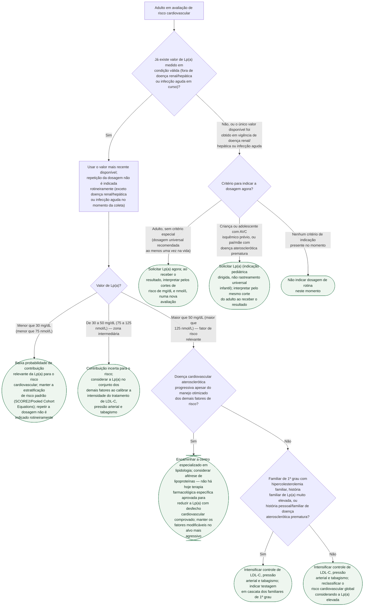

# Fluxograma: Lipoproteína(a) Elevada — Rastreamento e Estratificação de Risco Cardiovascular (Consenso EAS 2022 / ESC-EAS 2025)

A lipoproteína(a) — Lp(a) — é determinada em mais de 90% por variabilidade genética e se mantém estável ao longo da vida adulta, o que torna sua dosagem diferente de LDL-colesterol ou triglicerídeos: não é exame de seguimento seriado, é exame de uma vez na vida. Este fluxograma organiza duas decisões em sequência: primeiro, quando dosar (e quando não repetir uma dosagem já feita); depois, uma vez obtido o valor, como ele reclassifica o risco cardiovascular e calibra a intensidade do tratamento dos demais fatores modificáveis — já que não existe hoje terapia farmacológica específica para a própria Lp(a) com desfecho cardiovascular comprovado.

**O que a árvore não resolve sozinha**: os cortes de 30 e 50 mg/dL (75 e 125 nmol/L) são simplificação pragmática de uma relação de risco contínua — o próprio consenso descreve risco crescente por percentil populacional (75º, 90º, 95º), sem um único limiar biológico abrupto. A conversão entre mg/dL e nmol/L não é exata (varia com o tamanho da isoforma de apolipoproteína(a) de cada indivíduo).

## Árvore de decisão

## O que a árvore não mostra

**Os cortes de 30/50 mg/dL (75/125 nmol/L) são simplificação prática de uma relação contínua.** O consenso EAS 2022 descreve risco crescente por percentil populacional — acima do 75º percentil já há associação com estenose aórtica valvar e infarto do miocárdio; acima do 90º, com insuficiência cardíaca; acima do 95º, com mortalidade cardiovascular e AVC isquêmico. Não existe um único patamar biológico abrupto abaixo do qual não há risco algum.

**A mediana populacional de Lp(a) varia por ancestralidade** — o consenso cita dados do UK Biobank com mediana de 75 nmol/L em indivíduos de ascendência negra contra 19,7 nmol/L em ascendência branca. Aplicar o mesmo corte absoluto sem essa ressalva pode super ou subestimar quantas pessoas de cada grupo caem acima do corte de risco; a árvore usa os cortes pragmáticos do consenso, sem essa estratificação.

**Não existe hoje terapia farmacológica específica aprovada para reduzir a Lp(a) com desfecho cardiovascular comprovado** — por isso a conduta em risco aumentado não é "tratar a Lp(a)", é intensificar o tratamento dos fatores que já são modificáveis (LDL-C, pressão arterial, tabagismo), calibrado pelo risco cardiovascular global E pelo nível de Lp(a) juntos.

**A conversão entre mg/dL e nmol/L não é exata** — o tamanho da isoforma de apolipoproteína(a) varia entre indivíduos, então não existe fator de conversão fixo simples entre as duas unidades; os pares de corte desta árvore (30/75, 50/125) são os que o próprio consenso reporta lado a lado, não uma conversão calculada.

**Esta árvore não cobre gestantes, hipercolesterolemia familiar homozigota nem terapias experimentais em investigação** (siRNA como olpasirana e zerlasirana, antisense como pelacarsen, inibidor oral como muvalaplin) — nenhuma delas tem hoje aprovação regulatória nem desfecho cardiovascular comprovado; ver os documentos específicos desta pasta para o estágio de desenvolvimento de cada uma.
