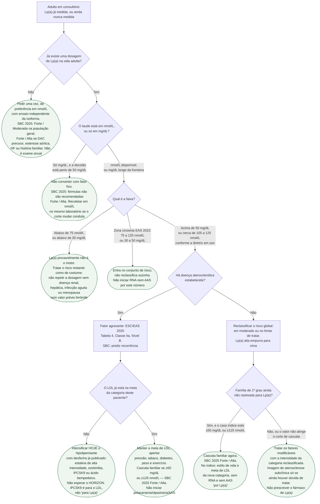

# Fluxograma: Lp(a) elevada — rastreio, risco residual e o que não esperar do fármaco

Árvore da **consulta em que o número de Lp(a) decide o que fazer nesta semana**,
não da pergunta "quem dosar na população" (consenso EAS 2022) nem da pergunta
"quanto a olpasirana baixa o biomarcador" (OCEAN(a)-DOSE). As folhas são condutas
de hoje. Nenhuma folha inicia pelacarsena, olpasirana ou AAS "porque a Lp(a) está
alta": Lp(a)HORIZON não tinha MACE publicado em 29/08/2026, e nenhuma tabela lida
nesta revisão editorial recomenda AAS só por esse número.

O texto que explica unidade, GRADE brasileiro e o status dos CVOTs está em
[`lipoproteina-a-conduta-pratica-enquanto-os-desfechos-nao-chegam`](lipoproteina-a-conduta-pratica-enquanto-os-desfechos-nao-chegam.md).

## Árvore de decisão

## O que a árvore recusa de propósito

**Pelacarsena e olpasirana não têm folha de "iniciar".** O OCEAN(a)-DOSE (PMID 36342163)
baixa o biomarcador; o Lp(a)HORIZON (PMID 40185318, NCT04023552) é ensaio de desfecho
**ainda sem artigo de MACE na consulta PubMed de 29/08/2026**. OCEAN(a) Outcomes
(NCT05581303) segue em curso. Quem precisa do detalhe de dose vai ao documento
[`lipoproteina-a-e-olpasirana-o-ensaio-ocean-a-dose`](lipoproteina-a-e-olpasirana-o-ensaio-ocean-a-dose.md)
— não se copia aquele ensaio nesta árvore.

**AAS não tem folha de "começar porque a Lp(a) está alta".** Nenhuma tabela lida
nesta revisão editorial dá classe para isso. O protocolo irmão marca **LIMITE DA EVIDÊNCIA**.
AAS continua nas regras de prevenção primária ou secundária que já existem.

**50 mg/dL não é um único nmol/L.** ESC/EAS 2025 Tabela 4 usa ≈105 nmol/L; EAS 2022,
SBC 2025 e ACC/AHA 2026 usam 125 nmol/L para o mesmo 50 mg/dL. A folha C2 existe
para impedir a conta de guardanapo.

**Quem dosar na população** (adulto nunca testado, criança só com AVC ou pai/mãe
com DCVA prematura, ancestralidade como ressalva de corte) continua no consenso
EAS 2022. Esta árvore assume a consulta individual, não o programa de rastreio.

## Cortes que a árvore usa, e de onde vêm

| Faixa | Fonte lida | O que faz na prática |
|---|---|---|
| <30 mg/dL / <75 nmol/L | EAS 2022; SBC 2025 Tabela 3.1 (referência de estratificação, sem meta) | Folha C3 |
| 30–50 mg/dL / 75–125 nmol/L | EAS 2022 zona cinzenta | Folha C4 |
| >50 mg/dL (≈105 nmol/L) | ESC/EAS 2025 Tabela 4, **IIa B** | Entra em D4 |
| ≥50 mg/dL ou ≥125 nmol/L | SBC 2025 cascata, **Forte / Alta** | Folhas C6 e C7 |
| ≥125 nmol/L / 50 mg/dL (~1,4×) e ≥250 nmol/L / 100 mg/dL (~2×) | ACC/AHA 2026, texto; COR/LOE da medição **não lidos** nesta revisão editorial | Intensificador, sem classe americana atribuída aqui |
| >180 mg/dL (equivalência vitalícia com HF heterozigótica) | ESC/EAS 2019 | Extremo; não é o corte da Tabela 4 de 2025 |

Não há meta terapêutica de Lp(a) em nenhuma dessas tabelas.
