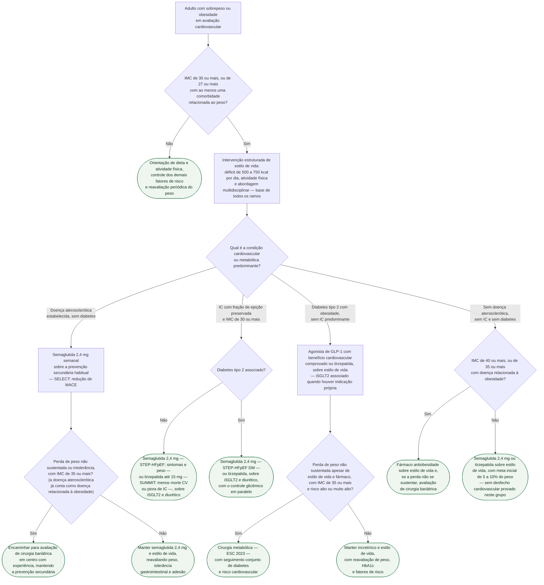

# Fluxograma: Obesidade e doença cardiovascular — quando indicar agonista de GLP-1 e cirurgia bariátrica

Dois terços do excesso de mortalidade atribuído à obesidade são cardiovasculares, e o consenso ESC 2024 pede que o cardiologista trate a obesidade como fator de risco próprio, não como pano de fundo. A pergunta prática mudou desde 2023: pela primeira vez há um ensaio randomizado em que um fármaco antiobesidade reduziu evento cardiovascular duro em quem já tem doença aterosclerótica (SELECT), dois ensaios em que incretínicos mudaram sintoma, peso e, no caso da tirzepatida, piora de insuficiência cardíaca na ICFEp com obesidade (STEP-HFpEF, SUMMIT), e limiares explícitos de IMC para pensar em cirurgia. Este fluxograma organiza essas decisões pelo fenótipo cardiovascular do paciente obeso. A escolha entre iSGLT2 e GLP-1 no diabético com doença cardiovascular já tem árvore própria (ver fluxograma-escolha-isglt2-glp1-diabetico-doenca-cardiovascular); aqui o eixo é o peso.

## Árvore de decisão

## O limiar de entrada e o que vale para todos os ramos

O consenso ESC 2024 fixa o limiar para fármaco antiobesidade em IMC de 30 kg/m² ou mais, ou de 27 kg/m² ou mais com pelo menos uma comorbidade relacionada ao peso, sempre em conjunto com mudança de estilo de vida — e a bula da semaglutida 2,4 mg usa a mesma lógica (obesidade, ou sobrepeso com ao menos uma comorbidade). O consenso não enumera quais comorbidades contam; hipertensão, diabetes tipo 2 e dislipidemia são as citadas na prática, mas a lista exata fica a cargo do julgamento clínico.

A intervenção de estilo de vida é o primeiro degrau de todos os ramos, não uma alternativa ao fármaco: déficit de 500 a 750 kcal por dia, menos ultraprocessados e álcool, mais frutas e vegetais, combinados a atividade física para perder massa gorda preservando massa magra. Perdas de 5 a 10% são alcançáveis com abordagens nutricionais e multidisciplinares. A ESC 2021 recomenda que pessoas com sobrepeso ou obesidade reduzam o peso para melhorar pressão, lipídios e risco de diabetes (classe I, nível A). O que o estilo de vida não demonstrou, e o consenso registra, foi redução de evento cardiovascular: no Look AHEAD, a intervenção intensiva não reduziu o desfecho primário após seguimento mediano de 9,6 anos.

## Doença aterosclerótica estabelecida: o ramo do SELECT

O SELECT randomizou 17.604 pacientes com 45 anos ou mais, IMC de 27 kg/m² ou mais e doença cardiovascular estabelecida (infarto prévio, AVC prévio ou doença arterial periférica sintomática), sem diabetes (diagnóstico prévio ou HbA1c de 6,5% ou mais excluíam), para semaglutida 2,4 mg semanal ou placebo. O desfecho primário (morte cardiovascular, infarto não fatal ou AVC não fatal) ocorreu em 6,5% contra 8,0% (HR 0,80; IC95% 0,72 a 0,90; p < 0,001), com exposição média de 34,2 meses. O peso caiu 9,39% contra 0,88% em 104 semanas, e a descontinuação por evento adverso foi de 16,6% contra 8,2%, sobretudo por sintomas gastrointestinais. A análise pré-especificada por adiposidade, registrada no documento do acervo sobre o SELECT, mostrou benefício amplamente independente da perda de peso obtida — o que sustenta tratar a semaglutida aqui como fármaco de prevenção secundária, e não apenas como emagrecedor.

É por isso que o consenso ESC 2024 afirma que a semaglutida 2,4 mg é, hoje, a única intervenção de perda de peso com benefício de desfecho demonstrado em doença cardiovascular estabelecida sem diabetes, e a bula norte-americana traz a indicação de redução de MACE em adultos com doença cardiovascular estabelecida e obesidade ou sobrepeso. O ramo cirúrgico deste fenótipo só entra quando a via clínica falha: a ESC 2021 recomenda considerar cirurgia bariátrica no obeso de alto risco quando a mudança de estilo de vida não sustenta a perda de peso (classe IIa, nível B), e o consenso de 2024 põe os limiares em IMC de 40 kg/m² ou mais, ou de 35 kg/m² ou mais com ao menos uma doença relacionada à obesidade — condição que a própria doença aterosclerótica satisfaz.

## ICFEp com obesidade: dois ensaios, duas perguntas

| Ensaio | População | Intervenção | Desfecho primário | Resultado |
|---|---|---|---|---|
| STEP-HFpEF (2023) | 529 pacientes, ICFEp, IMC ≥ 30, sem diabetes | Semaglutida 2,4 mg semanal, 52 semanas | KCCQ-CSS e peso corporal | KCCQ +16,6 vs +8,7 (diferença 7,8; IC95% 4,8 a 10,9); peso −13,3% vs −2,6% |
| STEP-HFpEF DM (2024) | 616 pacientes, FEVE ≥ 45%, IMC ≥ 30, com diabetes tipo 2 | Semaglutida 2,4 mg semanal, 52 semanas | KCCQ-CSS e peso corporal | KCCQ +13,7 vs +6,4 (diferença 7,3; IC95% 4,1 a 10,4) |
| SUMMIT (2025) | 731 pacientes, IC com FEVE ≥ 50%, IMC ≥ 30 | Tirzepatida até 15 mg semanal, mínimo 52 semanas, seguimento mediano 104 semanas | Morte CV ou piora de IC; KCCQ-CSS | 9,9% vs 15,3% (HR 0,62; IC95% 0,41 a 0,95; p = 0,026); KCCQ diferença 6,9 |

A distinção entre os ramos C4 e C5 é de evidência, não de fármaco: o STEP-HFpEF excluiu diabéticos e o STEP-HFpEF DM incluiu só diabéticos, e ambos mediram sintoma e peso, não evento. O SUMMIT foi o único com desfecho de evento, e o ganho veio inteiramente de menos piora de IC (8,0% vs 14,2%; HR 0,54), com morte cardiovascular numericamente maior no braço ativo (2,2% vs 1,4%; HR 1,58; IC95% 0,52 a 4,83), sem significância. Nenhum dos três deve ser citado como redução de mortalidade. Descontinuação por evento adverso no SUMMIT: 6,3% vs 1,4%. O incretínico entra sobre o iSGLT2, que é a base para toda ICFEp independentemente de diabetes — a sequência completa está em fluxograma-manejo-icfep-fenotipo-dirigido-acc-2026, e o capítulo 10 da ADA 2026 recomenda incluir agonista dual GIP/GLP-1 ou GLP-1 com benefício demonstrado no plano do diabético obeso com ICFEp sintomática.

## Diabetes tipo 2 com obesidade e cirurgia metabólica

No diabético obeso sem IC predominante, a diretriz ESC 2023 recomenda iSGLT2 e/ou agonista de GLP-1 com benefício cardiovascular em doença aterosclerótica estabelecida, independentemente do controle glicêmico; a escolha entre as classes e a combinação estão em fluxograma-escolha-isglt2-glp1-diabetico-doenca-cardiovascular e não são repetidas aqui. O que este ramo acrescenta é o degrau cirúrgico: a ESC 2023 indica cirurgia bariátrica no paciente de risco alto ou muito alto com IMC de 35 kg/m² ou mais quando as demais intervenções não produzem perda de peso sustentada. A evidência de desfecho é observacional — no SOS, HR ajustado de 0,47 para morte cardiovascular e de 0,67 para infarto ou AVC em cerca de 15 anos; na coorte de Aminian (diabetes tipo 2 e obesidade), HR 0,61 para MACE estendido e 0,59 para mortalidade em 8 anos — e carrega confusão por indicação, como os documentos do acervo sobre esses estudos detalham.

## Doses e escalonamento

| Fármaco | Início | Escalonamento | Manutenção |
|---|---|---|---|
| Semaglutida 2,4 mg (Wegovy) | 0,25 mg por semana, semanas 1 a 4 | 0,5 mg (semanas 5 a 8), 1 mg (9 a 12), 1,7 mg (13 a 16) | 2,4 mg por semana a partir da semana 17 |
| Tirzepatida (Zepbound) | 2,5 mg por semana por 4 semanas | Incrementos de 2,5 mg após pelo menos 4 semanas em cada dose | 5, 10 ou 15 mg por semana; máximo 15 mg |

Contraindicações de bula, comuns às duas moléculas: história pessoal ou familiar de carcinoma medular de tireoide, neoplasia endócrina múltipla tipo 2 e hipersensibilidade grave prévia ao fármaco. Pancreatite aguda, inclusive hemorrágica ou necrosante, foi observada com a classe: diante de suspeita, suspender e tratar; a bula não define conduta para história prévia de pancreatite, e a decisão de prescrever nesse cenário é individual. Colelitíase merece investigação quando suspeita. Os efeitos gastrointestinais são a principal causa de abandono nos ensaios, e a suspensão perioperatória tem orientação própria (ver agonistas-de-receptor-de-glp-1-no-perioperatorio-orientacao-multissocietaria-2024).

## Limitações e o que confirmar

- O ramo de obesidade sem doença cardiovascular, IC ou diabetes (C8 e C9) segue os limiares do consenso ESC 2024, mas nenhum ensaio demonstrou redução de evento cardiovascular com fármaco antiobesidade nessa população; o SELECT não se aplica a ela.
- A lista de comorbidades que qualificam o IMC entre 27 e 30 não está enumerada no consenso ESC 2024 nem na bula; usar as condições relacionadas ao peso reconhecidas na prática.
- O ramo de ICFEp exige IMC de 30 kg/m² ou mais porque foi esse o critério de entrada do STEP-HFpEF, do STEP-HFpEF DM e do SUMMIT; o paciente com ICFEp e IMC entre 27 e 30 não tem evidência específica e deve ser conduzido pelos demais ramos conforme a comorbidade.
- O SUMMIT incluiu pacientes com e sem diabetes; este fluxograma não atribui efeito específico a um subgrupo nem usa a proporção de diabéticos como critério de decisão.
- As classes de recomendação do consenso ESC 2024 para cada fármaco e para cirurgia não foram extraídas do texto integral (acesso truncado); os limiares citados vêm dos pontos-chave oficiais e do resumo. A classe I A e IIa B citadas são da diretriz ESC 2021.
- A recomendação de cirurgia bariátrica da ESC 2023 (IMC de 35 ou mais em risco alto ou muito alto) foi tomada do documento do acervo, não do texto integral da diretriz nesta sessão.
- Os números do STEP-HFpEF e do STEP-HFpEF DM foram tomados dos documentos verificados do acervo; o resumo do PubMed não abriu nesta sessão.
- Nenhum dos estudos de cirurgia bariátrica citados é randomizado; o tamanho de efeito não deve ser comparado diretamente com o do SELECT.

## Tudo com Tudo

- [Cirurgia Metabólica e Semaglutida em Obesidade Sem Diabetes (Estudo SELECT)](/biblioteca/cirurgia-metabolica-e-semaglutida-em-obesidade-sem-diabetes-select)
- [Semaglutida na ICFEp com Obesidade: o Ensaio STEP-HFpEF](/biblioteca/semaglutida-na-icfep-com-obesidade-o-ensaio-step-hfpef)
- [Tirzepatida e ICFEp com Obesidade: o Ensaio SUMMIT](/biblioteca/tirzepatida-e-icfep-com-obesidade-o-ensaio-summit)
- [Cirurgia Bariátrica e Eventos Cardiovasculares de Longo Prazo: Estudo SOS](/biblioteca/cirurgia-bariatrica-e-eventos-cardiovasculares-de-longo-prazo-estudo-sos)
- [Cirurgia Metabólica e Redução de MACE em Diabetes Tipo 2 com Obesidade (Coorte de Aminian, JAMA 2019)](/biblioteca/cirurgia-metabolica-e-mace-em-diabetes-tipo-2-e-obesidade-coorte-de-aminian)
- [Fluxograma: Escolha entre inibidor de SGLT2 e agonista de GLP-1 no diabético com doença cardiovascular](/biblioteca/fluxograma-escolha-isglt2-glp1-diabetico-doenca-cardiovascular)
- [Fluxograma: Manejo Fenótipo-dirigido da ICFEp (ACC 2026 Expert Consensus Decision Pathway)](/biblioteca/fluxograma-manejo-icfep-fenotipo-dirigido-acc-2026)
