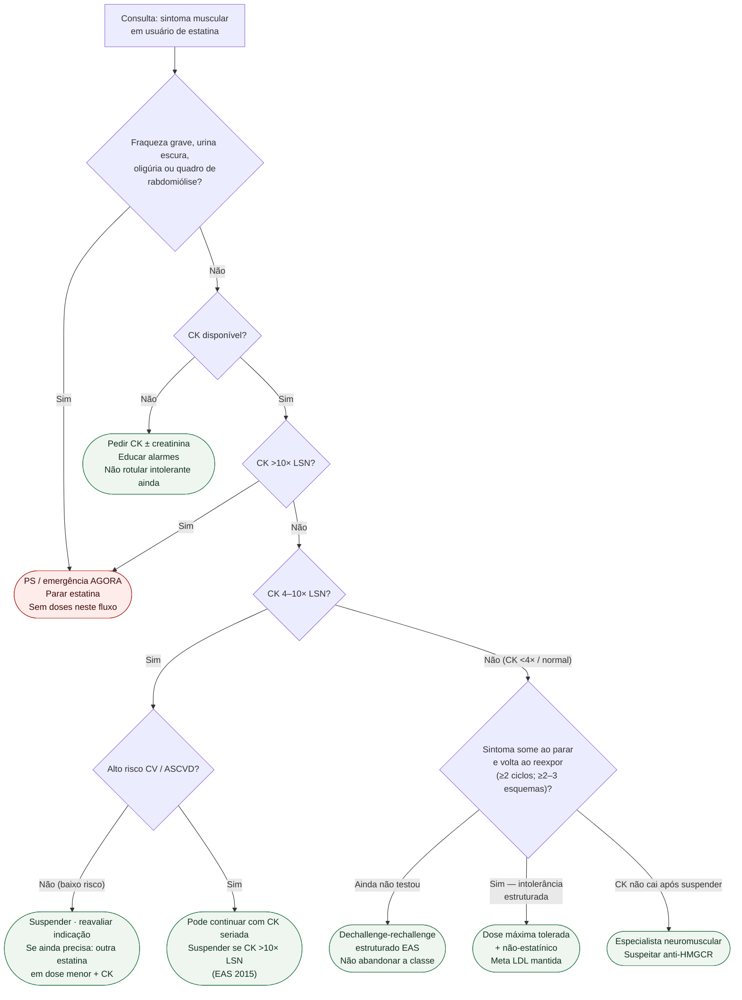

# Fluxograma: sinalizadores ambulatoriais de intolerância a estatina

Prosa: [`sams-no-consultorio-sinais-vermelhos-quando-ir-ao-ps`](sams-no-consultorio-sinais-vermelhos-quando-ir-ao-ps.md) e [`sinalizadores-ambulatoriais-de-intolerancia-a-estatina-quando-escalar`](sinalizadores-ambulatoriais-de-intolerancia-a-estatina-quando-escalar.md). Definição/reexposição EAS: [`intolerancia-a-estatina-definicao-operacional-e-protocolo-de-reexposicao-eas-2015`](intolerancia-a-estatina-definicao-operacional-e-protocolo-de-reexposicao-eas-2015.md) e [`fluxograma-intolerancia-a-estatina-definicao-e-protocolo-de-reexposicao`](fluxograma-intolerancia-a-estatina-definicao-e-protocolo-de-reexposicao.md).

## Árvore de decisão

## Notas

- **D1/D3** = gate de segurança (rabdomiólise / CK \>10× LSN) — EAS 2015 + AHA 2019.
- **D5** = mesmo intervalo 4–10× LSN muda de destino conforme risco CV (EAS).
- **C5/C6** = StatinWISE + ESC/EAS 2019: reexpor antes do rótulo; depois, não abandonar meta de LDL.
- **C7** = fora do espectro SAMS comum — ver documento anti-HMGCR.
- Não decide doses, nem cascata HF (#894), nem AINE (#887).
