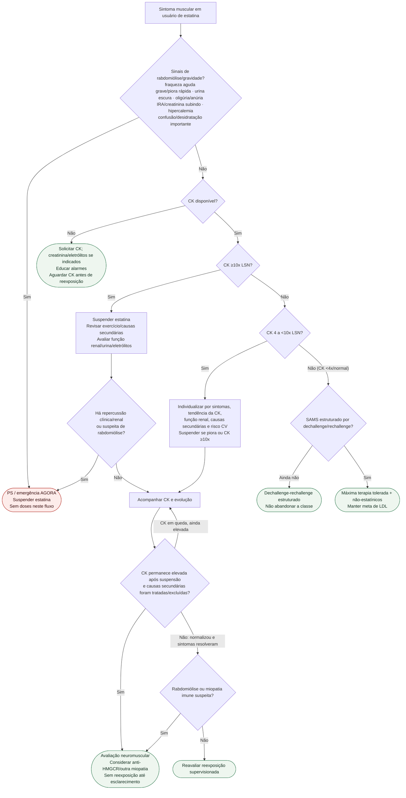

# Fluxograma: sinalizadores ambulatoriais de intolerância a estatina

## Notas

- CK ≥10x LSN é um **gate para suspender e investigar**, não um diagnóstico isolado de rabdomiólise.
- Emergência depende de contexto clínico/renal/sistêmico.
- CK persistente após retirada e exclusão de causas secundárias alimenta o ramo neuromuscular.
- StatinWISE apoia reavaliação/reexposição em sintomas sem toxicidade grave; não prova que todo SAMS seja nocebo.

## Segurança da reexposição e prevenção

CK ≥10x LSN impede reexposição enquanto ativa. Após esse episódio, considerar nova tentativa apenas quando CK normalizar, sintomas resolverem e causas secundárias forem corrigidas, com supervisão e monitorização. CK apenas em queda não libera nova tentativa. Suspeita de rabdomiólise impede reintrodução; suspeita de miopatia necrosante imunomediada requer avaliação especializada, mantendo a estatina suspensa. Se a investigação rápida não estiver disponível ou ocorrer deterioração, encaminhar à urgência.

Com CK entre 4 e <10x LSN, a decisão considera sintomas, tendência da CK, função renal, causas secundárias e risco cardiovascular. Continuação em alto risco só com monitorização próxima e sem toxicidade progressiva; suspender se houver piora ou CK atingir 10x LSN.

A NLA 2022 distingue intolerância parcial de completa e exige tentativa de pelo menos duas estatinas, uma na menor dose diária aprovada, quando seguro; esse critério não obriga reexposição após toxicidade grave. A atualização ESC/EAS 2025 recomenda alternativas não estatínicas com benefício cardiovascular comprovado quando estatinas não puderem ser usadas.

[Protocolo canônico de reexposição](/biblioteca/intolerancia-a-estatina-definicao-operacional-e-protocolo-de-reexposicao-eas-2015).
