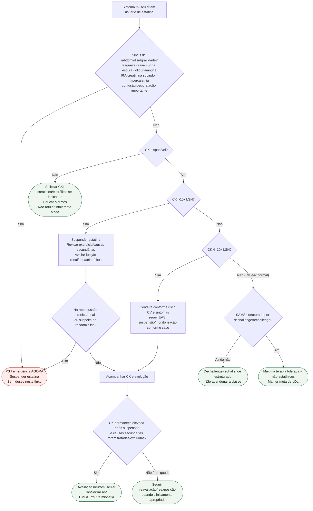

# Fluxograma: sinalizadores ambulatoriais de intolerância a estatina

## Notas

- CK >10x LSN é um **gate para suspender e investigar**, não um diagnóstico isolado de rabdomiólise.
- Emergência depende de contexto clínico/renal/sistêmico.
- CK persistente após retirada e exclusão de causas secundárias alimenta o ramo neuromuscular.
- StatinWISE apoia reavaliação/reexposição em sintomas sem toxicidade grave; não prova que todo SAMS seja nocebo.
