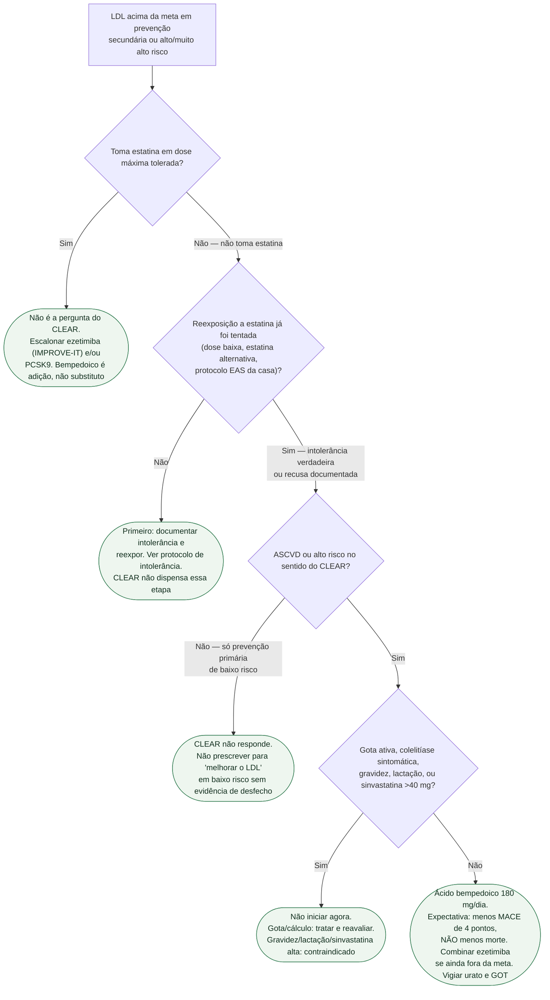

# Quando usar ácido bempedoico depois do CLEAR Outcomes

## Função deste protocolo

A casa já tem o dump do ensaio (IMPROVE-IT + CLEAR + o limite do ORION) e a monografia do fármaco. Faltava a pergunta do plantão e do ambulatório: **este paciente deve sair com ácido bempedoico hoje?**

A resposta curta: **sim, no intolerante a estatina com doença aterosclerótica ou alto risco, quando a reexposição falhou e o LDL continua acima da meta — com a reserva explícita de que o ensaio não reduziu morte cardiovascular, morte total nem AVC.**

## O que o CLEAR mostrou — só o que muda a prescrição

- **13.970** intolerantes a estatina (incapazes ou não dispostos por efeito adverso inaceitável), com ASCVD ou alto risco.
- Ácido bempedoico **180 mg/dia** versus placebo. Seguimento mediano **40,6 meses**.
- LDL basal **139 mg/dL**; diferença adicional de **−29,2 mg/dL** em 6 meses (21,1 pontos percentuais).
- Primário (morte CV + IAM não fatal + AVC não fatal + revascularização coronariana): **11,7% versus 13,3%**; **HR 0,87 (0,79–0,96); P=0,004**.
- **Sem efeito significativo** sobre AVC fatal/não fatal, **morte cardiovascular** e **morte por qualquer causa**.
- Mais **gota (3,1% vs 2,1%)** e **colelitíase (2,2% vs 1,2%)**; pequenos aumentos de creatinina, ácido úrico e enzimas hepáticas.

Quem prescreve ácido bempedoico como se fosse “estatina sem músculo que reduz mortalidade” está lendo o ensaio errado.

## Árvore de decisão

## Onde o bempedoico NÃO entra

- **No lugar da estatina** em quem tolera estatina. O CLEAR é um ensaio de intolerantes contra placebo, não contra atorvastatina.
- **Como se reduzisse mortalidade.** O primário é um composto de 4 pontos puxado por IAM e revascularização.
- **Como se fosse inclisirana.** ORION-10/11 medem LDL, não MACE. CVOT de inclisirana não lido / não publicado como desfecho nesta revisão editorial — não antecipar.
- **Na gestação ou na lactação.** Bula brasileira do Nustendi contraindica lactação (monografia da casa).
- **Com sinvastatina acima de 40 mg/dia.** Interação de exposição; contraindicação de prescrição.

## Vigilância prática

- Ácido úrico e crises de gota — avisar o paciente antes da primeira caixa.
- Colelitíase.
- Creatinina e transaminases — aumentos pequenos no ensaio; não transformar isso em “nefrotóxico” sem contexto.
- LDL em 8–12 semanas para decidir se entra ezetimiba (se ainda não estiver) ou PCSK9.

## Mensagem prática

**Ácido bempedoico 180 mg/dia é a opção com desfecho cardiovascular medido para quem não toma estatina de verdade — depois da reexposição, em ASCVD ou alto risco, sem pretender redução de morte.** Ezetimiba continua a primeira adição em quem já está em estatina.
