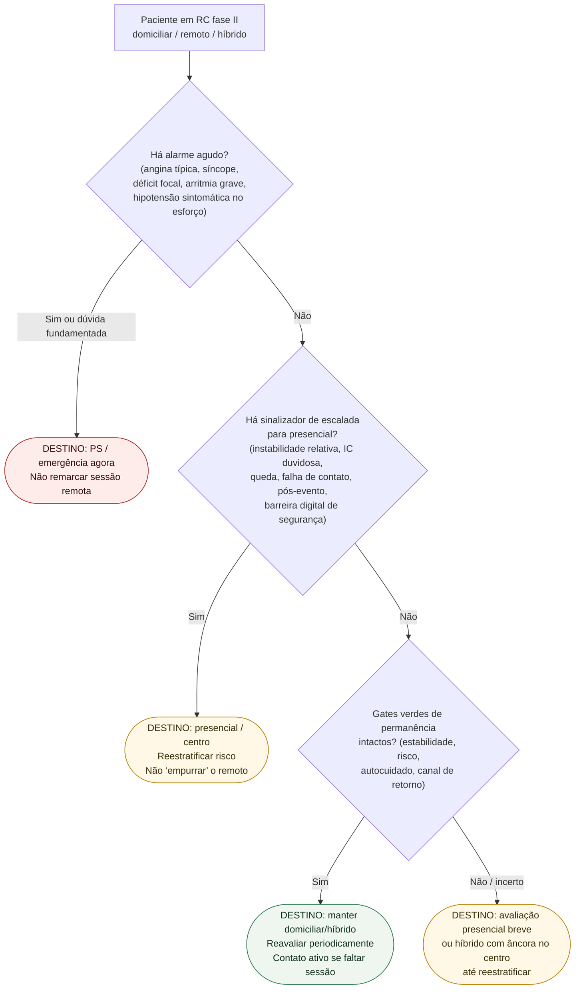

# Fluxograma: destino do modelo de entrega na reabilitação cardíaca ambulatorial

Prosa: [`reabilitacao-cardiaca-domiciliar-ou-hibrida-quando-escalar-para-presencial`](reabilitacao-cardiaca-domiciliar-ou-hibrida-quando-escalar-para-presencial.md). Sintomas na sessão: [`quando-pausar-o-exercicio-na-sessao-de-reabilitacao-cardiaca-sintomas-de-alarme`](quando-pausar-o-exercicio-na-sessao-de-reabilitacao-cardiaca-sintomas-de-alarme.md).

## Árvore de decisão

## Notas

- **D1** = gate de segurança (mesma lógica do #858 / hub #831).
- **D2** = escalada de **modelo**, não de intensidade numérica.
- **D3** = permanência só com estabilidade documentável (Thomas 2019; ESC 2026).
- Não decide METs, %FC máxima nem doses de fármacos.
