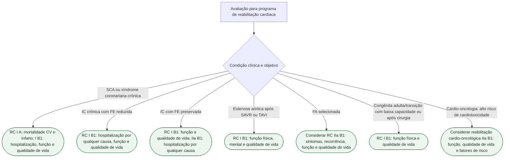

# Fluxograma: encaminhamento para reabilitação cardíaca — ESC 2026

Avaliar condição índice, risco e objetivos. A classe abaixo se refere ao desfecho indicado, não a qualquer benefício em qualquer paciente.

## Escolha da modalidade e segurança

Na ESC 2026, telereabilitação em DAC ou IC é IIa B1; em cardiopatia congênita, FA ou cardio-oncologia, IIa B2; após intervenção/cirurgia valvar, IIb B2. A seleção depende do risco, da capacidade de participação e dos recursos do programa. RC hospitalar para pacientes de alto risco ou instáveis é I C; isso não autoriza exercício durante instabilidade clínica.

O início de treinamento exige estabilidade e prescrição individualizada. A reabilitação precoce durante internação por IC descompensada pode ser considerada após estabilização. Outras indicações, como dispositivos, fragilidade e hipertensão pulmonar, exigem a avaliação específica da diretriz.

## Tudo com Tudo

Reabilitação cardíaca · Doença coronariana · Insuficiência cardíaca · Valvopatias · Fibrilação atrial · Cardiopatias congênitas · Cardio-oncologia.

## Conteúdo clínico relacionado

- [Indicações de reabilitação cardíaca pela ESC 2026 — portas de entrada por condição](/biblioteca/indicacoes-de-reabilitacao-cardiaca-esc-2026-por-condicao)
- [Reabilitação cardíaca após SCA: porta de entrada ESC 2026](/biblioteca/reabilitacao-cardiaca-apos-sca-porta-de-entrada-esc-2026)
