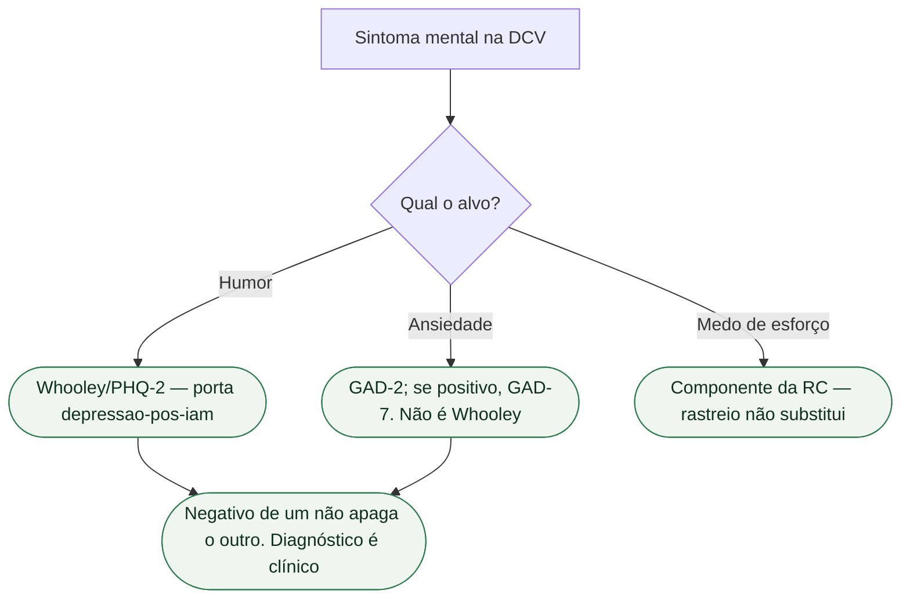

# Ansiedade não é depressão e não é Whooley

Três coisas se misturam na alta: **ansiedade**, **depressão** e o **rastreio de Whooley**. O consenso ESC 2025 (Bueno, Deaton et al., *Eur Heart J*. 2025;**46**:4156-4225; PMID **40878270**) nomeia as três. Não as funde.

Não há Classe ESC no consenso. Rastreio psicológico (depressão **e** ansiedade) na RC é **I C** da Table 20 da ESC 2026 — no **rastreio**, não no Whooley. Intervenção psicológica em DAC/IC e TCC em DAC/IC/CDI: I B1. Não colar I B1 no GAD-2 da enfermaria.

## Três construtos, três portas

**Depressão** é humor: anedonia, desesperança. O consenso nomeia **Whooley** e **PHQ-2** para esse alvo; tela positiva pede **PHQ-9**. Perguntas, corte do PHQ-2 e Table 4 **já estão** na porta de rastreio. **Não se repetem aqui.** Whooley positivo **não** é diagnóstico. Whooley negativo **não** encerra saúde mental.

**Ansiedade** é outro construto: preocupação, medo, pânico, evitação. O mesmo consenso nomeia **GAD-2** quando o alvo é ansiedade; tela positiva pede **GAD-7**. GAD-2 **não** é Whooley com outro nome. PHQ-9 **não** fecha transtorno de ansiedade. O GAD-2 deve ser pontuado conforme sua versão validada e contexto; o corte do PHQ-2 não deve ser transferido entre instrumentos.

**Whooley** rastreia **humor**. Um ou dois “sim” abrem avaliação de depressão — não de ansiedade. Não é DSM, CID, GAD nem o quarto componente da RC. “Whooley negativo, então está bem” apaga medo de esforço, pânico e ansiedade de choque do CDI.

A prevalência varia por população e instrumento. Um percentual de ansiedade em portadores de CDI não deve ser generalizado para todo paciente cardiovascular.

## O que não herda

Medo de esforço **pode** ser ansiedade, descondicionamento, angina ou os três. Whooley não decide. GAD-2 positivo **não** cancela isquemia. ISRS **IIa B2** da Table 20 da RC é **depressão** maior moderada a grave em DAC — não ansiedade. O consenso2025 admite ISRS em transtornos de ansiedade após avaliação; o diagnóstico e a indicação não decorrem de um rastreio isolado. Não prescrever benzodiazepínico porque o rastreio acendeu; o consenso pede cuidado com uso excessivo. Esta ficha **não** inventa classe de ansiolítico.

A ESC 2026 de IC, já extraída no lote, considera **avaliar** ansiedade, depressão e fragilidade (**IIa C**). Avaliar ≠ diagnosticar pelo Whooley. Não copiar I C da RC para a IC. Porta do CDI: outra ficha — não colar o 23% aqui.

## Frase da consulta

> “Ansiedade não é depressão. Whooley não mede as duas. Medo, pânico ou evitação pedem o instrumento de ansiedade — e a RC continua, mesmo com rastreio negativo.”

Não diga “está deprimido”. Não diga “é só ansiedade”. Não prometa que rastrear reduz morte. Não invente prevalência.

## Tudo com Tudo

- [Consenso ESC 2025: saúde mental e doença cardiovascular](/biblioteca/consenso-esc-2025-saude-mental-e-doenca-cardiovascular)
- [Depressão pós-IAM: Whooley e PHQ-2 rastreiam; não diagnosticam](/biblioteca/depressao-pos-iam-rastreio-whooley-nao-e-diagnostico)
- [Insônia não é depressão e não é Whooley](/biblioteca/insonia-nao-e-depressao-e-nao-e-whooley)
- [Medo de choque do CDI não é depressão](/biblioteca/medo-de-choque-do-cdi-nao-e-depressao)
- [RC tem componente psicossocial: rastreio não substitui o programa](/biblioteca/rc-tem-componente-psicossocial-rastreio-nao-substitui)
