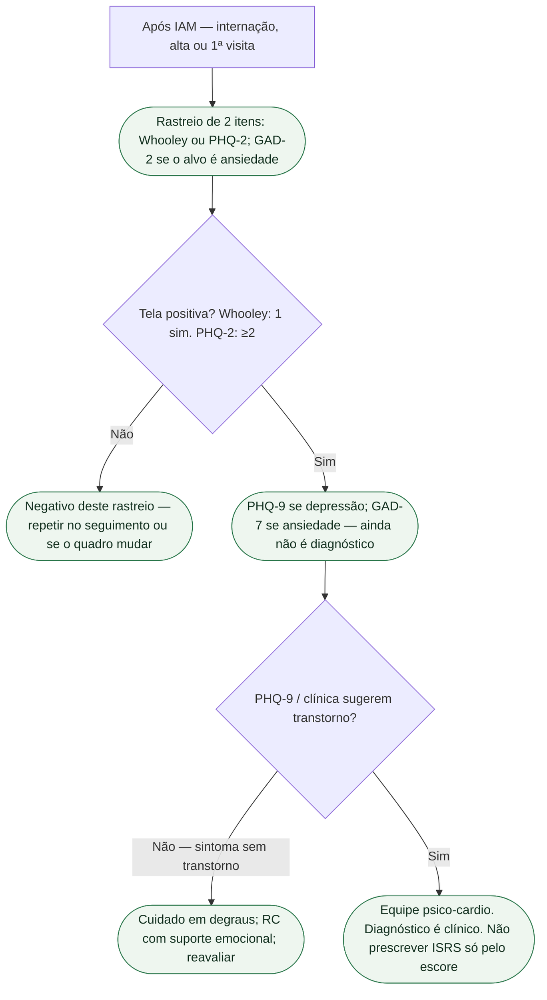

# Depressão pós-IAM: Whooley e PHQ-2 rastreiam; não diagnosticam

O consenso ESC 2025 de saúde mental e DCV (Bueno, Deaton et al., *Eur Heart J*. 2025;**46**:4156-4225; PMID **40878270**) é o documento-irmão [Consenso ESC 2025: saúde mental e doença cardiovascular](/biblioteca/consenso-esc-2025-saude-mental-e-doenca-cardiovascular). Aquela ficha é o mapa. **Esta é a porta de rastreio** depois do infarto: o que o plantão, a enfermaria e a primeira visita de alta podem fazer em um minuto — e o que **não** podem chamar de diagnóstico.

Não há Classe ESC no consenso. O que há é consenso clínico e, na reabilitação cardíaca, uma linha classificada: rastreio psicológico (depressão, ansiedade) é **recomendado** na avaliação abrangente — **I C** da Table 20 da ESC 2026 de RC. Não colar I C no Whooley como se o consenso tivesse virado diretriz.

## O que o consenso e o slideset oficial nomeiam

A seção 6.2.1 e o slideset oficial de ehaf191 nomeiam três medidas de **dois itens** para o rastreio inicial: **perguntas de Whooley**, **PHQ-2** e **GAD-2**. Tela positiva pede instrumento mais longo: **PHQ-9** se o alvo é depressão; **GAD-7** se o alvo é ansiedade. Timing (Table 5 do consenso / slideset): (1) após diagnóstico novo de DCV, evento ou procedimento — **pode ser ainda na internação**; (2) no seguimento (ex.: anual); (3) a qualquer momento por juízo clínico. Depois de um IAM, o primeiro momento é a internação ou a alta — não “quando o psiquiatra aparecer”.

Perguntas de Whooley, no texto do consenso:

1. No último mês, você tem se sentido frequentemente abatido(a), deprimido(a) ou sem esperança?
2. No último mês, você tem sentido pouco interesse ou prazer em fazer as coisas?

Sim a **uma ou às duas** = teste positivo (exige avaliação adicional). Não às duas = teste negativo para este rastreio. Não é DSM. Não é CID.

PHQ-2 pontua cada um dos dois sintomas de0 a3 nas últimas duas semanas (total0–6); Whooley pergunta sobre o último mês. O slideset tabula **PHQ-2 ≥2 pontos** como ponto de corte do rastreio, seguido de PHQ-9 se positivo. Não transformar ≥2 em “depressão maior”.

Propriedades no slideset (Table 4 de ehaf191): Whooley — sensibilidade **95%** (IC95% **88–97**), especificidade **65%** (IC95% **56–74**); GAD-2 — sensibilidade **91%**, especificidade **37%**; PHQ-2 ≥2 — sensibilidade **97%**, especificidade **48%**. A tabela não apresenta IC para GAD-2/PHQ-2. Whooley foi validado em população geral; GAD-2/PHQ-2 nessa tabela vêm de amostra australiana, não de todo paciente pós-IAM. Especificidade baixa é o recado clínico: **muitos falsos positivos**. Por isso o degrau PHQ-9 existe. Por isso o escore não fecha o diagnóstico.

A frequência de sintomas depende da população e do instrumento; não é necessária uma estimativa universal para organizar o rastreio.

## O que o rastreio não é

- **Não é diagnóstico.** Whooley/PHQ-2 positivos abrem PHQ-9 (ou entrevista). PHQ-9 positivo abre avaliação clínica — equipe **psico-cardio**, não o carimbo do questionário.
- **Não é classe de antidepressivo.** ISRS na Table 20 da RC é **IIa B2** no recorte DAC + depressão maior **moderada a grave**. Não sai do Whooley da enfermaria.
- **Não substitui a RC.** Medo de esforço, isolamento e humor entram no componente mental da RC ([Saúde mental como componente da reabilitação cardíaca: ESC 2025 e ESC 2026](/biblioteca/saude-mental-como-componente-da-reabilitacao-cardiaca-esc-2025-2026)). O resultado deve ser acompanhado de plano de avaliação e cuidado.
- **Não espera o sintoma “óbvio”.** O consenso pede limiar baixo: condições mentais são prevalentes e passam batidas. Sem inventar o quanto.

Qualquer relato de ideação suicida, risco imediato ou desorganização grave exige avaliação urgente; não deve aguardar a sequência rotineira de questionários.

## Frase da alta

> “Duas perguntas não fecham depressão. Se uma delas vier positiva, a gente completa o questionário e, se precisar, chama a equipe de saúde mental. Isso faz parte do infarto — não é ‘outro serviço’.”

Não diga “está deprimido porque o Whooley deu sim”. Não prometa que rastrear reduz morte. Não misture GAD e PHQ no mesmo carimbo.

## Tudo com Tudo

- [Ansiedade não é depressão e não é Whooley](/biblioteca/ansiedade-nao-e-depressao-e-nao-e-whooley)
- [Consenso ESC 2025: saúde mental e doença cardiovascular](/biblioteca/consenso-esc-2025-saude-mental-e-doenca-cardiovascular)
- [RC tem componente psicossocial: rastreio não substitui o programa](/biblioteca/rc-tem-componente-psicossocial-rastreio-nao-substitui)
