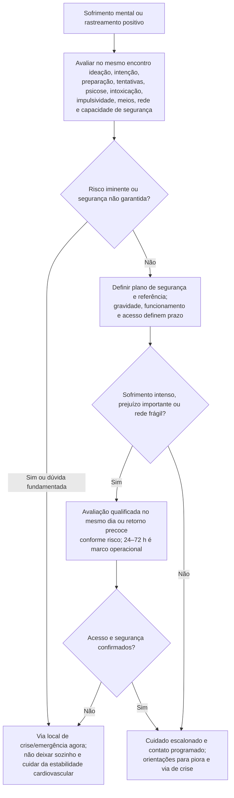

# Fluxograma ambulatorial: crise psiquiátrica — destino

Prosa: [[sinalizadores-ambulatoriais-crise-psiquiatrica-no-consultorio-de-cardiologia](/biblioteca/sinalizadores-ambulatoriais-crise-psiquiatrica-no-consultorio-de-cardiologia)](/biblioteca/sinalizadores-ambulatoriais-crise-psiquiatrica-no-consultorio-de-cardiologia). Checklist: [[checklist-ambulatorial-alarme-crise-psiquiatrica-cardiopata](/biblioteca/checklist-ambulatorial-alarme-crise-psiquiatrica-cardiopata)](/biblioteca/checklist-ambulatorial-alarme-crise-psiquiatrica-cardiopata). Rastreamento ACTIVE: [[fluxograma-rastreamento-saude-mental-cuidado-escalonado-esc-2025](/biblioteca/fluxograma-rastreamento-saude-mental-cuidado-escalonado-esc-2025)](/biblioteca/fluxograma-rastreamento-saude-mental-cuidado-escalonado-esc-2025).

## Árvore de decisão

## Notas

- **D1** = gate de segurança (ESC 2025: urgência segue protocolo local; AHA 2008: ideação no rastreamento → avaliação imediata).
- **D2** = sofrimento ambulatorial controlável com rede → destino clínico precoce + referência qualificada.
- **D3** = ponte para ACTIVE / Psycho-Cardio e para pacotes de QT/antidepressivo já existentes, **sem** decidir fármaco aqui.
- Não decide doses, ponto de corte único de escala nem periodicidade universal de rastreamento.

## Avaliação de segurança no mesmo encontro

Ausência de plano não libera o paciente. Aprofundar qualquer ideação ou desejo de morrer: intensidade/persistência, intenção, preparação, tentativas anteriores, intoxicação, agitação/psicose, impulsividade, meios disponíveis, desesperança, rede e fatores protetores. PHQ-9 item 9 ou qualquer escore isolado não diagnostica risco nem autoriza alta; usar entrevista estruturada adequada e protocolo local por equipe capacitada.

Se não houver risco iminente, construir plano de segurança colaborativo, acesso ao apoio e redução segura de acesso a meios letais. Não substituir avaliação por promessa de não se ferir. O prazo de referência depende da gravidade e do acesso, podendo ser no mesmo dia; 24–72 h/7 dias não são regras universais. Na suspeita de abuso, violência, coerção ou ameaça a terceiros, acionar proteção e via institucional/legal local.

Abandono de tratamento exige avaliar acesso, efeitos adversos, capacidade e preferências; não atribuir automaticamente à depressão. Dor torácica, dispneia, síncope, delirium/intoxicação e efeitos de medicamentos exigem investigação clínica paralela. Risco de QT depende de molécula, dose, eletrólitos, QT basal e interações; usar o protocolo canônico, sem trocar classe automaticamente.
