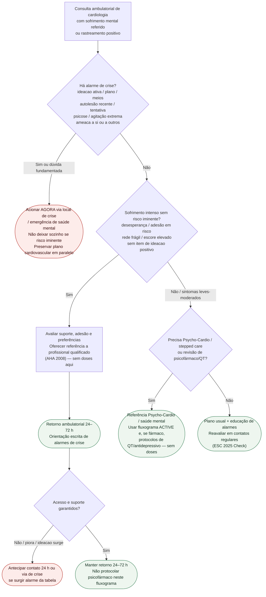

# Fluxograma ambulatorial: crise psiquiátrica — destino

Prosa: [`sinalizadores-ambulatoriais-crise-psiquiatrica-no-consultorio-de-cardiologia`](sinalizadores-ambulatoriais-crise-psiquiatrica-no-consultorio-de-cardiologia.md). Checklist: [`checklist-ambulatorial-alarme-crise-psiquiatrica-cardiopata`](checklist-ambulatorial-alarme-crise-psiquiatrica-cardiopata.md). Rastreamento ACTIVE: [`fluxograma-rastreamento-saude-mental-cuidado-escalonado-esc-2025`](fluxograma-rastreamento-saude-mental-cuidado-escalonado-esc-2025.md).

## Árvore de decisão

## Notas

- **D1** = gate de segurança (ESC 2025: urgência segue protocolo local; AHA 2008: ideacao no rastreamento → avaliação imediata).
- **D2** = sofrimento ambulatorial controlável com rede → destino clínico precoce + referência qualificada.
- **D3** = ponte para ACTIVE / Psycho-Cardio e para pacotes de QT/antidepressivo já existentes, **sem** decidir fármaco aqui.
- Não decide doses, ponto de corte único de escala nem periodicidade universal de rastreamento.
