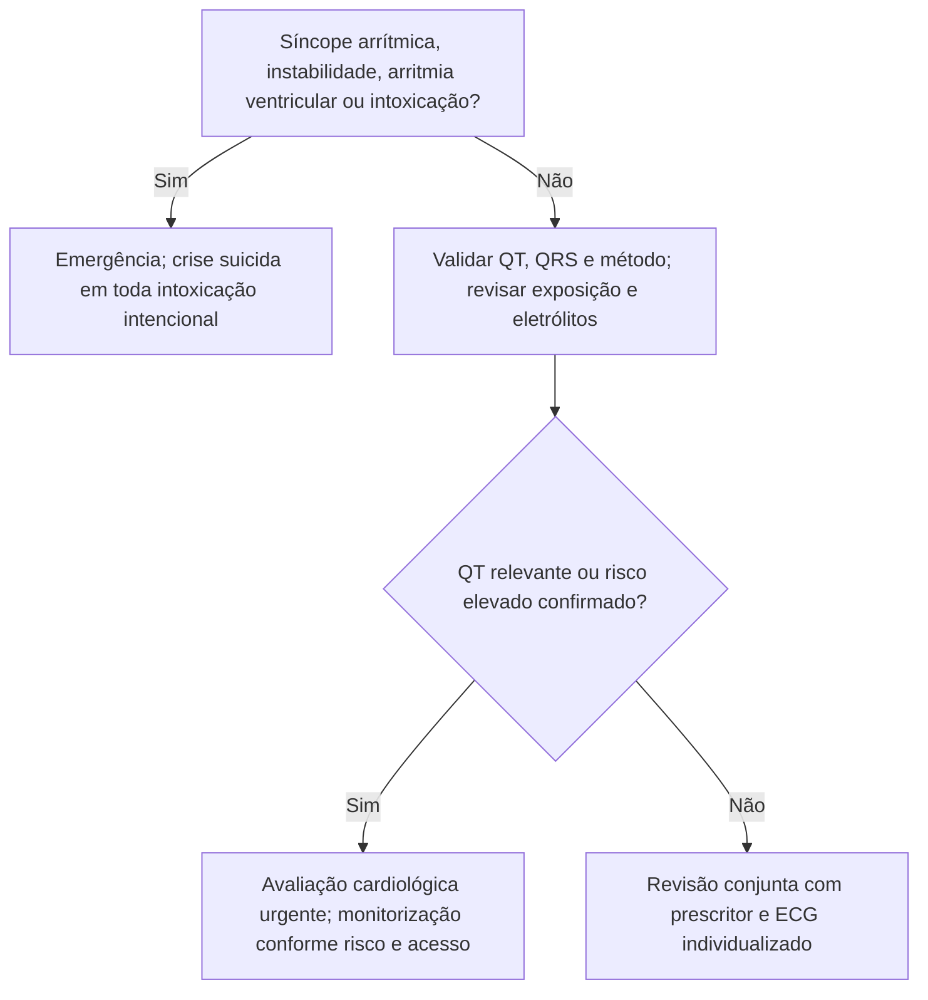

# Fluxograma ambulatorial: preocupação com QT por psicofármaco — PS agora vs. retorno precoce vs. Psycho-Cardio

Consulte o protocolo de sinalizadores do mesmo pacote para critérios e limites. Reavalie o destino após exames e diante de qualquer piora.

## Navegação

- [`sinalizadores-ambulatoriais-preocupacao-qt-psicofarmaco-quando-escalar`](/biblioteca/sinalizadores-ambulatoriais-preocupacao-qt-psicofarmaco-quando-escalar)
- [`checklist-ambulatorial-alarme-qt-psicofarmaco-cardiopata`](/biblioteca/checklist-ambulatorial-alarme-qt-psicofarmaco-cardiopata)
- [`fluxograma-escolha-de-antidepressivo-e-antipsicotico-no-cardiopata-risco-de-qt`](/biblioteca/fluxograma-escolha-de-antidepressivo-e-antipsicotico-no-cardiopata-risco-de-qt)
