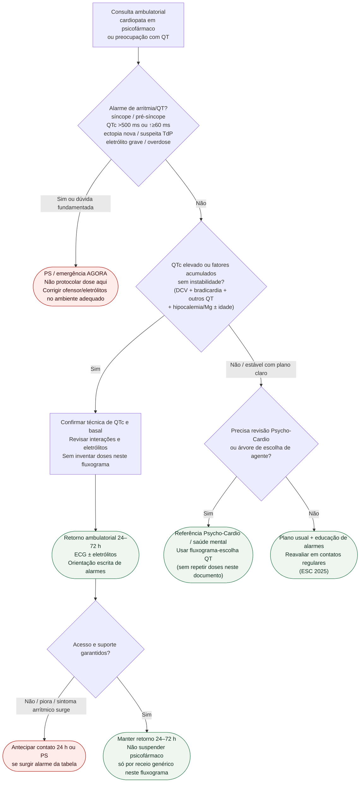

# Fluxograma ambulatorial: QT por psicofármaco — destino

Prosa: [`sinalizadores-ambulatoriais-preocupacao-qt-psicofarmaco-quando-escalar`](sinalizadores-ambulatoriais-preocupacao-qt-psicofarmaco-quando-escalar.md). Checklist: [`checklist-ambulatorial-alarme-qt-psicofarmaco-cardiopata`](checklist-ambulatorial-alarme-qt-psicofarmaco-cardiopata.md). Escolha de agente (com doses — **não duplicar aqui**): [`fluxograma-escolha-de-antidepressivo-e-antipsicotico-no-cardiopata-risco-de-qt`](fluxograma-escolha-de-antidepressivo-e-antipsicotico-no-cardiopata-risco-de-qt.md). Crise: [`fluxograma-ambulatorial-crise-psiquiatrica-destino-cardiologia`](fluxograma-ambulatorial-crise-psiquiatrica-destino-cardiologia.md).

## Árvore de decisão

## Notas

- **D1** = gate de segurança arrítmica (AHA/ACCF 2010 limiares de ação pronta).
- **D2** = risco acumulado ambulatorial controlável (Wenzel-Seifert) → retorno precoce.
- **D3** = ponte para Psycho-Cardio e para o fluxograma de **escolha** já existente — **sem doses aqui**.
- Não decide doses, periodicidade universal de ECG nem troca de classe isolada.
- Ideação/crise → usar pacote #847 em paralelo se coexistir.
