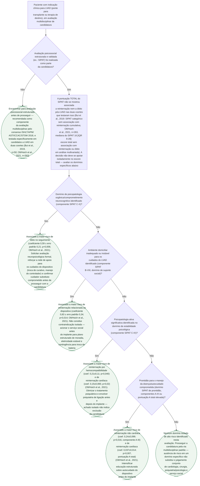

# Fluxograma: Avaliação Psicossocial Estruturada (SIPAT) na Candidatura ao LVAD

O consenso multissocietário ISHLT/APM/AST/ICCAC/STSW de 2018 recomenda a avaliação psicossocial estruturada como parte da candidatura a dispositivo de assistência ventricular esquerda (LVAD), tanto em ponte para transplante quanto em terapia de destino. O instrumento mais estudado nesse contexto é o SIPAT (Stanford Integrated Psychosocial Assessment for Transplantation), validado originalmente em transplante (fígado, coração, pulmão) e depois testado especificamente em candidatos a LVAD em duas coortes independentes. **O achado central dessas duas coortes muda a forma de usar o instrumento**: a pontuação TOTAL do SIPAT não previu reinternação nem óbito pós-LVAD — mas domínios específicos do próprio instrumento previram, cada um, um tipo diferente de desfecho adverso. Este fluxograma traduz esse achado em conduta por domínio, em vez de tratar o SIPAT como um escore único de corte.

## Árvore de decisão

## O que a árvore não mostra

**As duas coortes de LVAD são retrospectivas e unicêntricas** — Bui et al. (2019, UC San Diego, n=50) e Olt/Hsich et al. (2021, Cleveland Clinic, n=263). São hipótese-geradoras, não uma regra clínica prospectivamente validada como ferramenta específica de MCS; os próprios autores do estudo maior concluem que os achados "poderiam ser usados para criar uma ferramenta psicossocial específica do programa de LVAD" — ainda não existe essa ferramenta pronta.

**Um achado do estudo de Bui et al. (2019) foi deliberadamente deixado fora da árvore**: pontuação SIPAT mais alta (isto é, pior) associou-se a mais sangramento maior — direção contraintuitiva, sem explicação mecanística estabelecida no próprio artigo, numa amostra de apenas 50 pacientes. Incluir esse achado como nó de decisão correria o risco de sugerir uma relação causal que a fonte não sustenta.

**O consenso ISHLT/APM/AST/ICCAC/STSW 2018 (Dew et al.) é citado aqui como o documento-quadro que recomenda a avaliação psicossocial estruturada como parte da candidatura** — é um consenso de 27 especialistas de 6 sociedades, com revisão de literatura e opinião de especialistas, cobrindo conteúdo e processo da avaliação. O texto completo, com as recomendações específicas de conteúdo item a item, não foi acessado nesta verificação (bloqueio de acesso já registrado no acervo para outras diretrizes da mesma família de publicação) — por isso nenhuma recomendação numerada desse consenso foi citada individualmente aqui, só a existência e o escopo do documento, confirmados no próprio resumo indexado no PubMed.

**Não existe corte numérico do SIPAT aplicado a esta árvore de propósito.** O corte mais citado na literatura (≥21 associado a maior risco) vem sobretudo de estudos em transplante hepático, com valores de corte heterogêneos entre estudos (revisão de escopo de Olivero et al., 2026) — e nas duas coortes específicas de LVAD usadas aqui, foi exatamente a pontuação total que NÃO previu desfecho. Por isso a árvore segue os achados desta população específica (domínio, não escore de corte), em vez de importar um corte validado noutra população de transplante.

**As associações por domínio são estatísticas, obtidas em análise multivariável de coorte retrospectiva — não são, isoladamente, contraindicação à candidatura.** O próprio artigo de Olt/Hsich et al. propõe usá-las para orientar intervenção e acompanhamento mais próximo, não para excluir candidato. A decisão final de candidatura continua sendo do julgamento conjunto da equipe multidisciplinar.
