# Fluxograma: Cardiomiopatia de Takotsubo — Reconhecimento e Manejo Agudo

Takotsubo é diagnóstico de exclusão que se confunde clinicamente com síndrome coronariana aguda — dor torácica, alteração eletrocardiográfica nova e troponina elevada —, mas **doença coronariana obstrutiva concomitante não descarta o diagnóstico**: ela está presente em 10-29% dos casos de takotsubo, segundo o documento de consenso internacional que definiu os critérios InterTAK. Este fluxograma parte da apresentação aguda até as decisões de manejo que mais mudam a conduta em relação a uma síndrome coronariana aguda comum — sobretudo a obstrução dinâmica da via de saída do ventrículo esquerdo, presente em cerca de 20% dos casos, onde o tratamento inotrópico padrão pode piorar o quadro.

## Árvore de decisão

```mermaid
flowchart TD
  R0["Paciente com quadro sugestivo de takotsubo: dor torácica<br/>aguda e/ou dispneia, alterações eletrocardiográficas novas<br/>(supra ou infra de ST, inversão de onda T, prolongamento<br/>do QTc) e elevação de troponina/CK, frequentemente após<br/>gatilho emocional, físico ou neurológico — o gatilho não é<br/>obrigatório para o diagnóstico"] --> D1{"Coronariografia com ventriculografia esquerda urgente<br/>(ou angiotomografia coronária em paciente estável, de<br/>baixo risco ou com takotsubo recorrente) mostra disfunção<br/>contrátil regional do VE que se estende além do território<br/>de qualquer artéria obstruída, ou sem obstrução coronariana<br/>associada — abaulamento apical, médio-ventricular, basal<br/>ou focal?"}

  D1 -->|"Não — padrão restrito ao<br/>território da artéria obstruída"| C1(["Diagnóstico mais provável é infarto agudo do miocárdio<br/>clássico pela lesão coronariana obstrutiva identificada —<br/>padrão de contração restrito a um único território não<br/>sustenta takotsubo, mesmo com gatilho físico/emocional<br/>associado (o padrão típico do critério InterTAK é a<br/>extensão além de um único território)"])

  D1 -->|"Sim — estende-se além do<br/>território (ou sem obstrução)"| P1["Critérios diagnósticos InterTAK reunidos: biomarcadores<br/>(troponina/CK) moderadamente elevados, BNP frequentemente<br/>elevado, ausência de evidência de miocardite infecciosa,<br/>predomínio de mulheres na pós-menopausa; doença coronariana<br/>obstrutiva concomitante NÃO exclui o diagnóstico — presente<br/>em 10-29% dos casos de takotsubo (InterTAK, critério 6)"]
  P1 --> D2{"Ecocardiograma com Doppler mostra obstrução dinâmica<br/>da via de saída do VE (gradiente significativo) e/ou<br/>insuficiência mitral aguda grave por movimento sistólico<br/>anterior da valva mitral?"}

  D2 -->|"Sim"| C2(["Evitar nitroglicerina e catecolaminas — agravam o<br/>gradiente dinâmico, com mortalidade de até 20% descrita<br/>neste subgrupo; considerar betabloqueador de curta ação se<br/>não houver hipotensão, bradicardia ou insuficiência cardíaca<br/>aguda grave, ou levosimendana como inotrópico alternativo;<br/>otimizar volemia — obstrução da via de saída ocorre em<br/>cerca de 20% dos casos de takotsubo"])

  D2 -->|"Não"| D3{"Choque cardiogênico ou complicação hemodinâmica grave<br/>(hipotensão persistente, hipoperfusão), sem obstrução<br/>da via de saída do VE?"}

  D3 -->|"Sim"| C3(["Preferir levosimendana a catecolaminas como inotrópico —<br/>catecolaminas associadas a pior desfecho nesta síndrome;<br/>considerar suporte circulatório mecânico (balão intra-aórtico,<br/>ECMO veno-arterial) em choque refratário; complicações<br/>graves ocorrem em cerca de 1/5 dos pacientes com takotsubo,<br/>com mortalidade intra-hospitalar comparável à da síndrome<br/>coronariana aguda"])

  D3 -->|"Não"| D4{"Monitorização eletrocardiográfica mostra QTc muito<br/>prolongado, com risco de arritmia ventricular maligna<br/>(arritmia ventricular documentada em 3,0-8,6% dos casos<br/>de takotsubo)?"}

  D4 -->|"Sim"| C4(["Manter monitorização eletrocardiográfica contínua, corrigir<br/>distúrbio eletrolítico, suspender fármacos que prolongam o<br/>QT; considerar desfibrilador vestível em prolongamento<br/>excessivo ou arritmia com risco de vida; marca-passo<br/>temporário se bradicardia hemodinamicamente significativa;<br/>CDI tem valor incerto dado o caráter potencialmente<br/>reversível da disfunção"])

  D4 -->|"Não"| D5{"Disfunção ventricular extensa (abaulamento apical amplo,<br/>acinesia extensa) com risco aumentado de trombo mural<br/>apical?"}

  D5 -->|"Sim"| C5(["Anticoagulação com heparina intravenosa ou subcutânea<br/>enquanto durar a disfunção extensa; individualizar<br/>anticoagulação oral ou antiagregação após a alta, conforme<br/>resolução da acinesia e achado de trombo"])

  D5 -->|"Não"| C6(["Tratamento de suporte no paciente hemodinamicamente<br/>estável: considerar inibidor da ECA/BRA e betabloqueador<br/>enquanto houver disfunção do VE — extrapolado do manejo<br/>geral da insuficiência cardíaca, sem ensaio randomizado<br/>dedicado a takotsubo; reavaliação ecocardiográfica seriada,<br/>já que a contratilidade tipicamente se recupera por completo<br/>em 4 a 8 semanas"])

  classDef conduta fill:#eef6ef,stroke:#2f7a4f,color:#12301f;
  class C1,C2,C3,C4,C5,C6 conduta;
```

## O que a árvore não mostra

**Coronariografia com obstrução não encerra a investigação.** O critério InterTAK de número 6 é explícito — "significant coronary artery disease is not a contradiction in takotsubo syndrome" —, e o próprio documento de consenso descreve que síndrome coronariana aguda e takotsubo podem coexistir, sendo frequentemente confundidos com SCA clássica quando isso acontece. A pergunta que decide não é "há lesão?", mas "a disfunção contrátil observada é explicada inteiramente por essa lesão, ou a ultrapassa?".

**A angiotomografia coronária é alternativa aceita à cateterismo invasivo em cenários específicos** — paciente estável, takotsubo recorrente já com padrão conhecido, ou paciente criticamente enfermo em quem a invasão adicional traz risco desproporcional —, mas o próprio documento de consenso mantém a coronariografia com ventriculografia como padrão-ouro para apresentação com supra de ST, onde excluir infarto agudo com segurança é prioridade imediata.

**A obstrução dinâmica da via de saída do VE é o ponto do fluxograma com maior potencial de dano se não for reconhecido**: o reflexo de tratar hipotensão com catecolamina — a conduta padrão em choque de outras causas — pode agravar exatamente o mecanismo que está causando a hipotensão nesse subgrupo, e a fonte descreve mortalidade de até 20% associada a esse uso.

**As quatro variantes anatômicas (apical, médio-ventricular, basal e focal) não mudam a árvore de decisão**, que trata do reconhecimento e do manejo agudo comuns a todas — a variante apical é a mais frequente, e é dela que vem o nome da síndrome (abaulamento em forma de vaso de pesca usado para capturar polvo, "tako-tsubo" em japonês), mas basal e focal já têm reconhecimento próprio descrito noutro documento desta pasta.

**Cardioversor-desfibrilador implantável tem valor incerto** justamente porque a disfunção de takotsubo é tipicamente reversível em 4 a 8 semanas — implantar um dispositivo permanente para uma arritmia associada a uma disfunção transitória é decisão que pesa o risco imediato de arritmia maligna contra a experiência de que a maioria recupera a função sem sequela.
