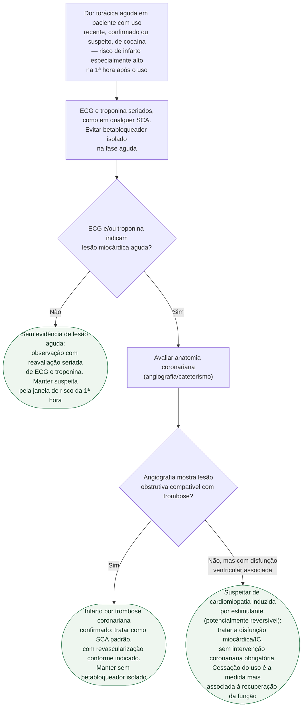

# Dor torácica aguda com uso recente confirmado ou suspeito de cocaína

A cocaína eleva o risco de início de infarto em **23,7 vezes** na hora seguinte
ao uso, efeito abrupto e transitório que cai rapidamente depois dessa janela
(Mittleman et al., 1999). A avaliação inicial segue o padrão de qualquer
síndrome coronariana aguda, mas duas particularidades mudam a conduta: evitar
betabloqueador isolado, e diferenciar infarto por trombose coronariana
verdadeira de disfunção miocárdica induzida pelo estimulante — que pode ser
reversível.

## Árvore de decisão

## O que se repete em todo ramo, e por isso não está no diagrama

**Reavaliação seriada de ECG e troponina** enquanto durar a dor ou a suspeita,
independente do ramo em que o paciente estiver.

**Suporte geral de qualquer dor torácica aguda** — monitorização contínua,
acesso venoso, oxigênio se houver hipoxemia — corre em paralelo, em qualquer
ramo.

**Perguntar diretamente sobre uso de substância** faz parte da anamnese em
qualquer paciente jovem com dor torácica ou disfunção ventricular nova, mesmo
sem fator de risco cardiovascular clássico — é informação que o paciente
frequentemente não oferece espontaneamente.

## Por que evitar betabloqueador isolado

A mesma ressalva farmacológica vale aqui e no fluxograma desta coleção sobre
vasoespasmo coronariano induzido por cocaína: o bloqueio beta isolado deixaria
a vasoconstrição alfa-adrenérgica sem oposição. Essa recomendação é amplamente
citada na literatura de emergência, mas **VERIFICAÇÃO HUMANA NECESSÁRIA** — a
declaração científica dedicada da American Heart Association que a sustenta
(McCord et al., 2008) está bloqueada por paywall e não foi lida na íntegra
nesta sessão.

## Por que a disfunção sem lesão obstrutiva pode não ser um infarto definitivo

O mecanismo da cocaína inclui vasoconstrição coronariana direta, inclusive de
segmentos sem placa angiograficamente visível — ou seja, dano miocárdico sem
trombose obstrutiva é biologicamente plausível na apresentação aguda. A
evidência de que essa disfunção pode reverter vem da cardiomiopatia associada
à metanfetamina (MACM): numa coorte de 30 pacientes com biópsia
endomiocárdica, a fração de ejeção subiu de **19 ± 6% para 43 ± 13%** entre os
que pararam de usar, e não melhorou entre os que mantiveram o uso (Schürer et
al., 2017), padrão confirmado em coorte independente (Sliman et al., 2016). O
dado prático: **fração de ejeção baixa na apresentação não prediz, sozinha, o
prognóstico** — a resposta à cessação do uso é o que separa quem recupera de
quem não recupera, o que torna o encaminhamento a tratamento de transtorno por
uso de substância parte central da conduta, não um adendo social.
