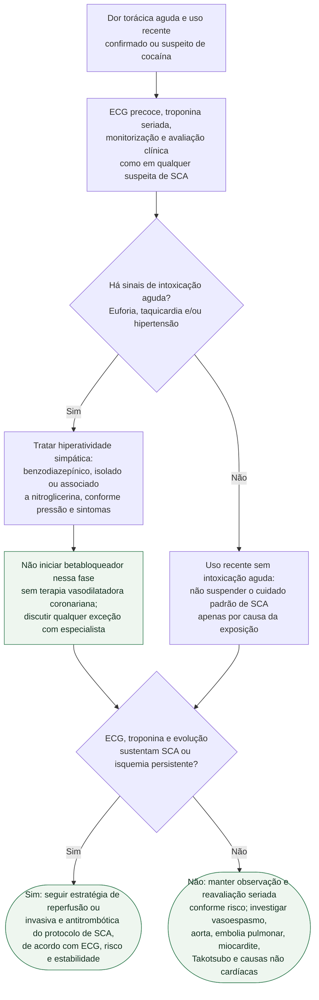

# Dor torácica aguda com uso recente confirmado ou suspeito de cocaína

A cocaína foi associada a risco **23,7 vezes maior de início de infarto na
primeira hora** após o uso no estudo caso-cruzado de Mittleman et al. (1999).
Esse dado aumenta a suspeita, mas não substitui ECG, troponina e estratificação
clínica. A decisão que realmente muda o fluxo é distinguir **história recente de
uso** de **intoxicação aguda em curso** — euforia, taquicardia e/ou hipertensão.

## Árvore de decisão

## A regra do betabloqueador, sem generalização indevida

A diretriz AHA/ACC 2014 recomenda que o paciente com SCA e história recente de
cocaína ou metanfetamina seja tratado da mesma forma que o paciente sem essa
exposição. A exceção é a presença de **sinais de intoxicação aguda**: nesse
contexto, betabloqueador não deve ser administrado sem terapia vasodilatadora
coronariana, pelo risco de potencializar espasmo (Classe III: dano, nível C).
Benzodiazepínico, isolado ou com nitroglicerina, é opção razoável para controlar
hipertensão e taquicardia nessa fase (Classe IIa, nível C).

Isso não equivale a proibição permanente. A metanálise de Lo et al. reuniu cinco
estudos observacionais e 1.447 pacientes com dor torácica associada a cocaína e
não encontrou diferença significativa de infarto (RR 1,08; IC 95% 0,61–1,91)
ou mortalidade (RR 0,75; IC 95% 0,46–1,24) entre quem recebeu e quem não recebeu
betabloqueador. A ausência de ensaios randomizados e a mistura de pacientes com
e sem intoxicação ativa impedem usar esse resultado para revogar a cautela no
ramo agudo; ele serve para impedir a extrapolação da contraindicação para todo
uso passado, insuficiência cardíaca crônica ou alta hospitalar.

## Limites e segurança

- Troponina positiva não obriga cateterismo em todos os casos; o tempo e a via
  invasiva dependem do ECG, da estabilidade, da probabilidade de SCA e dos
  diagnósticos alternativos, como nos protocolos gerais.
- Dados de recuperação ventricular após abstinência de **metanfetamina** não
  demonstram, por si, reversibilidade de uma disfunção atribuída à cocaína.
- A janela de maior risco na primeira hora não autoriza alta imediata após ela;
  observação e exames seriados são definidos pelo risco clínico e pelo protocolo
  institucional.

## Tudo com Tudo

- [Fluxograma geral de síndrome coronariana aguda (ESC 2023)](../Doença_coronariana/fluxograma-sindrome-coronariana-aguda-esc-2023.md)
- [Diretriz de síndrome coronariana aguda (ACC/AHA 2025)](../Doença_coronariana/acc-aha-2025-diretriz-sindrome-coronariana-aguda.md)
- [Protocolo de dor torácica na emergência (SBC 2025)](../Doença_coronariana/protocolo-de-dor-toracica-na-emergencia-escore-heart-e-tempo-porta-ecg-sbc-2025.md)
- [Fluxograma farmacológico do vasoespasmo por cocaína](../Geral/fluxograma-dor-toracica-e-sca-por-vasoespasmo-coronariano-induzido-por-cocaina.md)
- [Cardiotoxicidade aguda por cocaína e arritmia por bloqueio de sódio](../Terapia_intensiva/cardiotoxicidade-aguda-por-cocaina-vasoespasmo-bloqueio-de-canal-de-sodio-e-por-que-nao-usar-betabloqueador-isolado.md)
- [Cocaína, metanfetamina, infarto e cardiomiopatia: limites de extrapolação](cocaina-e-metanfetamina-infarto-desencadeado-na-primeira-hora-e-cardiomiopatia-reversivel.md)
