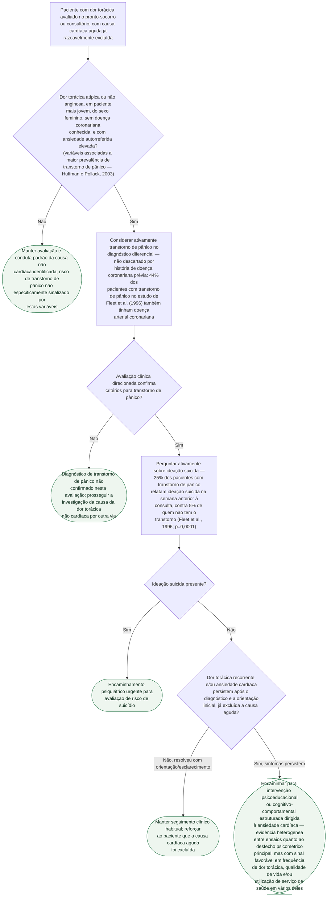

# Fluxograma: Dor Torácica Não Cardíaca com Ansiedade — Suspeita de Transtorno de Pânico e Encaminhamento

Cerca de 25% de quem procura o pronto-socorro com dor torácica tem transtorno de pânico — e, no estudo que mediu isso, **98% desses casos passaram despercebidos** pelos próprios cardiologistas plantonistas. Este fluxograma parte de onde o documento de diagnóstico diferencial já publicado nesta pasta termina — a suspeita do transtorno — e segue até a decisão de encaminhamento para intervenção estruturada da ansiedade cardíaca, juntando os dois documentos já existentes sobre o tema (diagnóstico diferencial e tratamento por terapia cognitivo-comportamental).

## Árvore de decisão

## O que a árvore não mostra

**A presença de doença coronariana não descarta transtorno de pânico**, e o inverso também não é verdade — as duas condições coexistem em quase metade dos casos do estudo de Fleet et al. A suspeita de transtorno de pânico orienta investigação psiquiátrica em paralelo, nunca substitui avaliação cardíaca quando ela é clinicamente indicada.

**O comparador importa tanto quanto a intervenção** no encaminhamento para terapia estruturada: contra cuidado habitual sem estrutura, a terapia cognitivo-comportamental pela internet reduziu ansiedade cardíaca com significância; contra psicoeducação já estruturada, não mostrou superioridade no desfecho psicométrico principal, ainda que tenha favorecido frequência de dor e qualidade de vida no seguimento mais longo. Isso não é razão para deixar de encaminhar — é razão para não prometer resposta garantida no instrumento de ansiedade especificamente.

**Nenhum dos ensaios de terapia cognitivo-comportamental aqui usados testou pacientes com angina por isquemia documentada** — a população de referência é dor torácica já classificada como não cardíaca, ou ansiedade de saúde/dor torácica recorrente sem achado físico.
