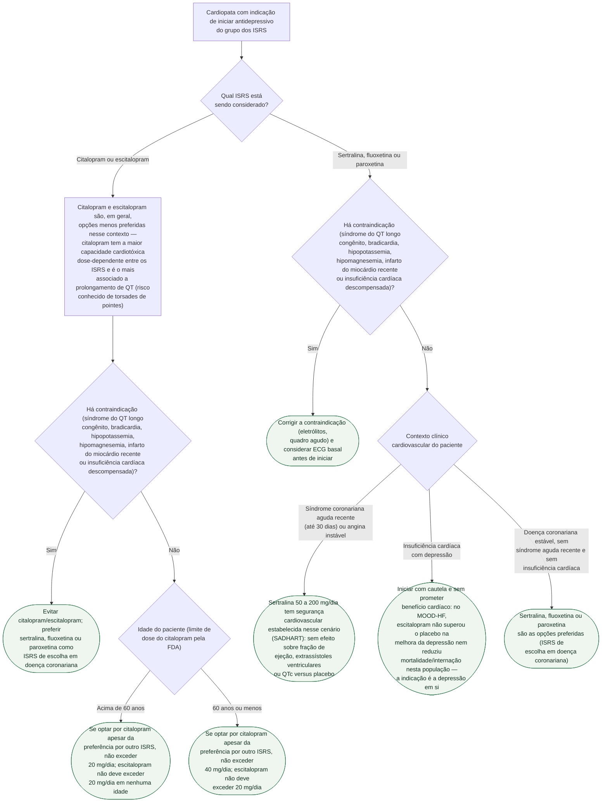
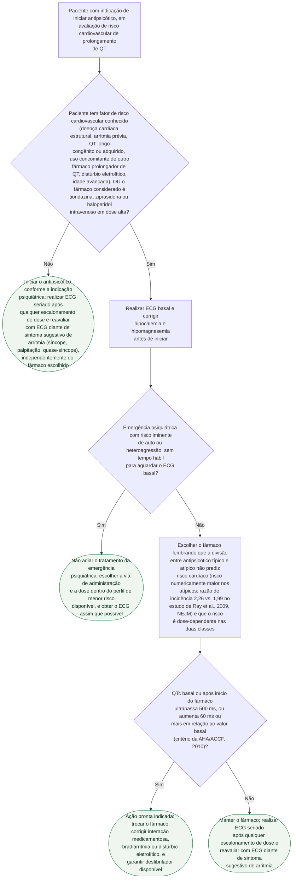

# Fluxograma: Escolha de Antidepressivo e Antipsicótico no Cardiopata — Risco de Prolongamento de QT

Duas classes de psicofármacos, dois documentos já publicados nesta pasta, duas árvores separadas — porque a lógica de decisão de cada classe é distinta. Antidepressivo: a escolha entre ISRS já embute o risco de QT (citalopram e escitalopram no topo do risco), e o cenário cardiovascular do paciente (síndrome coronariana aguda recente vs. insuficiência cardíaca) muda a expectativa de benefício. Antipsicótico: a decisão gira em torno de quando pedir ECG basal e quando agir diante de um QTc alterado, sem que a divisão típico/atípico sirva de critério de segurança.

## Árvore de decisão: escolha de antidepressivo no cardiopata

## Árvore de decisão: escolha de antipsicótico e monitorização de QT

## O que as árvores não mostram

**O risco cardíaco de um paciente polimedicado é cumulativo, não do fármaco isolado.** Além dos antipsicóticos e do citalopram, quetiapina, amisulprida e antidepressivos tricíclicos/tetracíclicos também aparecem entre os relatos de prolongamento de QTc — a avaliação de risco precisa somar toda a farmacoterapia.

**Não existe protocolo numerado e universal de periodicidade de ECG por fármaco** — duas revisões independentes (Wenzel-Seifert et al. e Beach et al.) concluem que a frequência de monitorização deve ser individualizada pelo fármaco e pelos fatores de risco do paciente, não fixada em uma tabela.

**Suspender o antipsicótico por receio cardiovascular tem custo de mortalidade próprio** — já documentado no acervo desta pasta (esquizofrenia e mortalidade cardiovascular): a decisão correta é estratificar risco e trocar por fármaco de perfil mais favorável, não interromper o tratamento psiquiátrico.
