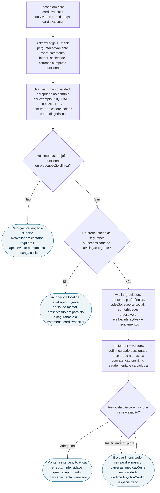
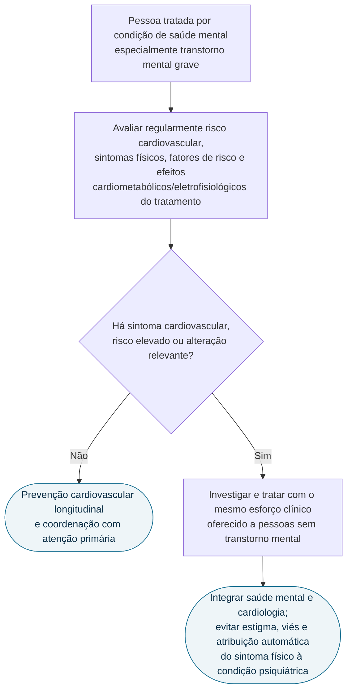

# Fluxograma: saúde mental no cuidado cardiovascular (ESC 2025)

O consenso ESC 2025 propõe integrar saúde mental ao cuidado cardiovascular com os princípios **ACTIVE**: reconhecer a relação bidirecional, checar sintomas, usar ferramentas validadas, implementar cuidado centrado na pessoa, criar colaboração e avaliar a evolução. A árvore abaixo organiza esse processo; ela **não é um algoritmo validado nem uma recomendação graduada**.

## Entrada pelo cuidado cardiovascular

O instrumento é escolhido pela pergunta clínica e pelo contexto. O consenso nomeia ferramentas validadas, mas não elege uma única escala obrigatória nem autoriza diagnosticar depressão, ansiedade ou estresse pós-traumático apenas pelo resultado de rastreamento.

## Entrada pelo cuidado em saúde mental

Essa segunda entrada combate o **diagnostic overshadowing**: sintomas cardiovasculares não devem ser descartados como “ansiedade” ou consequência inevitável do transtorno mental sem avaliação clínica adequada.

## Time Psycho-Cardio e cuidado escalonado

O time Psycho-Cardio não precisa ter composição idêntica em todos os serviços. O princípio é garantir comunicação entre cardiologia, atenção primária e profissionais de saúde mental, envolvendo enfermagem, assistência social, reabilitação e cuidadores conforme a necessidade e os recursos locais.

Cuidado escalonado significa começar pela intervenção menos intensiva que seja adequada à gravidade, segurança e preferência; reavaliar; e aumentar, manter ou reduzir a intensidade conforme a resposta. Não significa oferecer intervenção mínima a toda pessoa nem atrasar avaliação urgente.

## Conteúdo CorVIA conectado

- [Consenso clínico ESC 2025: saúde mental e doença cardiovascular](/biblioteca/saude-mental-e-doenca-cardiovascular-consenso-clinico-esc-2025)
- [Depressão pós-infarto e prognóstico cardiovascular](/biblioteca/depressao-pos-infarto-como-fator-de-risco-cardiovascular-van-melle-e-enrichd)
- [Segurança cardiovascular de antidepressivos](/biblioteca/seguranca-cardiovascular-de-psicofarmacos-antidepressivos-e-doenca-cardiaca)
- [Antipsicóticos, QT e morte súbita](/biblioteca/antipsicoticos-e-prolongamento-de-qt-risco-de-morte-subita-cardiaca)
- [Disparidade cardiovascular no transtorno mental grave](/biblioteca/disparidade-no-cuidado-cardiovascular-do-transtorno-mental-grave)

## Limites

- O consenso usa Delphi modificado, não classes tradicionais de recomendação e níveis de evidência.
- Rastreamento não substitui entrevista clínica nem avaliação diagnóstica.
- O documento não fixa escala, ponto de corte ou periodicidade universal.
- A base de evidência para melhorar desfechos cardiovasculares duros por meio do rastreamento e tratamento de saúde mental ainda tem lacunas.
- Situações urgentes seguem o protocolo local de segurança e emergência; este fluxo não o substitui.
