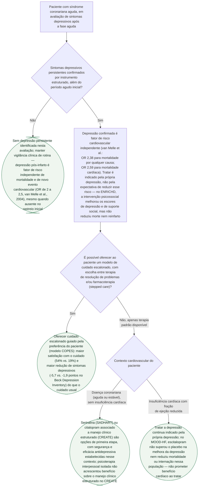

# Fluxograma: Rastreio e Manejo da Depressão Após Síndrome Coronariana Aguda

Depressão pós-infarto não tratada dobra o risco de morte e de novo evento cardiovascular. Mas os três ensaios que testaram tratá-la — ENRICHD, CREATE e MOOD-HF — mostram algo que não decorre automaticamente dessa associação: **melhorar o sintoma depressivo não reduziu, em nenhum deles, mortalidade ou reinfarto.** Este fluxograma une o rastreio (por que ele importa, mesmo sem prometer benefício cardíaco) ao modelo de cuidado (COPES) e à escolha farmacológica por contexto clínico (SADHART, CREATE, MOOD-HF), reunindo três documentos já publicados nesta pasta que, até aqui, tratavam cada pergunta em separado.

## Árvore de decisão

## O que a árvore não mostra

**A magnitude do risco associado à depressão não é fixa no tempo** — a própria metanálise de van Melle mostrou atenuação (embora não eliminação) do risco nos estudos mais recentes, possivelmente refletindo evolução do tratamento cardiológico padrão.

**O braço placebo do MOOD-HF também melhorou muito** (escala de depressão caindo de 21,4 para 12,5) — o que sugere que cuidado estruturado e contato regular têm efeito relevante por si só, independentemente do fármaco.

**Nenhum dos ensaios aqui citados testou terapia cognitivo-comportamental especificamente** — o braço psicoterápico do ENRICHD e do CREATE usou, respectivamente, terapia cognitivo-comportamental geral e psicoterapia interpessoal; os resultados não devem ser generalizados para todo formato de psicoterapia.

**Checar interação medicamentosa e QTc antes de escolher o antidepressivo** — a segurança estabelecida pelo SADHART é de fármacos específicos (sertralina, citalopram), não da classe inteira; ver o fluxograma de escolha de antidepressivo e antipsicótico no cardiopata, nesta mesma pasta.
