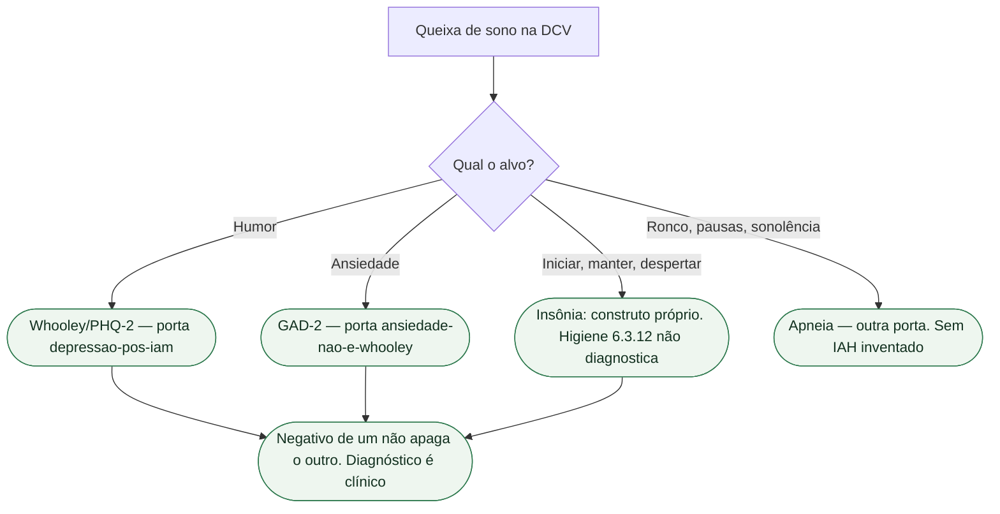

# Insônia não é depressão e não é Whooley

Três coisas se misturam na alta: **insônia**, **depressão** e o **rastreio de Whooley**. O consenso ESC 2025 (Bueno, Deaton et al., *Eur Heart J*. 2025;**46**:4156-4225; PMID **40878270**) nomeia depressão e ansiedade na seção **6.2.1** e higiene do sono na **6.3.12**. Não funde as três.

Não há Classe ESC no consenso. Rastreio psicológico (depressão **e** ansiedade) na RC é **I C** da Table 20 da ESC 2026 — no **rastreio de humor e ansiedade**, não no sono. Intervenção psicológica em DAC/IC e TCC em DAC/IC/CDI: I B1. Não colar I B1 numa queixa de “não durmo”. Higiene do sono no consenso é **estilo de vida**, não instrumento diagnóstico.

## Três construtos, três portas

**Depressão** é humor: anedonia, desesperança. O consenso nomeia **Whooley** e **PHQ-2** para esse alvo; tela positiva pede **PHQ-9**. Perguntas, corte do PHQ-2 e Table 4 **já estão** na porta de rastreio. **Não se repetem aqui.** Whooley positivo **não** é diagnóstico. Whooley negativo **não** encerra o sono.

**Insônia** é outro construto: dificuldade de **iniciar** o sono, de **manter** o sono ou despertar não restaurador, com prejuízo diurno, apesar de oportunidade de dormir. Javaheri e Redline (PMID **28153671**) tratam insônia como **transtorno do sono**, comórbido com depressão e com DCV, **não** como sinônimo de episódio depressivo. As duas entidades merecem manejo **separado**. Carney, Freedland e Rich (PMID **39048281**) observam que insônia — com fadiga e anedonia — **pode permanecer** depois do tratamento da depressão e, nessa persistência, associa-se a eventos. Tratar o humor **não** apaga automaticamente o sono. Não transformar essa revisão em prova de que “tratar insônia reduz morte”: os autores pedem pesquisa. **Não há RCT de desfecho de morte nesta ficha.**

**Whooley** rastreia **humor**. Um ou dois “sim” abrem avaliação de depressão — não de insônia. Não é DSM de sono, não é CID de insônia, não é GAD, não é apneia, não é o quarto componente da RC. “Whooley negativo, então o sono está bem” apaga iniciação, manutenção e despertar. Item de sono dentro de um questionário de depressão **não** fecha transtorno de insônia. Um questionário de humor não substitui investigação específica do sono.

A associação entre insônia e eventos cardiovasculares não demonstra que tratar insônia reduza mortalidade. A avaliação deve distinguir sono inadequado, transtorno de insônia e causas respiratórias ou clínicas.

## O que não herda

Queixa de sono **pode** ser insônia, depressão, ansiedade, apneia, diurético tardio, betabloqueador, dor, telas ou vários ao mesmo tempo. Whooley não decide. PHQ-9 positivo **não** cancela apneia. ISRS **IIa B2** da Table 20 da RC é **depressão** maior moderada a grave em DAC — não insônia. Não prescrever ISRS “porque não dorme”. Não prescrever benzodiazepínico porque o rastreio acendeu ou porque a noite foi ruim: o consenso pede cuidado com uso excessivo de ansiolítico. Esta ficha **não** inventa classe de hipnótico. O consenso§6.3.12 inclui higiene do sono e terapia cognitivo-comportamental para insônia, sem atribuir classe formal. Horários regulares, evitar estimulantes perto de dormir e reduzir luz/ruído podem ajudar. Apneia obstrutiva é **outra porta** — sem IAH inventado.

## Frase da consulta

> “Insônia não é depressão. Whooley não mede o sono. Dificuldade de pegar no sono, de manter ou de acordar sem descanso pede a conversa do sono — e a RC continua, mesmo com rastreio de humor negativo.”

Não diga “está deprimido porque não dorme”. Não diga “é só insônia”. Não prometa que rastrear humor ou higienizar o sono reduz morte. Não invente prevalência.

## Tudo com Tudo

- [Ansiedade não é depressão e não é Whooley](/biblioteca/ansiedade-nao-e-depressao-e-nao-e-whooley)
- [Consenso ESC 2025: saúde mental e doença cardiovascular](/biblioteca/consenso-esc-2025-saude-mental-e-doenca-cardiovascular)
- [Depressão pós-IAM: Whooley e PHQ-2 rastreiam; não diagnosticam](/biblioteca/depressao-pos-iam-rastreio-whooley-nao-e-diagnostico)
- [Medo de choque do CDI não é depressão](/biblioteca/medo-de-choque-do-cdi-nao-e-depressao)
