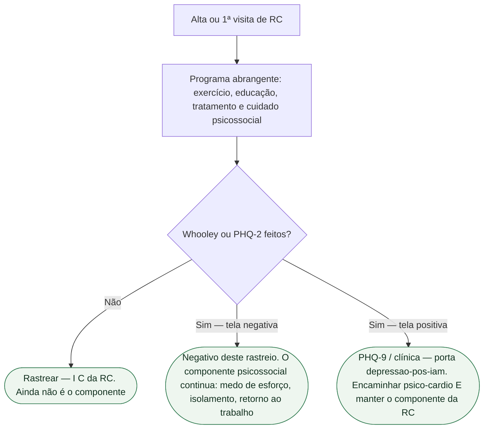

# RC tem componente psicossocial: rastreio não substitui o programa

A frase que esta porta recusa: “fiz Whooley na alta, então o componente mental da reabilitação está feito.” Whooley e PHQ-2 **rastreiam**. Não tratam. Não são o quarto componente da reabilitação cardíaca (RC). Neste resumo, agrupamos o programa em **quatro eixos didáticos**, sem pretender reproduzir a lista completa de componentes da ESC 2026: exercício, educação, fármacos e **cuidado psicossocial**. Tirar a quarta peça não deixa um programa “quase completo”. Deixa um treino com um questionário na pasta.

Esta ficha **não** republica o mapa do consenso (`consenso-esc-2025-saude-mental-e-doenca-cardiovascular`) nem a porta de rastreio pós-IAM (`depressao-pos-iam-rastreio-whooley-nao-e-diagnostico`). Lá estão as duas perguntas, o ponto de corte do PHQ-2 e o que **não** é diagnóstico. Aqui a pergunta é outra: o rastreio **não substitui** o componente psicossocial do programa.

## Quatro eixos didáticos — incluindo cuidado psicossocial

A primeira diretriz ESC dedicada a RC (Bäck, Wilhelm, Hansen; DOI 10.1093/eurheartj/ehag099) trata o programa como tratamento, não como “academia após a alta”. Os quatro eixos usados neste resumo:

1. **Exercício** — treinamento físico prescrito, não “caminhe em casa quando der”.
2. **Educação** — estilo de vida, medicamentos, decisão compartilhada.
3. **Fármacos** — a RC não suspende a terapia fundacional; o programa trabalha adesão.
4. **Cuidado psicossocial** — medo de esforço, humor, isolamento, confiança, retorno ao trabalho.

O press de 28 de agosto de 2026 descreve o programa eficaz como combinação de treinamento físico, **suporte emocional** e educação personalizada. Qualidade de vida entra no vocabulário de desfecho ao lado da aptidão. RC deixa de ser “só esteira”.

Não fundir educação com psicossocial: explicar o infarto **não** é tratar o medo de esforço. Não fundir fármaco com psicossocial: ISRS, quando couber, **não** é o programa.

## O que o rastreio faz — e o que ele não entrega

Whooley e PHQ-2 são medidas de **dois itens**. Tela positiva para depressão pede PHQ-9; ansiedade é rastreada separadamente com GAD-2 e aprofundada com GAD-7 se positivo e, se a clínica sugerir transtorno, equipe **psico-cardio**. Diagnóstico é clínico. Isso está em `depressao-pos-iam-rastreio-whooley-nao-e-diagnostico`. **Não** repetir aqui as perguntas nem a prevalência.

O que esta porta acrescenta:

- Rastreio na avaliação abrangente da RC é **recomendado** — **I C** da Table 20 da ESC 2026. Classe no **rastreio**, não no Whooley como se o consenso tivesse virado diretriz.
- Intervenção psicológica em DAC e IC é **I B1**. TCC em DAC, IC e portador de CDI é **I B1**. Isso é **terapia**, não o escore de dois itens.
- Rastrear e não encaminhar é teatro. Rastrear e não abrir o componente psicossocial da RC é o mesmo teatro com outro nome.

Tela **negativa** não dispensa o componente. Medo de esforço e isolamento entram no programa mesmo quando o Whooley veio “não e não”. Tela **positiva** não é ISRS na alta. Classes de ISRS (IIa B2 no recorte DAC + depressão maior moderada a grave) e a Table 20 integral moram em `saude-mental-como-componente-da-reabilitacao-cardiaca-esc-2025-2026`. Esta ficha não as republica.

## Frase da alta

> “Duas perguntas não são reabilitação. Elas só dizem se a gente precisa aprofundar o humor. O programa inclui — exercício, educação, medicamentos e o cuidado da cabeça. As quatro entram no encaminhamento.”

Não diga “está deprimido porque o Whooley deu sim”. Não diga “Whooley negativo, então RC sem psicólogo”. Não prometa que rastrear reduz morte. Não chame o questionário de terapia.

## O que não fazer

- Colar o Whooley na ficha e marcar o componente psicossocial como “cumprido”.
- Encaminhar RC “só de exercício” porque o humor “fica para o psiquiatra”.
- Transformar PHQ-2 positivo em ISRS na enfermaria.
- Copiar I C do rastreio para a intervenção, ou I B1 da intervenção para o questionário.
- Inventar que o consenso ESC 2025 (PMID 40878270) tem classe. Classe sai da Table 20 da RC 2026.

## Tudo com Tudo

- **Saúde mental e cardiologia.** Esta porta: rastreio ≠ componente. Rastreio pós-IAM: `depressao-pos-iam-rastreio-whooley-nao-e-diagnostico`. Mapa: `consenso-esc-2025-saude-mental-e-doenca-cardiovascular`.
- **Reabilitação cardíaca.** Eixos do cuidado e Table 20: `saude-mental-como-componente-da-reabilitacao-cardiaca-esc-2025-2026`. Encaminhamento: `fluxograma-encaminhamento-reabilitacao-cardiaca-esc-2026`.
- **Doença coronariana.** Depois do IAM, rastreio **e** RC multicomponente. Um não apaga o outro.
- **Comunicação clínica.** SPIKES organiza a alta; o Knowledge inclui perguntar humor. Não substituir números por um escore de dois itens.
- **Insuficiência cardíaca.** Intervenção psicológica I B1 na Table 20 da RC. Não copiar classe da IC para o Whooley.
- **Dispositivos.** TCC em portador de CDI é I B1 — depois do rastreio, dentro do componente.

## Limite editorial

DOI ehag099 (ESC 2026 RC) e PMID 40878270 (consenso 2025). Agrupamento didático, sem afirmar número oficial de componentes. Whooley/PHQ-2 = rastreio, não terapia. Sem republicar perguntas da porta `depressao-pos-iam-rastreio-whooley-nao-e-diagnostico`. Sem inventar que rastrear reduz morte. Consenso ≠ Classe. Diagnóstico ≠ escore. Componente psicossocial ≠ questionário.
