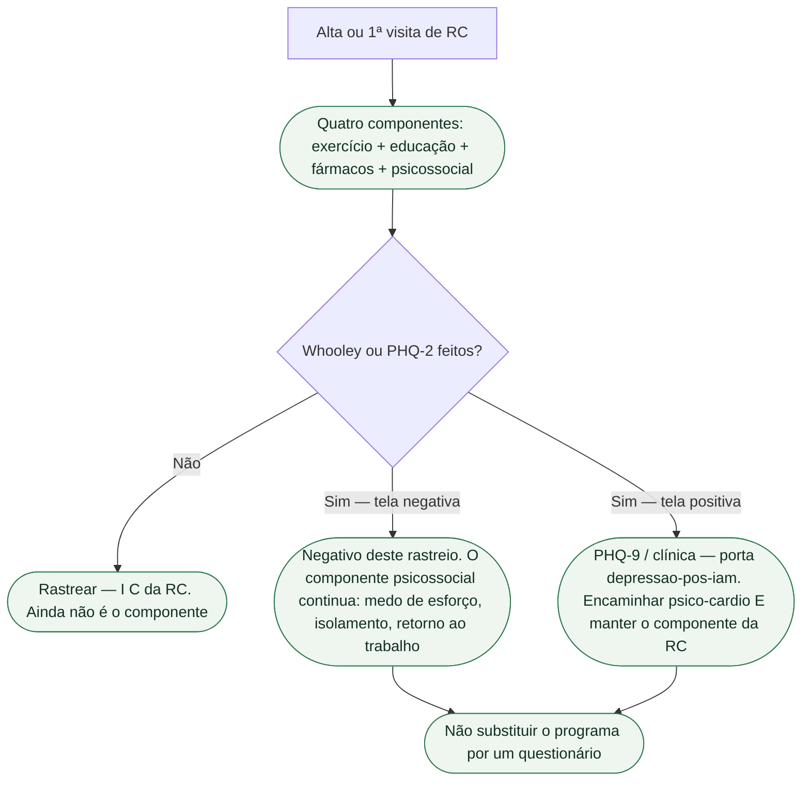

# RC tem componente psicossocial: rastreio não substitui o programa

A frase que esta porta recusa: “fiz Whooley na alta, então o componente mental da reabilitação está feito.” Whooley e PHQ-2 **rastreiam**. Não tratam. Não são o quarto componente da reabilitação cardíaca (RC). Podemos organizar didaticamente a RC em quatro eixos: exercício, educação, fármacos e **cuidado psicossocial**. Tirar a quarta peça não deixa um programa “quase completo”. Deixa um treino com um questionário na pasta.

Rastrear identifica necessidades; cuidar inclui intervenção e acompanhamento.

## Componentes do cuidado — o psicossocial faz parte

A primeira diretriz ESC dedicada a RC (Bäck, Wilhelm, Hansen; DOI 10.1093/eurheartj/ehag099) trata o programa como tratamento, não como “academia após a alta”. Eixos práticos, que não esgotam todos os componentes formais da diretriz:

1. **Exercício** — treinamento físico prescrito, não “caminhe em casa quando der”.
2. **Educação** — estilo de vida, medicamentos, decisão compartilhada.
3. **Fármacos** — a RC não suspende a terapia fundacional; o programa trabalha adesão.
4. **Cuidado psicossocial** — medo de esforço, humor, isolamento, confiança, retorno ao trabalho.

O press de 28 de agosto de 2026 descreve o programa eficaz como combinação de treinamento físico, **suporte emocional** e educação personalizada. Qualidade de vida entra no vocabulário de desfecho ao lado da aptidão. RC deixa de ser “só esteira”.

Não fundir educação com psicossocial: explicar o infarto **não** é tratar o medo de esforço. Não fundir fármaco com psicossocial: ISRS, quando couber, **não** é o programa.

## O que o rastreio faz — e o que ele não entrega

Whooley e PHQ-2 são medidas de **dois itens**. Tela de depressão positiva pede PHQ-9; para ansiedade, usar GAD-2 e GAD-7 conforme necessário e, se a clínica sugerir transtorno, equipe **psico-cardio**. Diagnóstico é clínico. Isso está em [Depressão pós-IAM: Whooley e PHQ-2 rastreiam; não diagnosticam](/biblioteca/depressao-pos-iam-rastreio-whooley-nao-e-diagnostico). **Não** repetir aqui as perguntas nem a prevalência.

O que esta porta acrescenta:

- Rastreio na avaliação abrangente da RC é **recomendado** — **I C** da Table 20 da ESC 2026. Classe no **rastreio**, não no Whooley como se o consenso tivesse virado diretriz.
- Intervenção psicológica em DAC e IC é **I B1**. TCC em DAC, IC e portador de CDI é **I B1**. Isso é **terapia**, não o escore de dois itens.
- Rastrear exige oferecer avaliação e cuidados proporcionais às necessidades encontradas.

Tela **negativa** não dispensa o componente. Medo de esforço e isolamento entram no programa mesmo quando o Whooley veio “não e não”. Tela **positiva** não é ISRS na alta. Classes de ISRS (IIa B2 no recorte DAC + depressão maior moderada a grave) e a Table 20 integral moram em [Saúde mental como componente da reabilitação cardíaca: ESC 2025 e ESC 2026](/biblioteca/saude-mental-como-componente-da-reabilitacao-cardiaca-esc-2025-2026). Esta ficha não as republica.

## Frase da alta

> “Duas perguntas não são reabilitação. Elas só dizem se a gente precisa aprofundar o humor. O programa tem quatro partes — exercício, educação, medicamentos e o cuidado da cabeça. As quatro entram no encaminhamento.”

Não diga “está deprimido porque o Whooley deu sim”. Não diga “Whooley negativo, então RC sem psicólogo”. Não prometa que rastrear reduz morte. Não chame o questionário de terapia.

## O que não fazer

- Colar o Whooley na ficha e marcar o componente psicossocial como “cumprido”.
- Encaminhar RC “só de exercício” porque o humor “fica para o psiquiatra”.
- Transformar PHQ-2 positivo em ISRS na enfermaria.
- Copiar I C do rastreio para a intervenção, ou I B1 da intervenção para o questionário.
- Inventar que o consenso ESC 2025 (PMID 40878270) tem classe. Classe sai da Table 20 da RC 2026.

## Tudo com Tudo

- [Saúde mental como componente da reabilitação cardíaca: ESC 2025 e ESC 2026](/biblioteca/saude-mental-como-componente-da-reabilitacao-cardiaca-esc-2025-2026)
- [Ansiedade não é depressão e não é Whooley](/biblioteca/ansiedade-nao-e-depressao-e-nao-e-whooley)
- [Consenso ESC 2025: saúde mental e doença cardiovascular](/biblioteca/consenso-esc-2025-saude-mental-e-doenca-cardiovascular)
- [Depressão pós-IAM: Whooley e PHQ-2 rastreiam; não diagnosticam](/biblioteca/depressao-pos-iam-rastreio-whooley-nao-e-diagnostico)
- [Medo de choque do CDI não é depressão](/biblioteca/medo-de-choque-do-cdi-nao-e-depressao)
