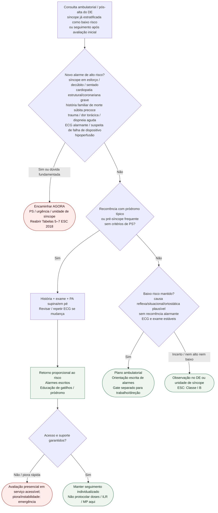

# Fluxograma ambulatorial: síncope pós-avaliação — destino

Prosa: [[sinalizadores-ambulatoriais-sincope-pos-alta-quando-retornar](/biblioteca/sinalizadores-ambulatoriais-sincope-pos-alta-quando-retornar)](/biblioteca/sinalizadores-ambulatoriais-sincope-pos-alta-quando-retornar). Gate atividades: [[sincope-gate-ambulatorial-retorno-atividades-trabalho-direcao](/biblioteca/sincope-gate-ambulatorial-retorno-atividades-trabalho-direcao)](/biblioteca/sincope-gate-ambulatorial-retorno-atividades-trabalho-direcao). Estratificação no DE: [[fluxograma-sincope-criterios-de-alto-risco-emergencia-esc-2018-eusem-2024](/biblioteca/fluxograma-sincope-criterios-de-alto-risco-emergencia-esc-2018-eusem-2024)](/biblioteca/fluxograma-sincope-criterios-de-alto-risco-emergencia-esc-2018-eusem-2024).

## Árvore de decisão

## Notas

- **D1** = gate de segurança (reabertura de alto risco ESC 2018).
- **D2** = recorrência “benigna” → destino clínico precoce, não alta sem plano.
- **D3** = baixo risco só com dados coerentes; se nem alto nem baixo, observação no DE/unidade de síncope.
- Trabalho, direção e altura ficam no documento-gate irmão (sem inventar legislação).

## Reabrir risco e definir investigação

Baixo risco na alta descreve aquele momento. Novo fenótipo, trauma relevante, cardiopatia estrutural/coronariana grave, ECG alterado ou história familiar de morte súbita precoce reabrem estratificação. Ausência de pródromo isolada não determina alto risco; considerar os demais achados. Síncope durante esforço, supina ou sentada exige particular atenção. Se nem alto nem baixo risco após reavaliação, a recomendação ESC é observação no DE/unidade de síncope, não retorno curto rotulado Classe I.

Em portador de dispositivo estável, providenciar interrogação rápida com correlação clínica; instabilidade, choque de CDI, trauma, suspeita de BAV/pausas ou falta de acesso rápido exigem via urgente. Convulsão prolongada, confusão persistente ou déficit focal seguem emergência neurológica apropriada. Recorrência inexplicada exige investigação com monitorização prolongada/ILR ou estudo eletrofisiológico conforme substrato, em vez de retornos curtos indefinidos.

Síncope ao dirigir é freio específico à liberação, mesmo em condutor particular. Regras ocupacionais/legais dependem de jurisdição, licença, causa e recorrência; não derivar prazo legal da janela clínica de retorno.
