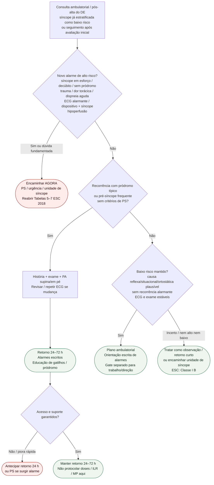

# Fluxograma ambulatorial: síncope pós-avaliação — destino

Prosa: [`sinalizadores-ambulatoriais-sincope-pos-alta-quando-retornar`](sinalizadores-ambulatoriais-sincope-pos-alta-quando-retornar.md). Gate atividades: [`sincope-gate-ambulatorial-retorno-atividades-trabalho-direcao`](sincope-gate-ambulatorial-retorno-atividades-trabalho-direcao.md). Estratificação no DE: [`fluxograma-sincope-criterios-de-alto-risco-emergencia-esc-2018-eusem-2024`](fluxograma-sincope-criterios-de-alto-risco-emergencia-esc-2018-eusem-2024.md).

## Árvore de decisão

## Notas

- **D1** = gate de segurança (reabertura de alto risco ESC 2018).
- **D2** = recorrência “benigna” → destino clínico precoce, não alta sem plano.
- **D3** = baixo risco só com dados coerentes; na dúvida, sobe para retorno curto / unidade de síncope.
- Trabalho, direção e altura ficam no documento-gate irmão (sem inventar legislação).
