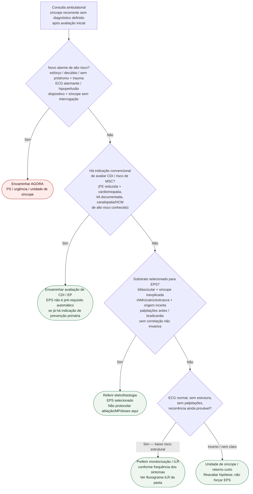

# Fluxograma ambulatorial: síncope recorrente — EPS vs. ILR vs. PS

Prosa: [`sinalizadores-ambulatoriais-sincope-recorrente-inexplicada-quando-referir-eletrofisiologia`](sinalizadores-ambulatoriais-sincope-recorrente-inexplicada-quando-referir-eletrofisiologia.md). Gate CDI: [`candidatos-ambulatoriais-avaliacao-cdi-apos-sincope-quando-encaminhar`](candidatos-ambulatoriais-avaliacao-cdi-apos-sincope-quando-encaminhar.md). Monitorização detalhada: [`fluxograma-sincope-inexplicada-recorrente-monitor-de-eventos-implantavel`](fluxograma-sincope-inexplicada-recorrente-monitor-de-eventos-implantavel.md). Pós-alta (#859): [`fluxograma-ambulatorial-sincope-pos-avaliacao-destino`](fluxograma-ambulatorial-sincope-pos-avaliacao-destino.md).

## Árvore de decisão

## Notas

- **D1** = gate de segurança (reabre alto risco ESC 2018 / pacote #859).
- **D2** = candidato a **avaliação** de CDI/MSC — ver documento-gate irmão; não decide implante.
- **D3** = EPS só com **pré-teste elevada** (ESC 2018; ACC/AHA/HRS 2017).
- **D4** = na ausência de substrato, o fluxograma de ILR desta pasta manda na escolha Holter vs. loop externo vs. ILR.
- Este fluxograma **não** duplica o protocolo de tilt nem restrições legais de direção.
