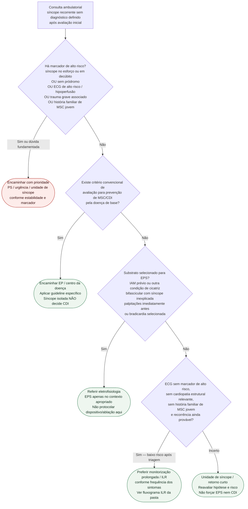

# Fluxograma ambulatorial: síncope recorrente — EPS vs. ILR vs. PS

Prosa: [`sinalizadores-ambulatoriais-sincope-recorrente-inexplicada-quando-referir-eletrofisiologia`](sinalizadores-ambulatoriais-sincope-recorrente-inexplicada-quando-referir-eletrofisiologia.md). Gate de risco de MSC: [`candidatos-ambulatoriais-avaliacao-cdi-apos-sincope-quando-encaminhar`](candidatos-ambulatoriais-avaliacao-cdi-apos-sincope-quando-encaminhar.md). Monitorização: [`fluxograma-sincope-inexplicada-recorrente-monitor-de-eventos-implantavel`](fluxograma-sincope-inexplicada-recorrente-monitor-de-eventos-implantavel.md).

## Árvore de decisão

## Notas

- **Síncope sem pródromo** é marcador de alto risco por si só; trauma é um fator separado de disposição/gravidade.
- **História familiar de morte súbita em idade jovem** deve ser checada antes de classificar o paciente como baixo risco.
- O ramo de EPS de maior força na ESC 2018 é ligado a **IAM prévio/outra condição relacionada a cicatriz**, não a qualquer cardiopatia estrutural inespecífica.
- FEVE levemente reduzida, isoladamente, não cria indicação de CDI. Quando houver doença com critério convencional de prevenção primária/ secundária, aplicar o guideline específico, incluindo tratamento otimizado, timing e prognóstico quando pertinentes.
- HCM, Brugada, QT longo, CPVT e outras doenças arrítmicas devem seguir **estratificação específica da doença**, não um agrupamento genérico.
