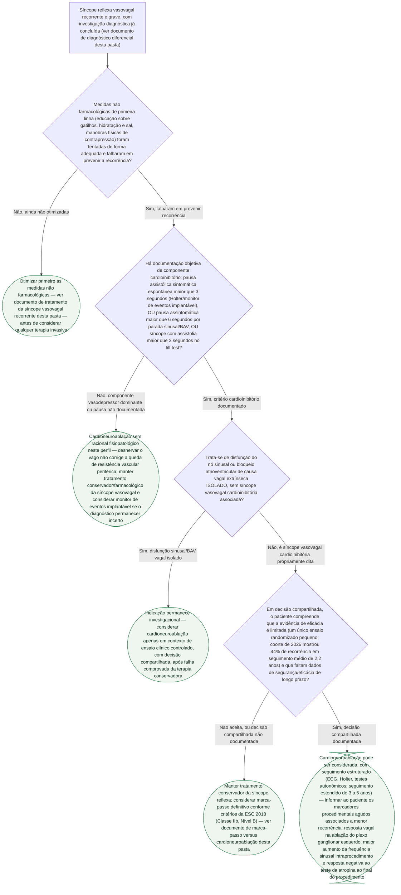

# Fluxograma: Indicação de Cardioneuroablação na Síncope Vasovagal Cardioinibitória Refratária (EHRA/HRS/APHRS/LAHRS 2024)

A posição conjunta EHRA/HRS/APHRS/LAHRS 2024 é deliberadamente cautelosa: não autoriza recomendação
forte para a cardioneuroablação (CNA), e restringe o único subgrupo com algum dado favorável de
redução de síncope a critérios objetivos de pausa cardioinibitória, sempre depois de falha
comprovada das medidas não farmacológicas. Fora desse subgrupo — componente vasodepressor
dominante, ou disfunção sinusal/BAV vagal isolado sem síncope vasovagal associada — a indicação
não tem racional ou permanece investigacional, restrita a ensaio clínico controlado. Um estudo
observacional de 2026 (57 pacientes, coorte unicêntrica) quantifica essa cautela com número real:
44% de recorrência em seguimento médio de 2,2 anos, o que torna a decisão compartilhada — e não
apenas o preenchimento dos critérios de pausa — parte obrigatória do caminho até a indicação.

## Árvore de decisão

## O que a árvore não mostra

- **A idade do paciente não entra como ramo binário.** A posição conjunta descreve que os dados
  favoráveis "se concentram" em pacientes jovens, mas isso é uma observação sobre a população
  estudada, não um critério de corte etário explícito para indicar ou excluir a CNA — por isso
  não virou nó de decisão. O contraste com a idade de 40 anos usada pela ESC 2021 de estimulação
  cardíaca para restringir marca-passo no fenótipo bradicárdico é contexto, tratado em prosa no
  documento de posição conjunta desta pasta, não critério de seleção da CNA em si.
- **O teste da atropina pré-procedimento não é um ramo de decisão.** Seu valor para selecionar
  quem se beneficia da CNA "ainda não está definido" segundo a posição de 2024 — historicamente
  foi usado para excluir doença intrínseca do nó sinusal/AV, não para prever benefício. O estudo
  de 2026 traz um dado novo, mas é sobre resposta ao teste **ao final** do procedimento associada
  a menor recorrência (achado prognóstico pós-procedimento), não critério de indicação prévia —
  por isso entra como informação a comunicar ao paciente na conduta final (C5), não como pergunta
  da árvore.
- **A técnica de guia da ablação (estimulação vagal extracardíaca versus outras) não está
  detalhada aqui.** O estudo de 2026 associa a estimulação vagal extracardíaca a maior incidência
  de taquicardia sinusal inapropriada sintomática (64% vs. 2%) — é dado de segurança do
  procedimento, relevante para a conversa de decisão compartilhada, mas não altera o caminho de
  indicação descrito nesta árvore.
- **Os riscos gerais do procedimento (acesso vascular, tamponamento, lesão de nó sinusal/AV,
  pericardite, entre outros) não estão listados como ramo** — são riscos de qualquer ablação por
  cateter atrial, tratados em prosa no documento de posição conjunta desta pasta, não critérios
  que mudam a indicação.
- **O algoritmo de escolha entre marca-passo e CNA quando ambos são tecnicamente elegíveis** (após
  a conduta C4) tem documento próprio nesta pasta — a árvore acima limita-se a apontar a
  alternativa estabelecida quando a CNA não é aceita ou a evidência não sustenta a indicação.
