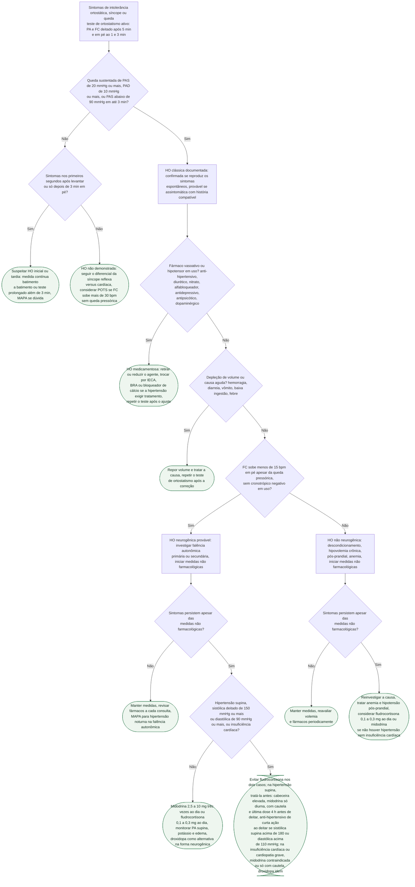

# Fluxograma: Hipotensão ortostática — diagnóstico, causa e manejo escalonado

Os fluxogramas de síncope desta pasta tratam a hipotensão ortostática (HO) como um dos três grupos etiológicos e param na confirmação do nexo com a síncope. Este começa onde eles param: a HO como entidade, com ou sem síncope. A decisão importa porque a causa mais comum é medicamentosa e se resolve retirando um fármaco, porque a forma neurogênica muda a investigação (Parkinson, atrofia de múltiplos sistemas, diabetes, amiloidose) e porque os dois fármacos com recomendação — midodrina e fludrocortisona — sobem a pressão também deitado. A ESC 2018 organiza o tratamento em degraus: educação e volume para todos, retirada do agente causador, medidas físicas e, só se os sintomas persistirem, o fármaco. A árvore segue essa ordem.

## Árvore de decisão

## O teste e os três subtipos

A ESC 2018 indica a medida intermitente de PA e FC com esfigmomanômetro, deitado e durante 3 minutos em pé, na avaliação inicial de toda síncope (Classe I, nível C). O consenso de Gibbons 2017 detalha o protocolo: pelo menos 5 minutos deitado, medida imediatamente antes de levantar e ao 1 e 3 minutos em pé (a medida sentado-em pé é aceita como alternativa quando a supina é impraticável). O critério pressórico é o da diretriz — queda progressiva e sustentada de 20 mmHg ou mais na sistólica, 10 mmHg ou mais na diastólica, ou sistólica abaixo de 90 mmHg —, e a diretriz explica que o corte absoluto de 90 mmHg foi acrescentado ao consenso de Freeman 2011 por ser útil sobretudo em quem tem sistólica deitado abaixo de 110 mmHg. Queda isolada da diastólica é rara e de relevância limitada.

| Subtipo | Critério | Como documentar |
|---|---|---|
| HO inicial | Queda acima de 40 mmHg na sistólica e/ou 20 mmHg na diastólica nos primeiros 15 s, com recuperação espontânea em menos de 40 s | Só com medida contínua batimento a batimento — o esfigmomanômetro não passa de quatro medidas por minuto |
| HO clássica | Critério pressórico acima, em até 3 min em pé ou em tilt | Esfigmomanômetro é adequado |
| HO tardia | Mesmo critério pressórico, mas só depois de 3 min | Prolongar o teste ou usar tilt; a ausência de bradicardia distingue da síncope reflexa |

A Tabela 8 da diretriz gradua o nexo com a síncope: queda sintomática que reproduz os sintomas confirma (Classe I); queda assintomática com história muito sugestiva, ou queda sintomática com história incompleta, torna provável (Classe IIa); queda assintomática com história pouco sugestiva torna possível (Classe IIb); sem queda anormal, o nexo fica não provado. A história muito sugestiva inclui sintomas em pé que somem deitado, predileção pela manhã e piora após exercício, refeição ou calor, sem ativação autonômica. O ramo sem queda documentada devolve o paciente ao diferencial geral (ver fluxograma-sincope-reflexa-versus-cardiaca-diagnostico-diferencial); a POTS, com aumento de FC acima de 30 bpm sem HO, está em hipotensao-ortostatica-e-sindrome-de-taquicardia-postural-pots-diagnostico-diferencial.

## Causa: fármaco, volume ou falência autonômica

A Tabela 3 da ESC 2018 chama a HO medicamentosa de causa mais comum e cita vasodilatadores, diuréticos, fenotiazinas e antidepressivos; o texto da seção 5.3.3 acrescenta nitratos, neurolépticos e dopaminérgicos, e observa que três ou mais anti-hipertensivos, ou o alvo abaixo de 140/90 mmHg, predizem HO. IECA, BRA e bloqueadores de cálcio se associam menos à HO que betabloqueadores e tiazídicos, e a diretriz recomenda usá-los preferencialmente em quem tem risco de queda. A tabela de Gibbons 2017 amplia a lista: dopaminérgicos, tricíclicos, anticolinérgicos, inibidores da fosfodiesterase 5, alfabloqueadores, agonistas alfa-2 centrais, bloqueadores de cálcio, betabloqueadores, IECA e BRA. A regra da diretriz para a forma induzida por fármaco é eliminar o agente; e a metanálise que mostra que o achado assintomático em si não justifica desescalonar o anti-hipertensivo está em hipotensao-ortostatica-nao-e-motivo-para-desescalonar-o-anti-hipertensivo — o ramo C3 vale para HO sintomática documentada.

A resposta cronotrópica separa a forma neurogênica: a ESC 2018 descreve aumento de FC embotado ou ausente, em geral não acima de 10 bpm, na HO neurogênica, e aumento exagerado na anemia e na hipovolemia. Gibbons 2017 usa o corte de 15 bpm em 3 minutos — aumento menor sugere HO neurogênica, maior sugere forma não neurogênica —, com a ressalva de que o critério só vale com queda pressórica presente e sem fármaco que embote a FC nem marca-passo ou arritmia que impeça a resposta cronotrópica. A árvore usa o corte de Gibbons por ser o operacional. As causas neurogênicas da Tabela 3 são a falência autonômica primária (falência autonômica pura, atrofia de múltiplos sistemas, doença de Parkinson, demência com corpos de Lewy) e a secundária (diabetes, amiloidose, lesão medular, neuropatias autonômicas autoimune e paraneoplásica, insuficiência renal). Na suspeita de HO neurogênica, a manobra de Valsalva e o teste de respiração profunda são Classe IIa, nível B, e a MAPA é Classe I, nível B para detectar hipertensão noturna na falência autonômica (ver sincope-diagnostico-e-manejo-esc-2018).

## Manejo não farmacológico para todos

| Medida | ESC 2018 | Números (Gibbons 2017, salvo indicação) |
|---|---|---|
| Educação, evitar gatilhos e situações | Classe I, nível C | Evitar refeições grandes ricas em carboidrato, álcool e calor ambiente; ganho pressórico pequeno, 10 a 15 mmHg, mas funcionalmente relevante (ESC) |
| Hidratação e sal | Classe I, nível C | 2 a 3 L de líquido e 10 g de cloreto de sódio ao dia, apenas na ausência de hipertensão, insuficiência cardíaca ou doença renal que contraindique expansão; bolo de 500 mL de água pode ser usado em situações selecionadas |
| Modificar ou retirar hipotensores | Classe IIa, nível B | Ver seção anterior |
| Manobras de contrapressão isométrica | Classe IIa, nível C | Cruzar as pernas e agachar em quem tem pródromo e consegue executar (ESC) |
| Cinta abdominal e/ou meias compressivas | Classe IIa, nível B | Compressão de 30 a 40 mmHg; cinta abdominal inflável a 40 mmHg foi tão eficaz quanto midodrina |
| Cabeceira elevada ao dormir | Classe IIa, nível C | Mais de 10 graus (ESC); 15 a 23 cm acima dos pés (Gibbons); reduz poliúria noturna e a hipertensão noturna |

A ESC 2018 acrescenta, em "conselhos adicionais", que em HO estabelecida com risco de queda o tratamento anti-hipertensivo agressivo deve ser evitado, com alvo sistólico revisto para 140 a 150 mmHg e retirada de medicação considerada. O recorte geriátrico dessa desintensificação está em fluxograma-hipertensao-no-idoso-e-no-fragil-quando-iniciar-alvo-e-desintensificacao-esc-2024.

## Fármacos: só se os sintomas persistirem

| Fármaco | ESC 2018 | Dose e limites |
|---|---|---|
| Midodrina | Classe IIa, nível B, se os sintomas persistem; 2,5 a 10 mg três vezes ao dia, eficaz em três ensaios randomizados contra placebo | Bula: 10 mg três vezes ao dia, com intervalo de cerca de 4 h, última dose até 18 h e pelo menos 4 h antes de deitar; tarja de hipertensão supina; contraindicada em cardiopatia grave, doença renal aguda, retenção urinária, feocromocitoma, tireotoxicose e hipertensão supina persistente e excessiva. Gibbons: 2,5 a 15 mg, uma a três vezes ao dia, não nas 5 h antes de dormir |
| Fludrocortisona | Classe IIa, nível C, se os sintomas persistem; 0,1 a 0,3 mg uma vez ao dia, evidência de dois estudos observacionais e um ensaio duplo-cego com 60 pacientes | Gibbons: 0,1 a 0,2 mg ao dia, início de efeito em 3 a 7 dias. Bula: HO não é indicação aprovada; alerta para hipertensão, edema, cardiomegalia, insuficiência cardíaca e hipocalemia, com eletrólitos periódicos |
| Droxidopa | Sem classe; quatro ensaios curtos com 485 pacientes mostraram ganho modesto na sistólica em pé e em sintomas às 2 semanas, perdido às 8 semanas | Bula Northera: HO neurogênica sintomática por Parkinson, atrofia de múltiplos sistemas, falência autonômica pura, deficiência de dopamina beta-hidroxilase ou neuropatia autonômica não diabética; 100 mg três vezes ao dia, subir 100 mg por dose a cada 24 a 48 h, máximo 600 mg três vezes ao dia, última dose 3 h antes de deitar; eficácia além de 2 semanas não estabelecida |

Os efeitos adversos da midodrina na bula, no ensaio de 3 semanas, foram parestesia do couro cabeludo em 18,3%, piloereção em 13,4% e hipertensão supina em 7,3%, além de sintomas urinários. Gibbons 2017 orienta titular um agente até a dose máxima tolerada antes de associar o segundo e cita piridostigmina 30 a 60 mg, uma a três vezes ao dia, como opção menos estabelecida; a ESC lista desmopressina na poliúria noturna, octreotida na hipotensão pós-prandial e eritropoetina na anemia como terapias adicionais de eficácia menos comprovada. Na síncope vasovagal, os mesmos dois fármacos têm classe mais fraca (IIb) — ver tratamento-da-sincope-vasovagal-recorrente-medidas-nao-farmacologicas-e-farmacos.

## Hipertensão supina concomitante

Gibbons 2017 define hipertensão supina como sistólica de 150 mmHg ou mais ou diastólica de 90 mmHg ou mais deitado, e gradua a resposta: até 160 mmHg, observar sem tratar se os sintomas de HO melhoram; 160 a 180 mmHg, intervenção individualizada; acima de 180 mmHg ou diastólica acima de 110 mmHg, anti-hipertensivo de curta ação ao deitar. A cabeceira elevada é a primeira medida, e as bulas de midodrina e droxidopa exigem reduzir ou suspender o fármaco se a hipertensão supina não for controlada com ela. A ESC 2018 acrescenta que a MAPA identifica hipertensão supina ou noturna em pacientes tratados, e a hipotensão pós-prandial, que se soma à HO no idoso, tem manejo próprio em hipotensao-pos-prandial-no-idoso-cardiopata-mecanismo-prevalencia-e-manejo.

## Limitações e o que confirmar

- Freeman 2011 não foi lido na íntegra (acesso Springer bloqueado); as definições de HO inicial e tardia foram tomadas das Practical Instructions da ESC 2018, que o citam como fonte.
- A meta de sal reproduz a ESC 2018 em gramas de cloreto de sódio; não se deve convertê-la para “gramas de sódio” sem cálculo explícito.
- O corte de FC da árvore (15 bpm) é o de Gibbons 2017; a ESC 2018 descreve "em geral não acima de 10 bpm". Nenhum dos dois é validado como critério diagnóstico isolado.
- A árvore não fixa o tempo de espera antes de chamar os sintomas de refratários às medidas não farmacológicas; nenhuma das fontes lidas estabelece esse intervalo.
- As doses de midodrina e fludrocortisona são as da ESC 2018 e das bulas americanas; a fludrocortisona não tem HO como indicação em bula, e a droxidopa não tem registro no Brasil conferido nesta sessão.
- A conduta em hipertensão supina (limiares de 160 e 180 mmHg) é opinião de consenso, não recomendação de diretriz com classe.

## Tudo com Tudo

- [Hipotensão Ortostática e Síndrome de Taquicardia Postural (POTS): Diagnóstico Diferencial na Síncope](/biblioteca/hipotensao-ortostatica-e-sindrome-de-taquicardia-postural-pots-diagnostico-diferencial)
- [Fluxograma: Síncope reflexa versus cardíaca versus hipotensão ortostática — diagnóstico diferencial (ESC 2018)](/biblioteca/fluxograma-sincope-reflexa-versus-cardiaca-diagnostico-diferencial)
- [Fluxograma: Síncope e queda no idoso — investigação diferenciada de causas ortostáticas, reflexas e cardíacas](/biblioteca/fluxograma-sincope-idoso-investigacao-diferenciada)
- [Fluxograma: Hipertensão no idoso e no frágil — quando iniciar, alvo e desintensificação (ESC 2024)](/biblioteca/fluxograma-hipertensao-no-idoso-e-no-fragil-quando-iniciar-alvo-e-desintensificacao-esc-2024)
- [Hipotensão Ortostática Não é Motivo para Desescalonar o Anti-Hipertensivo](/biblioteca/hipotensao-ortostatica-nao-e-motivo-para-desescalonar-o-anti-hipertensivo)
- [Tratamento da Síncope Vasovagal Recorrente: Medidas Não Farmacológicas e Fármacos](/biblioteca/tratamento-da-sincope-vasovagal-recorrente-medidas-nao-farmacologicas-e-farmacos)
- [Hipotensão Pós-Prandial no Idoso Cardiopata: Mecanismo, Prevalência e Manejo](/biblioteca/hipotensao-pos-prandial-no-idoso-cardiopata-mecanismo-prevalencia-e-manejo)
