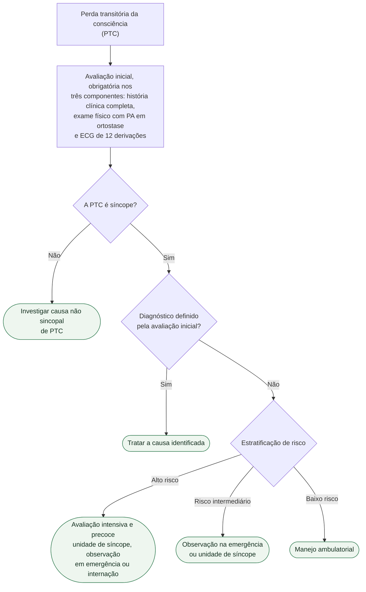

# Fluxograma: Síncope — avaliação inicial e estratificação de risco (ESC 2018)

A decisão central na síncope não é diagnóstica, é **de destino**: quem pode ir
para casa, quem fica em observação e quem precisa de investigação intensiva
imediata. O fluxograma abaixo organiza esse caminho.

## Árvore de decisão

## Os três componentes da avaliação inicial

A diretriz é explícita quanto a esses três elementos serem realizados em todo
paciente com PTC — nenhum deles é opcional:

1. **História clínica completa** — circunstâncias, pródromos, testemunhas,
   recuperação, episódios prévios, medicações, história familiar.
2. **Exame físico com aferição de pressão arterial em ortostase**.
3. **Eletrocardiograma padrão de 12 derivações**.

## O que a estratificação decide

O propósito da estratificação não é nomear a síncope, e sim alocar recurso e
tempo. Pacientes com características de alto risco recebem avaliação intensiva e
imediata — em unidade de síncope, em unidade de observação da emergência quando
disponível, ou internados. O risco intermediário justifica um período de
observação. O baixo risco é conduzido em ambulatório.

Essa separação existe porque a síncope reúne, sob uma mesma apresentação, causas
de curso benigno e causas de mortalidade elevada; o que muda o desfecho é quanto
tempo se leva para distinguir umas das outras.
