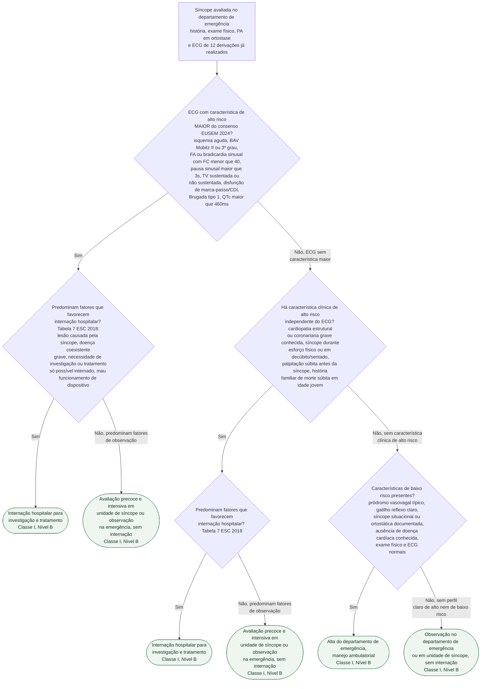

# Fluxograma: Critérios de alto risco na síncope da emergência — alta, observação ou internação (ESC 2018 / EUSEM 2024)

O fluxograma de avaliação inicial já publicado nesta pasta resume a decisão em três
caixas — alto, intermediário e baixo risco. Este documento detalha o que entra em cada
caixa: as características maiores do ECG que o consenso EUSEM 2024 classifica como alto
risco por si só, os achados clínicos de alto risco da ESC 2018 que não dependem do ECG, e
o desdobramento seguinte — já dentro do grupo de alto risco — entre internar e apenas
observar em unidade de síncope, conforme a Tabela 7 da diretriz.

## Árvore de decisão

## O que a árvore não mostra

- **Escore de estratificação de risco não substitui julgamento clínico.** A própria
  diretriz é explícita: escores (CSRS, EGSYS, OESIL) podem ser considerados como apoio
  (Classe IIb, Nível B), mas não têm desempenho comprovadamente melhor do que a avaliação
  clínica bem feita, e não devem decidir internação sozinhos.
- **Exame complementar de rotina tem baixo rendimento.** Radiografia de tórax, tomografia
  de crânio, hematologia, D-dímero e marcador cardíaco por rotina não são recomendados na
  síncope — só quando a avaliação clínica especificamente sugerir uma dessas investigações.
- **Dispositivo cardíaco implantado exige interrogação, não espera.** Paciente com
  marca-passo ou CDI e síncope deve ter o dispositivo interrogado prontamente — é uma das
  medidas citadas pela diretriz para evitar internação desnecessária ou, ao contrário, para
  não deixar passar disfunção do dispositivo.
- **As características menores do ECG (EUSEM 2024) só contam se a história for compatível
  com síncope arritmogênica** — bloqueio Mobitz I, BAV de 1º grau com PR muito prolongado,
  bradicardia assintomática entre 40 e 50/min, taquicardia supraventricular paroxística,
  QRS pré-excitado, QTc curto, padrão atípico de Brugada e ondas T negativas/épsilon em
  precordiais direitas. Fora desse contexto clínico, esses achados isolados não classificam
  o paciente como alto risco — por isso não entraram como ramo autônomo na árvore.
- **O corte de QTc muda conforme o instrumento.** O EUSEM 2024 usa 460 ms como
  característica de alto risco do ECG; o Escore Canadense de Risco de Síncope (CSRS), citado
  em outro documento desta pasta, usa 480 ms como variável pontuada de um escore diferente.
  Não são o mesmo corte para o mesmo fim.
- **A árvore pressupõe que a avaliação inicial completa já foi feita** — história clínica
  detalhada, exame físico com PA em ortostase e ECG de 12 derivações interpretado por
  profissional experiente em até 10 minutos do registro (prazo operacional do EUSEM 2024).
  Sem esses três componentes, nenhuma das classificações acima pode ser aplicada com
  segurança.
