# Fluxograma: Síncope e queda no idoso — investigação diferenciada de causas ortostáticas, reflexas e cardíacas

A síncope no idoso é um problema diagnóstico à parte, não apenas "a mesma
síncope, num paciente mais velho": amnésia retrógrada e ausência de
testemunha tornam a distinção entre queda mecânica e síncope verdadeira
frequentemente impossível de fazer só pela história. Este fluxograma organiza
a investigação a partir daí — quando tratar uma queda como síncope
inexplicada, como diferenciar as três causas mais prevalentes nesta faixa
etária (hipotensão ortostática, hipersensibilidade do seio carotídeo e causa
cardíaca) e quando pedir ecocardiograma pelo escore ROMEO, em vez de por
rotina.

## Árvore de decisão

```mermaid
flowchart TD

R["Idoso (≥60 anos) com episódio de perda de consciência ou queda sem explicação mecânica clara"]
D1{"Há explicação mecânica evidente e suficiente para a queda (tropeço, obstáculo, degrau)?"}
C1(["Queda mecânica explicada: não é necessário investigar como síncope inexplicada"])
X1["Investigar como síncope inexplicada, mesmo sem relato confiável de perda de consciência: anamnese completa (considerando amnésia retrógrada e ausência frequente de testemunha), exame físico, PA deitado e em pé, ECG, revisão completa de medicações"]
D2{"Queda ortostática da PA confirmada (≥20 mmHg PAS ou ≥10 mmHg PAD em até 3 min, ou PAS<90 mmHg)?"}
C2(["Hipotensão ortostática: revisar fármacos hipotensores em uso (anti-hipertensivo, diurético, tricíclico, antipsicótico), orientar medidas posturais e reavaliar a necessidade de cada medicação"])
X2["Avaliar suspeita clínica de hipersensibilidade do seio carotídeo (síncope/queda associada a giro cervical, barbear, colar apertado, idade avançada)"]
D3{"Suspeita clínica de hipersensibilidade do seio carotídeo presente?"}
X3["Massagem do seio carotídeo sob monitorização contínua batimento a batimento, em supino e ortostatismo"]
X4["Prosseguir com avaliação cardiovascular dirigida: aplicar o escore ROMEO para decidir a necessidade de ecocardiograma transtorácico"]
D4{"Resposta cardioinibitória, vasodepressora ou mista reproduzindo os sintomas (assistolia ≥3s e/ou queda de PAS ≥50 mmHg)?"}
C3(["Hipersensibilidade do seio carotídeo confirmada: considerar marca-passo se padrão cardioinibitório predominante; orientar restrição de direção conforme o perfil (particular vs. comercial) e o risco de recorrência"])
X5["Prosseguir com avaliação cardiovascular dirigida: aplicar o escore ROMEO para decidir a necessidade de ecocardiograma transtorácico"]
D5{"Algum critério ROMEO presente (IC congestiva, doença arterial coronariana, ECG anormal, troponina T de alta sensibilidade >14 pg/mL ou NT-proBNP >125 pg/mL)?"}
C4(["ROMEO=0: baixa probabilidade de achado ecocardiográfico significativo (VPN 98,6%) — não indicar ecocardiograma de rotina só pela síncope/queda, salvo outra indicação clínica independente. Se a etiologia permanecer indefinida, investigar como síncope inexplicada recorrente (tilt test e monitor de eventos implantável, com rendimento particularmente alto no idoso por amnésia retrógrada e ausência de testemunha) e complementar com avaliação multifatorial de risco de queda (marcha, força, visão, cognição, ambiente domiciliar)"])
C5(["ROMEO≥1: indicar ecocardiograma transtorácico; especificidade baixa (20%), então achado positivo exige correlação clínica antes de assumir causalidade. Se a etiologia permanecer indefinida mesmo após o ecocardiograma, investigar como síncope inexplicada recorrente (tilt test e monitor de eventos implantável) e complementar com avaliação multifatorial de risco de queda"])
D6{"Algum critério ROMEO presente (IC congestiva, doença arterial coronariana, ECG anormal, troponina T de alta sensibilidade >14 pg/mL ou NT-proBNP >125 pg/mL)?"}
C6(["ROMEO=0: baixa probabilidade de achado ecocardiográfico significativo (VPN 98,6%) — não indicar ecocardiograma de rotina só pela síncope/queda, salvo outra indicação clínica independente. Se a etiologia permanecer indefinida, investigar como síncope inexplicada recorrente (tilt test e monitor de eventos implantável, com rendimento particularmente alto no idoso por amnésia retrógrada e ausência de testemunha) e complementar com avaliação multifatorial de risco de queda (marcha, força, visão, cognição, ambiente domiciliar)"])
C7(["ROMEO≥1: indicar ecocardiograma transtorácico; especificidade baixa (20%), então achado positivo exige correlação clínica antes de assumir causalidade. Se a etiologia permanecer indefinida mesmo após o ecocardiograma, investigar como síncope inexplicada recorrente (tilt test e monitor de eventos implantável) e complementar com avaliação multifatorial de risco de queda"])

R --> D1
D1 -->|"Sim"| C1
D1 -->|"Não"| X1
X1 --> D2
D2 -->|"Sim"| C2
D2 -->|"Não"| X2
X2 --> D3
D3 -->|"Sim"| X3
D3 -->|"Não"| X4
X3 --> D4
D4 -->|"Sim"| C3
D4 -->|"Não"| X5
X4 --> D5
D5 -->|"Não"| C4
D5 -->|"Sim"| C5
X5 --> D6
D6 -->|"Não"| C6
D6 -->|"Sim"| C7

classDef conduta fill:#eef6ef,stroke:#2f7a4f,color:#12301f;
class C1,C2,C3,C4,C5,C6,C7 conduta;
```

## Armadilhas clínicas

- Descartar investigação cardiovascular porque o idoso "não perdeu a
  consciência", quando o relato vem de paciente sem testemunha do evento e
  sem confiabilidade de memória estabelecida — a amnésia retrógrada torna
  essa negativa pouco confiável nessa população, e a ESC 2018 recomenda
  investigar a queda inexplicada com o mesmo rigor da síncope inexplicada.
- Aplicar o escore ROMEO como se fosse regra de indicação de alto risco —
  ele é regra de **exclusão** de baixo risco (ROMEO=0, VPN alto); ROMEO≥1
  não significa achado positivo automático, só tira o paciente do grupo de
  exclusão segura, já que a especificidade fica em torno de 20%.
- Confundir a massagem do seio carotídeo negativa com ausência de causa
  cardiovascular — ela só investiga um mecanismo específico (hipersensibilidade
  do seio carotídeo); resultado negativo não dispensa a investigação cardíaca
  dirigida (ECG, ROMEO/ecocardiograma) nem a avaliação ortostática.
- Não revisar a lista completa de medicações em uso à procura de fármacos que
  reduzam o limiar para hipotensão ortostática ou bradicardia reflexa —
  anti-hipertensivos, diuréticos, tricíclicos e antipsicóticos são
  amplificadores comuns das duas causas mais prevalentes nessa faixa etária.
- Reservar o monitor de eventos implantável apenas para pacientes jovens com
  síncope recorrente — no idoso com queda/síncope inexplicada e sem
  diagnóstico após a avaliação inicial, é ferramenta com papel reconhecido
  justamente pela dificuldade de captar o evento por outros meios (sem
  testemunha, sem memória confiável).
- Investigar apenas a esfera cardiovascular e ignorar a avaliação
  multifatorial de risco de queda (marcha, força, visão, cognição, ambiente
  domiciliar) — as duas frentes são complementares, não substitutas uma da
  outra.
