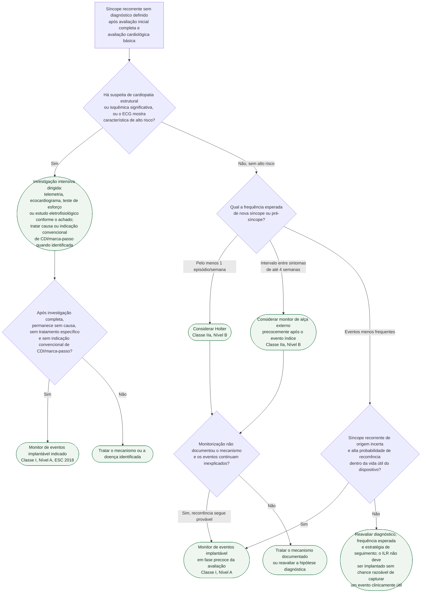

# Fluxograma: Investigação da síncope inexplicada recorrente — escolha da monitorização e monitor implantável (ESC 2018)

Quando a avaliação inicial e a estratificação de risco não fecham o diagnóstico e a
síncope se repete, a diretriz ESC 2018 escolhe a monitorização pela frequência esperada
dos eventos e pelo risco. O monitor de eventos implantável (ILR) pode entrar cedo, sem
exigir tilt test prévio, quando não há critérios de alto risco e a recorrência é provável
dentro da vida útil do dispositivo. Também é indicação Classe I A após investigação
completa negativa em pacientes de alto risco sem indicação convencional de CDI ou
marca-passo.

## Árvore de decisão

## O que a árvore não mostra

- **O protocolo do tilt test em si não está detalhado aqui.** Jejum de 2 a 4 horas, fase
  supina de pelo menos 5 minutos (ou 20 minutos com canulação venosa), fase de inclinação
  passiva de 20 a 45 minutos e, se negativa, provocação farmacológica com nitroglicerina
  sublingual ou isoproterenol intravenoso — está descrito no documento próprio desta pasta.
- **O tilt test não é pré-requisito para o ILR.** Deve ser considerado quando a avaliação
  inicial sugere síncope reflexa, hipotensão ortostática tardia, falência autonômica ou
  POTS, ou para ajudar a separar síncope de pseudossíncope psicogênica. Um resultado
  negativo não cria, isoladamente, indicação de monitor implantável.
- **O rendimento precisa ser apresentado no contexto correto.** Na meta-análise de cinco
  ensaios (660 pacientes) citada pela ESC, a estratégia inicial com ILR aumentou em 3,7
  vezes (IC 95% 2,7–5,0) a probabilidade relativa de diagnóstico versus a estratégia
  convencional. Após investigação completa negativa, nove estudos com 506 pacientes
  documentaram correlação sintoma–ECG em 35%; entre esses registros, 56% mostraram
  assistolia/bradicardia, 11% taquicardia e 33% ausência de arritmia.
- **Vídeo gravado por smartphone durante um episódio espontâneo** passa a ser aceito pela
  diretriz como ferramenta diagnóstica auxiliar, e pode encurtar a investigação quando
  disponível — não é um ramo separado porque depende de oportunidade, não de indicação
  programável.
- **Tilt cardioinibitório não equivale automaticamente a indicação de marca-passo.** A
  ESC reserva a estimulação para pacientes altamente selecionados, em geral com 40 anos
  ou mais, episódios reflexos graves, recorrentes, imprevisíveis e risco de trauma; a
  susceptibilidade hipotensiva associada pode reduzir a resposta ao dispositivo.
- **Estudo eletrofisiológico não é indicado de rotina** quando o paciente tem ECG normal,
  ausência de cardiopatia estrutural e ausência de palpitação — geralmente não acrescenta
  informação nesse perfil, mesmo dentro do ramo de "suspeita estrutural" da árvore.
