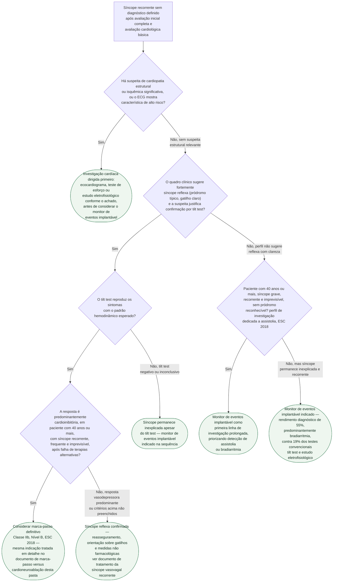

# Fluxograma: Investigação da síncope inexplicada recorrente — do tilt test ao monitor de eventos implantável (ESC 2018)

Quando a avaliação inicial e a estratificação de risco não fecham o diagnóstico e a
síncope se repete, a diretriz ESC 2018 organiza um caminho específico: descartar primeiro
causa estrutural relevante, confirmar ou afastar síncope reflexa pelo tilt test quando
houver suspeita clínica, e reservar o monitor de eventos implantável para quem permanece
sem diagnóstico — inclusive como primeira linha em um subgrupo definido pela idade e pela
ausência de pródromo.

## Árvore de decisão

## O que a árvore não mostra

- **O protocolo do tilt test em si não está detalhado aqui.** Jejum de 2 a 4 horas, fase
  supina de pelo menos 5 minutos (ou 20 minutos com canulação venosa), fase de inclinação
  passiva de 20 a 45 minutos e, se negativa, provocação farmacológica com nitroglicerina
  sublingual ou isoproterenol intravenoso — está descrito no documento próprio desta pasta.
- **O tilt test é teste confirmatório, não teste de rastreio geral.** A diretriz ESC 2018
  reposicionou seu uso: só deve ser solicitado quando a suspeita clínica já aponta para
  síncope reflexa ou tendência a hipotensão — não para investigar qualquer síncope
  inexplicada indiscriminadamente, o que a árvore reflete ao condicionar esse ramo à
  suspeita clínica prévia.
- **Vídeo gravado por smartphone durante um episódio espontâneo** passa a ser aceito pela
  diretriz como ferramenta diagnóstica auxiliar, e pode encurtar a investigação quando
  disponível — não é um ramo separado porque depende de oportunidade, não de indicação
  programável.
- **A escolha entre marca-passo e cardioneuroablação, no cenário de resposta
  cardioinibitória confirmada, tem algoritmo próprio** (posição conjunta EHRA/HRS/APHRS/LAHRS
  2024), tratado em documento dedicado desta pasta — a árvore acima limita-se à indicação
  Classe IIb de marca-passo já estabelecida pela ESC 2018.
- **Estudo eletrofisiológico não é indicado de rotina** quando o paciente tem ECG normal,
  ausência de cardiopatia estrutural e ausência de palpitação — geralmente não acrescenta
  informação nesse perfil, mesmo dentro do ramo de "suspeita estrutural" da árvore.
