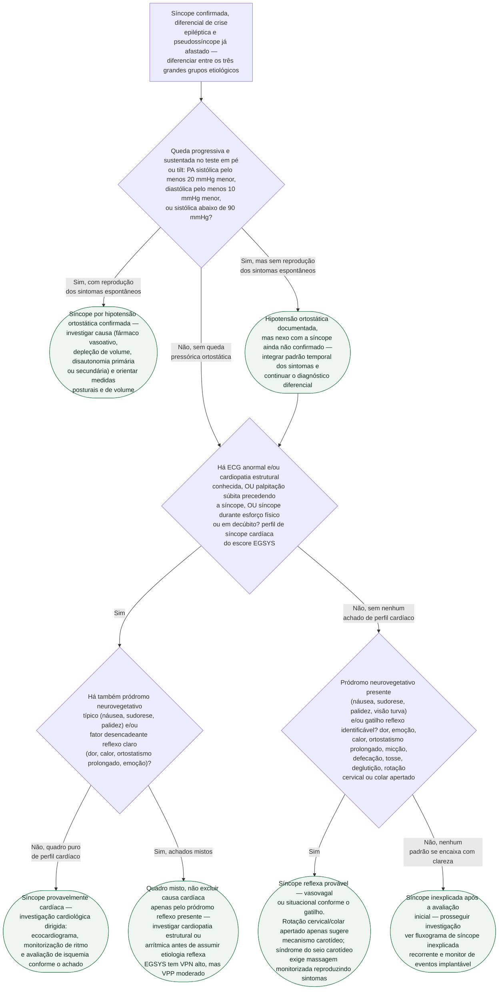

# Fluxograma: Síncope reflexa versus cardíaca versus hipotensão ortostática — diagnóstico diferencial (ESC 2018)

Depois de confirmado que o episódio é síncope (e não crise epiléptica ou pseudossíncope
psicogênica — diferenciais já cobertos em documentos próprios desta pasta), a pergunta
seguinte é a que mais muda a conduta: qual dos três grandes grupos etiológicos está em
jogo. Este fluxograma organiza essa diferenciação a partir da história, do exame físico
com teste postural e dos preditores clínicos de causa cardíaca.

## Árvore de decisão

## O que a árvore não mostra

- **O EGSYS não substitui a avaliação clínica.** VPN de 99% e VPP de 33% foram resultados
  da coorte original de derivação e não devem ser transportados como desempenho universal
  para outras populações. O perfil levanta ou reduz suspeita, mas não confirma nem exclui
  sozinho uma causa cardíaca.
- **Os três subtipos de hipotensão ortostática (inicial, clássica e tardia) têm janelas de
  tempo diferentes** — a inicial dura menos de 15 segundos e exige medida contínua
  batimento a batimento; a clássica e a tardia se distinguem pelo corte de 3 minutos em pé.
  A árvore trata "queda pressórica ortostática" como um único ramo porque a conduta inicial
  de investigação é a mesma nos três; a diferenciação entre eles é etapa posterior.
- **POTS não entra como ramo autônomo.** Em adultos, exige aumento sustentado da frequência
  cardíaca de pelo menos 30 bpm em até 10 minutos em pé (pelo menos 40 bpm entre 12 e 19
  anos), **na ausência** de hipotensão ortostática, associado a intolerância ortostática
  crônica. O antigo corte absoluto de 120 bpm não deve ser usado como alternativa isolada,
  e POTS não é sinônimo de síncope por hipotensão ortostática.
- **Síndrome do seio carotídeo não é diagnosticada pela história isolada.** Em paciente
  apropriado, geralmente com mais de 40 anos e após checar contraindicações, é necessário
  que a massagem do seio carotídeo monitorizada reproduza os sintomas espontâneos junto
  de resposta cardioinibitória e/ou vasodepressora compatível.
- **Os três grupos não são estanques.** A própria diretriz descreve hipotensão ortostática,
  POTS e síncope vasovagal como pontos de um mesmo espectro fisiopatológico contínuo, não
  como categorias sempre mutuamente exclusivas — um mesmo paciente pode ter mecanismos
  sobrepostos ao longo do tempo.
- **A árvore não substitui a avaliação de risco da emergência.** Mesmo com perfil reflexo
  claro, características de alto risco (documentadas em fluxograma próprio desta pasta)
  continuam exigindo avaliação intensiva, independentemente da etiologia provável.
