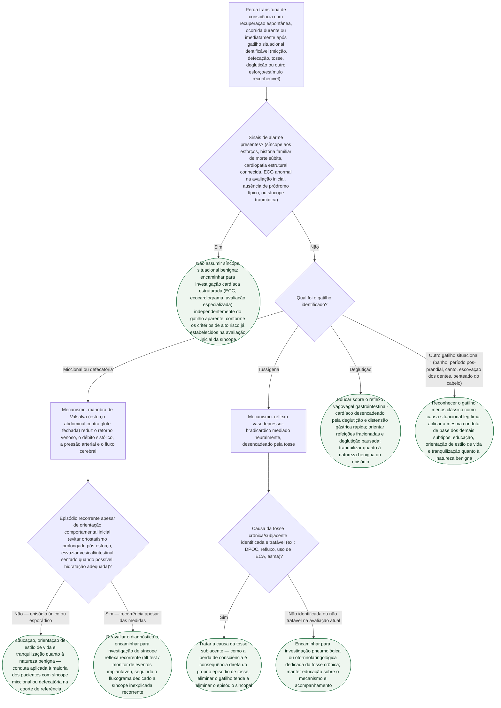

# Fluxograma: Síncope Situacional — Diferencial por Gatilho e Conduta

## Por que separar por gatilho
A síncope situacional é classificada pela ESC 2018 como um subtipo de síncope reflexa, mas os gatilhos que a compõem (miccional, defecatória, tussígena, deglutição e outros menos clássicos) têm mecanismos fisiopatológicos distintos entre si — e é o gatilho identificado, não o rótulo "situacional" genérico, que orienta a conduta prática. Este fluxograma organiza essa distinção como árvore de decisão, a partir da coorte de 3.140 pacientes avaliados por tilt test de Zou et al. (2020), na qual 354 (11,3%) foram diagnosticados com síncope situacional — miccional 50,85% dos casos, defecatória 15,82%, banho 10,45%, deglutição 6,50%, tosse 4,80%, pós-prandial 3,95%, canto 3,11%, escovação dos dentes 2,26% e penteado do cabelo 2,26%.

## Árvore de decisão

## O que vale para todos os ramos, e não está no diagrama
Independentemente do gatilho identificado e da conduta escolhida em cada folha da árvore, dois pontos são transversais e não repetidos em cada ramo:

- **Reavaliação de sinais de alarme a cada recorrência.** Um padrão inicialmente compatível com síncope situacional benigna não isenta o paciente de reavaliação se o padrão do episódio mudar (novo pródromo ausente, aparecimento de sintomas ao esforço, trauma associado) — a árvore trata os sinais de alarme na entrada, mas a vigilância é contínua, não um filtro único.
- **Prognóstico geral favorável na ausência de doença sistêmica associada.** Na coorte de referência, eventos adversos relacionados à síncope situacional foram raros — o que sustenta a conduta predominantemente educativa em quase todos os ramos, exceto quando um sinal de alarme desvia o paciente para investigação cardíaca estruturada.

## Armadilhas clínicas
- Investigar exaustivamente com exames cardíacos invasivos um paciente jovem com episódio único e claro de síncope miccional noturna, sem sinais de alarme — o padrão típico dispensa investigação extensa na maioria dos casos.
- Tratar síncope tussígena como "síncope reflexa comum" sem investigar e tratar a causa da tosse persistente — eliminar o gatilho é o tratamento mais eficaz nesse subtipo específico, não a orientação genérica sobre síncope.
- Ignorar gatilhos menos clássicos (canto, escovação dos dentes, penteado do cabelo, período pós-prandial) como possíveis desencadeantes situacionais — a lista de gatilhos descritos na literatura é mais ampla do que os exemplos mais citados (micção, defecação, tosse).
- Assumir que toda recorrência é sempre benigna sem reavaliar sinais de alarme — recorrência apesar de medidas comportamentais é o ponto da árvore em que o encaminhamento para investigação adicional (tilt test / monitor de eventos) se torna apropriado.
