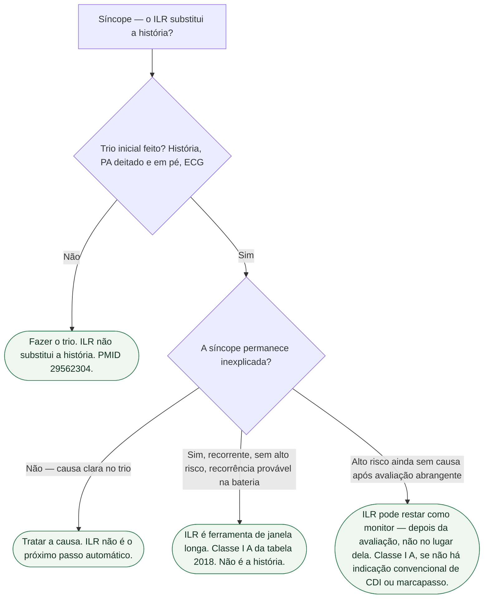

# ILR não substitui a história

Na consulta ao catálogo oficial em09/09/2026, a diretriz ESC dedicada à síncope permanece a de2018. O documento vigente continua sendo Brignole et al., *Eur Heart J*. 2018;39:1883-1948 (PMID **29562304**). O gravador implantável (ILR) é **ferramenta de monitorização** depois que a síncope permanece inexplicada. **Não** substitui história, exame nem ECG. Esta ficha **não** substitui [Tilt não é Holter e não é ILR](/biblioteca/tilt-nao-e-holter-e-nao-e-ilr) (três ferramentas, três perguntas), [Síncope reflexa não é bloqueio e não é TV](/biblioteca/sincope-reflexa-nao-e-bloqueio-e-nao-e-tv) nem [ESC 2018 de síncope ainda vale — e o que a IC 2026 muda no contexto](/biblioteca/esc-2018-ainda-vale-e-o-que-a-ic-2026-muda-no-contexto). Isola uma frase: **o ILR entra depois do trio inicial, não no lugar dele.** **Nenhuma taxa de yield, positividade ou sensibilidade é transcrita.**

## O trio que o ILR não apaga

A ESC 2018, nas mensagens-chave abertas nesta sessão, pede em **todos** os pacientes: história completa, exame físico **incluindo pressão em pé**, e ECG padrão. Quatro perguntas da perda transitória de consciência: foi perda de consciência? Se foi, é síncope? Há diagnóstico etiológico claro? Há alto risco de evento cardiovascular ou morte?

Sem testemunha, sem pródromo descrito, sem gatilho, sem pressão deitado e em pé e sem as 12 derivações, o ILR vira exame solto. Gravador implantado **não** mede hipotensão ortostática. **Não** reconstitui a crise. O traçado pode esclarecer o mecanismo arrítmico, mas não classifica sozinho todas as causas reflexas ou ortostáticas; deve ser interpretado com a história.

Alto risco na ESC 2018 (esforço, decúbito, palpitação imediata, estrutural, ECG de alarme: bifascicular, BAV, TVNS, Brugada, QT, pré-excitação, hipertrofia sugestiva de MHO) tira o caso da gaveta “inexplicada de baixo risco”. Aí a primeira ferramenta de ritmo é **monitorização imediata** (leito ou telemetria) — não o implante como atalho da anamnese. Porta irmã: [Quando a síncope é porta de arritmia e quando é porta de IC](/biblioteca/quando-a-sincope-e-porta-de-arritmia-e-quando-e-porta-de-ic).

## O que o ILR é — qualitativo

Janela **longa** (meses a anos) para capturar o **evento raro** que a janela do Holter não alcança. A ESC 2018 indica ILR numa fase **precoce** da avaliação em quem tem síncope **recorrente de origem incerta**, **sem** critérios de alto risco da Tabela 6, e **alta probabilidade de recorrência** dentro da vida da bateria — **Classe I A** (tabela de monitorização aberta nesta sessão). Também permanece ferramenta no alto risco **depois** de avaliação abrangente sem causa e sem indicação convencional de CDI ou marcapasso de prevenção primária — também I A na ESC2018.

O ouro do diagnóstico arrítmico, na própria diretriz, é a **correlação** sintoma–ECG. O ILR serve para **esperar** essa correlação. Não cria a história. Não educa manobra. Não provoca reflexo. Não indica gerador sozinho: marcapasso e CDI saem das tabelas próprias.

O ILR também deve ser considerado na síncope reflexa suspeita ou confirmada com episódios frequentes/graves (IIa B), quando documentar cardioinibição pode mudar a decisão terapêutica.

## O que o ILR não é

Não é substituto da história. Não diga: “vamos implantar e depois perguntamos.” A ordem da ESC 2018 não inverte.

Não é Holter eterno. Holter é janela curta. Porta: [Tilt não é Holter e não é ILR](/biblioteca/tilt-nao-e-holter-e-nao-e-ilr).

Não é tilt. Tilt provoca no laboratório. ILR observa na vida. Tilt negativo **não** é a indicação do ILR. ILR negativo **não** apaga reflexo.

Não é “yield de X% nesta ficha”. Meta-análises e séries da seção 4.2.4.7 da ESC 2018 **existem**; **não** são copiadas aqui. Sem percentual. Sem NNT diagnóstico inventado.

Não é licença para pular ortostática no idoso com queda inexplicada. Não apaga MHO, Brugada, QT nem IC. Não é indicação de CDI.

## Tudo com Tudo

- [ESC 2018 de síncope ainda vale — e o que a IC 2026 muda no contexto](/biblioteca/esc-2018-ainda-vale-e-o-que-a-ic-2026-muda-no-contexto)
- [Quando a síncope é porta de arritmia e quando é porta de IC](/biblioteca/quando-a-sincope-e-porta-de-arritmia-e-quando-e-porta-de-ic)
- [Síncope reflexa não é bloqueio e não é TV](/biblioteca/sincope-reflexa-nao-e-bloqueio-e-nao-e-tv)
- [Tilt não é Holter e não é ILR](/biblioteca/tilt-nao-e-holter-e-nao-e-ilr)
