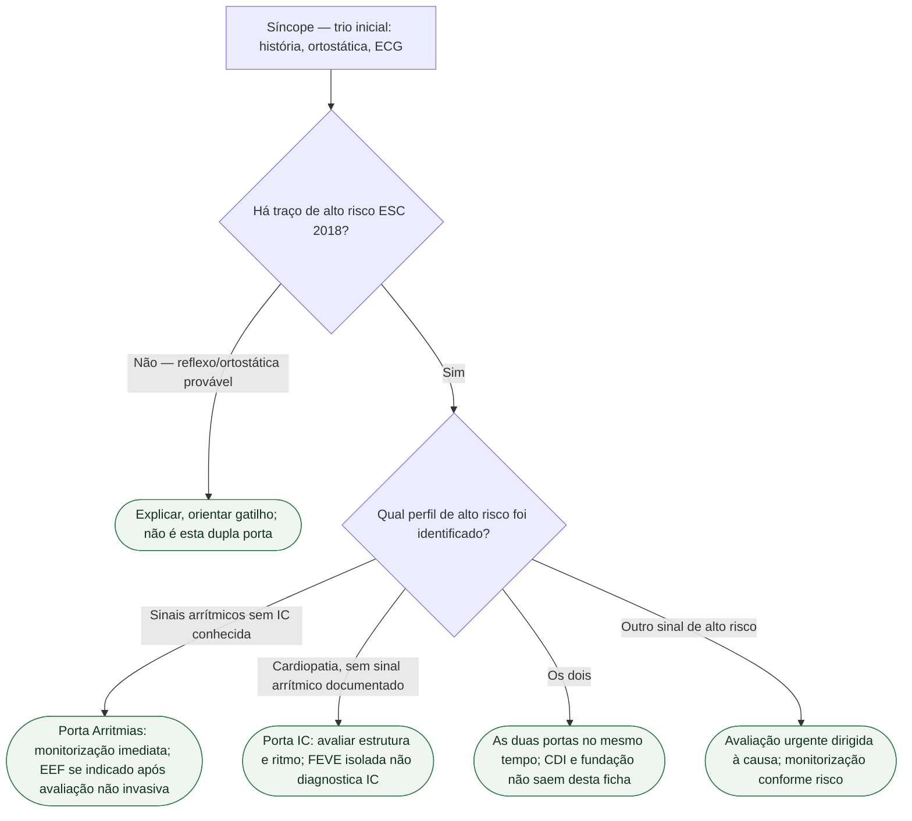

# Quando a síncope é porta de arritmia e quando é porta de IC

Na página oficial consultada em setembro de 2026, a diretriz ESC de síncope permanece a de 2018. O documento vigente continua sendo Brignole et al., *Eur Heart J*. 2018;39:1883-1948 (PMID **29562304**). A ESC 2026 de insuficiência cardíaca (PMID **42661420**) **não** reescreveu síncope. Isola a **dupla porta**: quando o desmaio abre **Arritmias** e quando abre **Insuficiência cardíaca**. As duas podem coexistir. Nenhuma autoriza “vasovagal até prova em contrário” se houver cardiopatia estrutural.

Classes abaixo saíram de tabelas conferidas da ESC 2018. **Não** inventar Classe I de CDI, ablação ou fundação de IC a partir de um desmaio.

## O trio que as duas portas compartilham

Em **todos** os pacientes, a ESC 2018 pede história (crise atual e anteriores, testemunha), exame com pressão **deitado e em pé**, e ECG de 12 derivações. Sem isso, tilt, monitor e massagem do seio carotídeo viram exame solto.

Alto risco inclui: síncope **no esforço** ou **em decúbito**; palpitação súbita imediatamente antes; história familiar de morte súbita inexplicada em jovem; **doença cardíaca estrutural** ou coronariana (IC, disfunção de VE, infarto prévio); história de arritmia. ECG de alarme: bloqueio bifascicular e outros distúrbios de condução (QRS ≥0,12 s), BAV, TV não sustentada, pré-excitação, QT longo ou curto, padrão de Brugada, ondas épsilon, hipertrofia sugestiva de miocardiopatia hipertrófica.

Pacientes com características de alto risco devem receber avaliação precoce e intensiva em unidade de síncope ou observação, ou ser internados — **Classe I, nível B**.

## Porta de arritmia

A síncope arrítmica é **altamente provável** quando o ECG mostra, entre outros: bradicardia sinusal persistente **<40** bpm ou pausas **>3 s** em vigília sem treino físico; BAV de 2º grau Mobitz II ou 3º grau; BRE e BRD **alternantes**; TV ou TSV paroxística rápida; TV polimórfica não sustentada com QT longo ou curto; mau funcionamento de marcapasso ou CDI com pausas — **Classe I, nível C**. Síncope por isquemia cardíaca confirma-se quando há evidência de isquemia miocárdica aguda, com ou sem infarto — **I C**.

O que essa porta pede, sem inventar classe nova: monitorização imediata se a hipótese é arrítmica de alto risco; EEF na síncope inexplicada com bloqueio bifascicular ou taquicardia suspeita; teste ergométrico se o desmaio foi **durante** ou **logo após** o esforço; monitor prolongado na recorrência grave inexplicada com traço arrítmico.

Palpitação súbita **imediatamente** antes aponta para esta porta. Tilt não apaga bifascicular, Brugada, QT nem pré-excitação. CDI em canalopatia ou MHO **não** se indica a partir desta ficha.

## Porta de insuficiência cardíaca

A mesma lista de alto risco nomeia **IC, disfunção de VE e infarto prévio** como doença estrutural grave. Ecocardiograma quando já há cardiopatia conhecida, dado sugestivo de doença estrutural, ou síncope de causa cardiovascular. A ESC 2018 já dizia: síncope em IC avançada carrega alto risco de morte súbita **independentemente** da origem do desmaio. Isso **não** é “primeiro tilt, depois FEVE”.

A ESC 2026 de IC **não** publicou classe nova de síncope. O que ela muda é o mapa: saiu a HFmrEF; restam **ICFER (FEVE <50%)** e **ICFEP (FEVE ≥50%)**. Quem tinha FEVE 41–49% passa a ser ICFER. Síncope nesse paciente entra no raciocínio de cardiopatia estrutural de 2018. A reclassificação de 2026 **não** suaviza a frase de 2018; só impede o atalho “é HFmrEF, então é reflexo”.

Não invente Classe I de CDI, TRC, ARNI ou iSGLT2 **a partir** do desmaio. Se houver IC — ICFER ou ICFEP — a hipótese padrão **não** é vasovagal. Ortostática por diurético é causa tratável; não apaga a cardiopatia.

## Como não fundir as duas portas

Não diga: “ECG normal, então é IC.” ECG normal **não exclui** arritmia paroxística. Não diga: “tem IC, então não precisa de monitor.” IC **aumenta** o risco. Não diga: “a ESC 2026 atualizou a classe da síncope.” Não atualizou — atualizou o fenótipo da IC. Não diga: “FEVE 45% é ICFEP nova, então é reflexo.” Na nomenclatura 2026, FEVE <50% é ICFER.

## Tudo com Tudo

- **Síncope:** ESC 2018 (PMID 29562304). Trio inicial. Alto risco → I B. Arrítmica no ECG listado → I C.
- **Arritmias:** palpitação imediata, bifascicular, TV, canalopatia. Monitor antes de tilt.
- **Insuficiência cardíaca:** ESC 2026 (PMID 42661420) — dois fenótipos. Síncope na IC herda alto risco, não classe nova.
- **Cardiomiopatias:** hipertrofia no ECG e síncope de esforço não se explicam com tilt.
- **Dispositivos:** CDI e ILR saem das tabelas próprias; esta ficha não indica gerador.
- **Cardiologia geriátrica:** queda inexplicada e polifarmácia; não apagam estrutural.
- **Comunicação clínica:** pressão em pé e ECG antes de chamar de vasovagal.

## Limite editorial

PMID **29562304**: I B da avaliação do alto risco e I C da síncope arrítmica/isquêmica conferidos em extrato de tabela. PMID **42661420** só para os dois fenótipos. **Nenhuma classe de síncope inventada** a partir da IC 2026. Indicação de CDI ou de terapia fundacional por síncope: **não transcrita**.

A presença de cardiopatia não exclui síncope reflexa ou ortostática quando os critérios clínicos são claros; exige avaliar também o risco cardíaco e causas coexistentes. Massagem do seio carotídeo requer equipe e monitorização apropriadas, com cautela especial após AIT/AVC ou na estenose carotídea conhecida >70%.
