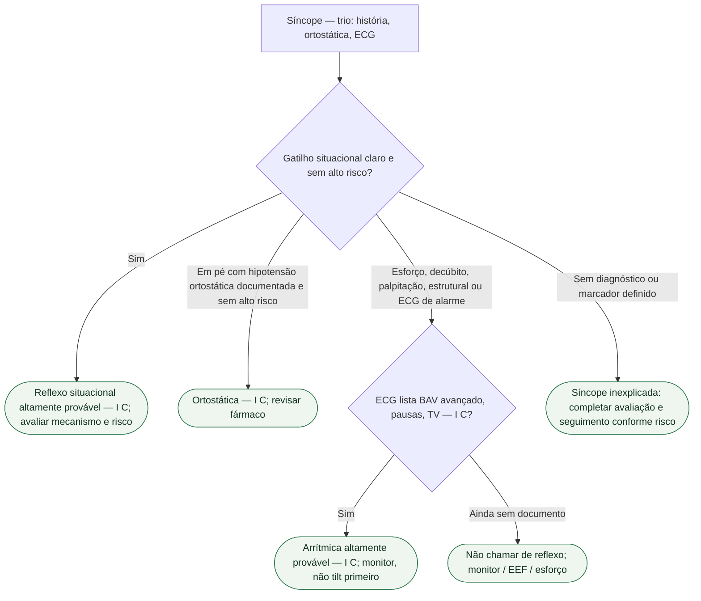

# Síncope reflexa não é bloqueio e não é TV

Na página oficial consultada em setembro de 2026, a diretriz ESC de síncope permanece a de 2018. O documento vigente continua sendo Brignole et al., *Eur Heart J*. 2018;39:1883-1948 (PMID **29562304**, DOI 10.1093/eurheartj/ehy037). Esta ficha **não** substitui `esc-2018-ainda-vale-e-o-que-a-ic-2026-muda-no-contexto` nem `quando-a-sincope-e-porta-de-arritmia-e-quando-e-porta-de-ic`. Isola o **diferencial qualitativo**: o mecanismo reflexo (neuromediado) deve ser distinguido de doença intrínseca de condução e de taquicardia ventricular. Sem números inventados de tilt. Sem classe de CDI fabricada a partir de um desmaio.

## Três gavetas, um trio inicial

A ESC 2018 classifica síncope em **reflexa**, **por hipotensão ortostática** e **cardíaca**. As três saem da **mesma** consulta. Em todos: história (crise atual e anteriores, testemunha), pressão **deitado e em pé**, ECG de 12 derivações. Sem isso, tilt, massagem do seio carotídeo e monitor viram exame solto.

**Reflexa.** Vasovagal (ortostática ao ficar de pé ou emocional: medo, dor, sangue, instrumentação); situacional (micção, estímulo gastrointestinal, tosse, pós-esforço); síndrome do seio carotídeo; formas não clássicas (sem pródromo, sem gatilho, atípica). Mecanismos: vasodepressão e/ou cardioinibição. Diagnóstico **altamente provável** quando ocorre **durante ou imediatamente após** o gatilho situacional da Tabela 3 — **Classe I, nível C**.

**Ortostática.** Confirmada quando a síncope ocorre em pé **e** há hipotensão ortostática concomitante — **I C**. Fármaco (vasodilatador, diurético), depleção, falência autonômica. Não apaga cardiopatia estrutural.

**Cardíaca.** Arritmia como causa primária: disfunção do nó sinusal; doença do sistema de condução AV; taquicardia supraventricular ou **ventricular**. Estrutural: estenose aórtica, isquemia aguda, MHO, tamponamento, disfunção de prótese. Cardiopulmonar: embolia, dissecção. Esta gaveta é a que o reflexo **não** cobre.

## O que tira o caso da gaveta reflexa

Alto risco na ESC 2018 inclui: síncope **no esforço** ou **em decúbito**; palpitação súbita imediatamente antes; história familiar de morte súbita inexplicada em jovem; **doença cardíaca estrutural** ou coronariana. ECG de alarme: bloqueio bifascicular e outros distúrbios de condução (QRS ≥0,12 s), BAV, TV não sustentada, pré-excitação, QT longo ou curto, Brugada, ondas épsilon, hipertrofia sugestiva de MHO.

Síncope arrítmica é **altamente provável** quando o ECG mostra, entre outros: bradicardia sinusal persistente **<40** bpm ou pausas **>3 s** em vigília sem treino; BAV de 2º grau Mobitz II ou 3º grau; BRE e BRD **alternantes**; TV ou TSV paroxística rápida; TV polimórfica não sustentada com QT longo ou curto; mau funcionamento de marcapasso ou CDI com pausas — **I C**. Isso **não** é “vasovagal com pródromo curto”.

Não diga: “ECG de consultório normal, então é reflexo.” Não fecha arritmia paroxística.

Não diga: “teve náusea, então não é bloqueio.” Pródromo autonômico aponta reflexo; **não** apaga bifascicular, Brugada, QT nem TV.

Não diga: “o tilt deu positivo, então o BAV não conta.” Tilt **não** apaga o ECG de alarme.

## Tilt — útil, não veredito, sem porcentagem inventada

A ESC 2018 pede tilt quando a hipótese é reflexa ou ortostática. Na tabela de 2018 o teste **deve ser considerado** (IIa B) na suspeita de reflexo, ortostática, POTS ou PPS; pode ser considerado (IIb B) para educar manobras. Reproduz sintomas **junto** do padrão circulatório. Expõe **suscetibilidade hipotensiva**. Não diagnostica sozinho. **Nenhuma taxa de positividade é transcrita nesta ficha.**

Massagem do seio carotídeo em >40 anos com síncope inexplicada compatível com reflexo. Monitor quando a hipótese é arrítmica. EEF na síncope inexplicada com bloqueio bifascicular ou taquicardia suspeita. Esforço se o desmaio foi **durante** ou **logo após** exercício. Nenhum substitui o trio inicial.

Não fundir reflexo, bloqueio e TV na mesma frase de alta. Não indicar CDI, ablação ou marcapasso **a partir** desta ficha. Não chamar de vasovagal a síncope de esforço, em decúbito, com palpitação imediata ou com cardiopatia estrutural. A ESC 2026 de IC **não** reescreveu síncope.

## Tudo com Tudo

- **Síncope:** diferencial qualitativo. Reflexo ≠ BAV ≠ TV. PMID 29562304. Trio inicial.
- **Arritmias:** palpitação imediata, bifascicular, TV, canalopatia. Monitor antes de tilt. Porta irmã: `quando-a-sincope-e-porta-de-arritmia-e-quando-e-porta-de-ic`.
- **Dispositivos:** CDI, marcapasso e ILR saem das tabelas próprias; esta ficha não indica gerador.
- **Insuficiência cardíaca:** estrutural tira da gaveta reflexa; a ESC 2026 não criou classe de síncope.
- **Cardiomiopatias:** hipertrofia no ECG e síncope de esforço não se explicam com tilt.
- **Cardiologia geriátrica:** queda inexplicada e polifarmácia; não apagam BAV nem TV.
- **Comunicação clínica:** “vamos medir a pressão em pé e olhar o ECG antes de chamar de vasovagal.”

## Limite editorial

PMID **29562304** conferido (Brignole 2018). I C do gatilho situacional, I C da ortostática e I C da síncope arrítmica: tabelas conferidas. IIa B do tilt: tabela 2018; **sem porcentagem de positividade**. Nenhuma classe de CDI, ablação ou marcapasso inventada.

A presença de cardiopatia não exclui síncope reflexa ou ortostática quando os critérios clínicos são claros; exige avaliar também o risco cardíaco e causas coexistentes. Massagem do seio carotídeo requer equipe e monitorização apropriadas, com cautela especial após AIT/AVC ou na estenose carotídea conhecida >70%.

Na forma cardioinibitória reflexa pode ocorrer bradicardia, assistolia e bloqueio AV vagal; isso não equivale a doença intrínseca do sistema de condução. O traçado e o contexto determinam a distinção.
