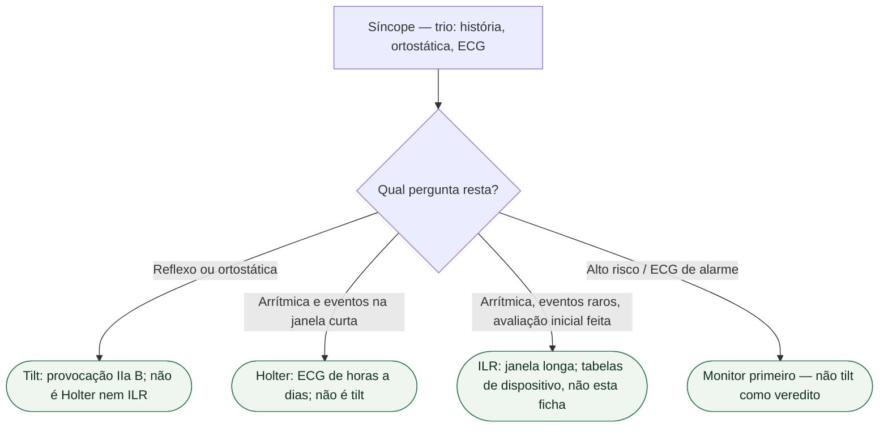

# Tilt não é Holter e não é ILR

Na página oficial consultada em setembro de 2026, a diretriz ESC de síncope permanece a de 2018. O documento vigente continua sendo Brignole et al., *Eur Heart J*. 2018;39:1883-1948 (PMID **29562304**). Esta ficha **não** substitui `esc-2018-ainda-vale-e-o-que-a-ic-2026-muda-no-contexto`, `sincope-reflexa-nao-e-bloqueio-e-nao-e-tv` nem `quando-a-sincope-e-porta-de-arritmia-e-quando-e-porta-de-ic`. Isola o **diferencial qualitativo de três ferramentas**: mesa inclinada (tilt), Holter e gravador implantável (ILR). São exames **diferentes**. Respondem perguntas **diferentes**. Nenhum substitui o trio inicial — história, pressão deitado e em pé, ECG de 12 derivações. **Nenhuma taxa de positividade, sensibilidade ou “yield” diagnóstico é transcrita nesta ficha.**

## Três ferramentas, três perguntas

**Tilt.** Exame de **provocação** no laboratório. Inclina o paciente e observa pressão, frequência e sintomas **juntos**. A ESC 2018 pede tilt quando a hipótese é **reflexa** ou **ortostática**. Na tabela de 2018 o teste **deve ser considerado** (IIa B) na suspeita de reflexo, ortostática, POTS ou PPS; pode ser considerado (IIb B) para educar manobras. Reproduz sintomas **junto** do padrão circulatório. Expõe **suscetibilidade hipotensiva**. Não diagnostica sozinho. **Não** é um ECG de 24 horas. **Não** captura BAV paroxístico em casa. **Não** apaga o ECG de alarme.

**Holter.** Registro **contínuo de ECG** por uma janela **curta** — horas a um ou dois dias, na linguagem usual do exame. Serve quando a pergunta é arrítmica **e** o evento tem chance de cair **nessa** janela: sintomas **frequentes**, palpitações diárias, ou correlação sintoma–traço se o desmaio se repetir no período. Janela curta **não** investiga o desmaio **raro**. Holter normal **não** fecha arritmia paroxística. Holter **não** mede pressão em pé. Holter **não** é tilt.

**ILR (gravador de alça implantável).** Monitor **implantado**, janela de **meses a anos**. Serve quando a pergunta continua arrítmica **depois** da avaliação inicial e os eventos são **infrequentes** demais para a janela do Holter. Não é “Holter eterno”. Não reproduz reflexo no laboratório. Não educa manobra. Indicação de gerador sai das **tabelas de dispositivos** da ESC 2018 — **não** desta ficha. Sem classe inventada. Sem percentual de diagnóstico inventado.

## O que cada um não faz

Não diga: “o tilt deu positivo, então o Holter é dispensável.” Tilt positivo mostra suscetibilidade hipotensiva. **Não** apaga bifascicular, Brugada, QT, TV nem pausa.

Não diga: “o Holter foi normal, então é vasovagal.” Holter normal numa janela curta **não** fecha o intervalo entre os desmaios.

Não diga: “vamos implantar o ILR porque o tilt foi negativo.” Tilt negativo **não** é a indicação do ILR. A pergunta do ILR é captura de ritmo no evento **raro**, após o trio inicial — não o resultado do tilt.

Não diga: “os três exames se cancelam.” Três perguntas. Não fundir tilt, Holter e ILR na mesma frase de alta. Não indicar marcapasso, CDI ou ILR **a partir** desta ficha.

## Ordem que a ESC 2018 não inverte

Em **todos**: história (crise atual e anteriores, testemunha), pressão **deitado e em pé**, ECG de 12 derivações. Sem isso, tilt, Holter e ILR viram exame solto.

Alto risco (esforço, decúbito, palpitação imediata, estrutural, ECG de alarme) tira o caso da gaveta reflexa. Aí a ferramenta precoce é **monitorização** — leito ou telemetria imediatamente nos pacientes de alto risco; Holter e ILR entram depois conforme estabilidade, investigação e frequência — **não** tilt primeiro. Porta irmã: `quando-a-sincope-e-porta-de-arritmia-e-quando-e-porta-de-ic`.

Hipótese reflexa ou ortostática **depois** do trio: tilt pode reproduzir o padrão. Isso **não** substitui Holter se houver dúvida arrítmica. Isso **não** substitui ILR se os eventos forem raros e inexplicados.

## Tudo com Tudo

- **Síncope:** três ferramentas, três perguntas. PMID 29562304. Trio inicial antes de qualquer uma.
- **Arritmias:** Holter e ILR capturam ritmo. Tilt não. Monitor antes de tilt no alto risco.
- **Dispositivos:** ILR, marcapasso e CDI saem das tabelas próprias; esta ficha não indica gerador.
- **Cardiomiopatias:** hipertrofia no ECG e síncope de esforço não se explicam com tilt.
- **Cardiologia geriátrica:** queda inexplicada e polifarmácia; não transformam Holter normal em vasovagal.
- **Comunicação clínica:** “tilt, Holter e ILR não se trocam. Qual é a pergunta?”

## Limite editorial

PMID **29562304** conferido (Brignole 2018). IIa B e IIb do tilt: tabela 2018 já usada neste lote. **Nenhuma taxa de positividade, yield ou sensibilidade** de tilt, Holter ou ILR. **Nenhuma classe de ILR, Holter, marcapasso ou CDI inventada.** 

A presença de cardiopatia não exclui síncope reflexa ou ortostática quando os critérios clínicos são claros; exige avaliar também o risco cardíaco e causas coexistentes. Massagem do seio carotídeo requer equipe e monitorização apropriadas, com cautela especial após AIT/AVC ou na estenose carotídea conhecida >70%.

Holter deve ser considerado se síncope ou pré-síncope ocorrer pelo menos semanalmente (IIa B). ILR pode ser indicado precocemente na síncope recorrente inexplicada sem alto risco e com provável recorrência durante a bateria (I A); em alto risco, requer avaliação abrangente sem causa ou tratamento específico e ausência de indicação convencional de marcapasso/CDI (I A). Não aguardar registro ambulatorial para tratar instabilidade ou arritmia já documentada.
