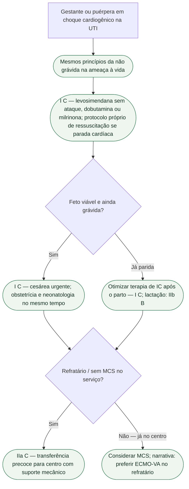

# Choque cardiogênico na gestante — porta UTI, ESC 2025

Esta ficha entra pela **porta da terapia intensiva**. A fonte é a mesma da porta Gravidez (De Backer, Haugaa et al., *Eur Heart J*. 2025;**46**:4462-4568; DOI 10.1093/eurheartj/ehaf193; PMID **40878294**), mas a pergunta muda: o que o intensivista faz quando a gestante — ou a puérpera (a Figura 22 abrange até seis meses após o parto) — chega em choque cardiogênico. Equipe mWHO 2.0 e fluxograma de dor torácica não se repetem. IC aguda/choque pela porta obstétrica: `esc-2025-ic-aguda-e-choque-na-gestacao.md`.

## A regra da ameaça à vida

Mensagem essencial da ESC 2025: em situação ameaçadora da vida, desfibrilação, intervenções, revascularização coronária aguda, **suporte circulatório mecânico** e medicação devem ser **os mesmos da mulher não grávida**, independentemente de contraindicações. A gravidez muda a equipe ao redor (obstetrícia, neonatologia, *Pregnancy Heart Team* em paralelo). Não muda o princípio de perfundir o miocárdio e a placenta.

IC aguda pede **internação urgente**. O texto da seção pede centro com IC avançada, cirurgia no local e suporte mecânico — ou transplante — de retaguarda. *Essential Messages*: quando inotrópico ou tratamento avançado for necessário, **encaminhar a centro especialista**.

## Inotrópico na UTI — o que tem Classe

**Inotrópicos e/ou vasopressores são recomendados** na gestante com choque cardiogênico, com **levosimendana, dobutamina e milrinona** como agentes recomendados — **Classe I, nível C**. Confirmado na tabela de recomendação, nos slides oficiais e no *Supplementary data* (Recommendation Table 20).

Como usar, no texto da seção — **sem Classe isolada para cada detalhe de infusão**:

- **Levosimendana:** infusão contínua **sem dose de ataque**.
- **Dobutamina:** opção.
- **Adrenalina:** a seção de choque aconselha evitar como inotrópico. Isso não se aplica à parada cardíaca: nesse cenário, a diretriz recomenda os mesmos medicamentos e doses de ressuscitação da mulher não grávida, sem omiti-los por receio de teratogenicidade.
- **Milrinona:** alternativa se o benefício superar o risco de atravessar a placenta.

**Não inventar µg/kg/min, bolus nem diluição.** Isso sai do capítulo, da bula e do protocolo local — não desta ficha.

A Figura 22 (IC aguda e choque na gravidez e até 6 meses pós-parto) coloca no ramo grave: otimizar pré-carga; **nitratos se PAS >110 mmHg**; oxigênio com VNI ou via aérea avançada se SpO₂ <95%; depois inotrópico/vasopressor (Classe I na figura). O 110 mmHg é limiar para nitrato, não meta de PAM no choque.

## Dois tempos que a UTI não pode atrasar

1. **Cesárea urgente** na gestante em choque, tão logo o feto seja viável, considerando idade gestacional, comorbidades e o nível de cuidado disponível — **I C**. Choque não herda a frase “parto vaginal é a primeira escolha na maioria das DCV” (I B no estável).
2. **Transferência precoce** para serviço que ofereça suporte circulatório mecânico **deve ser considerada** — **IIa C**. Narrativa da seção: no choque grave refratário, preferir ECMO-VA. Não transformar essa preferência em Classe I nem improvisar marca de cânula.

Depois do parto: otimizar a terapia de IC, respeitando o que a lactação contra-indica — **I C**. Prevenir lactação **pode ser considerado** na IC grave — **IIb B**. IECA, BRA, ARNI, ARM, ivabradina e iSGLT2 permanecem **III C** na gravidez; essa contraindicação ao tratamento crônico não deve ser confundida com a administração de medicamentos necessários durante ressuscitação. Na Figura 22, bromocriptina pode ser considerada na cardiomiopatia periparto após o parto (IIb); se utilizada, anticoagulação com heparina/HBPM deve ser considerada para reduzir eventos tromboembólicos (IIa). Ela não é um vasoativo para estabilização inicial.

## Pressão na mesma internação

Alvo da gestante na ESC 2025: PAS **<140** e PAD **<90 mmHg** — **I B**. Emergência hipertensiva gestacional (PAS ≥160 ou PAD ≥110): hospital — **I C**. Redução aguda: labetalol i.v., urapidil, nicardipino, nifedipino oral de ação curta ou metildopa; hidralazina i.v. segunda linha — **I C**. Sem miligrama aqui. Não aplicar a meta 130/80 da AHA 2025 da adulta não grávida a esta paciente.

## O que a UTI não faz nesta ficha

A estratificação mWHO não deve atrasar a estabilização da emergência. Não fecha “ansiedade da gravidez” se a porta de entrada foi dor torácica — isso é outra árvore. Não inventa classe para noradrenalina, vasopressina ou milrinona “em primeiro”. Não copia tabela de SCA/DAPT.

## Tudo com Tudo

- [Choque cardiogênico fora da gestante — o que a ESC 2026 de IC muda na porta UTI](/biblioteca/choque-cardiogenico-o-que-a-esc-2026-de-ic-muda-fora-da-gestante)
- [SCA com choque: o que não misturar com IC descompensada](/biblioteca/sca-com-choque-o-que-nao-misturar-com-ic-descompensada)
- [Pressão na gravidez não é a mesma meta](/biblioteca/pressao-na-gravidez-nao-e-a-mesma-meta)
