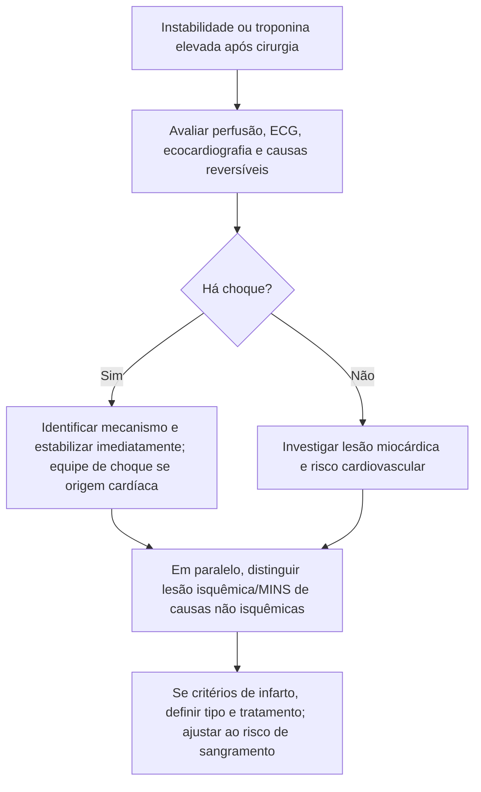

# Choque cardiogênico e MINS: diagnósticos diferentes que podem coexistir

Choque cardiogênico descreve hipoperfusão de órgãos por falência cardíaca. MINS descreve lesão miocárdica de mecanismo presumivelmente isquêmico após cirurgia não cardíaca, com troponina acima do percentil 99 do ensaio, mesmo sem sintomas. Ele pode incluir infarto tipo 1, infarto tipo 2 ou lesão isquêmica sem todos os critérios de infarto. Excluem-se causas alternativas não isquêmicas de elevação da troponina.

Uma pessoa operada pode apresentar MINS e choque ao mesmo tempo. A identificação de um não encerra a investigação do outro.

## Evidências diferentes

O DanGer Shock randomizou pacientes selecionados com IAM com supradesnível e choque para Impella CP mais tratamento padrão ou tratamento padrão. Na análise de 355 participantes, a morte em 180 dias foi 45,8% versus 58,5%; HR 0,74 (IC95% 0,55–0,99). O composto de sangramento grave, isquemia de membro, hemólise, falha do dispositivo ou piora da insuficiência aórtica foi 24,0% versus 6,2%. Esse equilíbrio benefício–risco não foi testado para troponina pós-operatória isolada.

O VISION foi uma coorte de cirurgia não cardíaca: mortalidade global em 30 dias de 1,9%, associada ao pico de troponina T de quarta geração. Não randomizou cateterismo nem suporte circulatório. Seus limiares não devem ser transferidos numericamente para ensaios atuais de alta sensibilidade.

## Avaliação à beira do leito

Instabilidade exige avaliação imediata de perfusão, ECG, função cardíaca e causas como hemorragia, sepse, embolia pulmonar e síndrome coronariana. No pós-operatório, caracterize o mecanismo da lesão e os critérios de infarto. Se houver IAMCSST com choque, avalie reperfusão e suporte com a equipe especializada, ponderando o risco hemorrágico cirúrgico. Se houver MINS sem choque, trate os fatores precipitantes e organize a avaliação cardiovascular; a troponina isolada não indica bomba microaxial.

## Tudo com Tudo

- [Choque cardiogênico fora da gestante — o que a ESC 2026 de IC muda na porta UTI](/biblioteca/choque-cardiogenico-o-que-a-esc-2026-de-ic-muda-fora-da-gestante)
- [DanGer Shock: bomba microaxial no IAMCSST com choque](/biblioteca/danger-shock-bomba-microaxial-no-iamcsst-com-choque)
- [MINS: lesão isquêmica pós-operatória, com ou sem infarto](/biblioteca/mins-nao-e-iam-tipo-1-nem-e-choque)
- [POISE-2: AAS perioperatório não reduz morte ou IAM — aumenta sangramento](/biblioteca/poise-2-aas-nao-reduz-morte-ou-iam)
