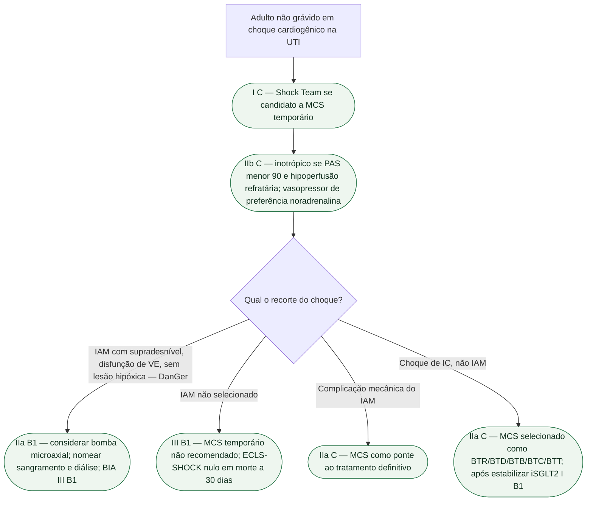

# Choque cardiogênico fora da gestante — o que a ESC 2026 de IC muda na porta UTI

Esta ficha entra pela **porta da terapia intensiva** do adulto **não grávido**. A fonte é a ESC 2026 de insuficiência cardíaca (Køber, Adamo et al., *Eur Heart J*. 2026; DOI 10.1093/eurheartj/ehag100; PMID **42661420**), seção de IC descompensada e choque — Recommendation Tables 9 e 10, conferidas no texto aberto. **Não** é a ficha da gestante (`choque-cardiogenico-na-gestante-esc-2025.md`; De Backer, PMID **40878294**). Cesárea, levosimendana I C obstétrica e mWHO **não** se copiam aqui.

## O que mudou na mesa da UTI — classes conferidas

**Equipe de choque.** Uma *Shock Team* multidisciplinar **é recomendada** em candidatos potenciais a suporte circulatório mecânico temporário (MCS), para guiar modalidade e tipo segundo o paciente e a IC — **Classe I, nível C**.

**Inotrópico.** Agentes inotrópicos **podem ser considerados** na IC descompensada com PAS **<90 mmHg** e hipoperfusão que **não** responde ao tratamento padrão, incluindo avaliação de resposta a volume quando clinicamente apropriada, sem sobrecarregar o paciente congesto, para melhorar perfusão — **IIb C**. Uso rotineiro **não** é recomendado: arritmia e isquemia. A escolha e a titulação exigem monitorização hemodinâmica e avaliação do risco de arritmia e isquemia.

**Vasopressor.** Vasopressores, **preferencialmente noradrenalina**, **podem ser considerados** no choque cardiogênico para aumentar pressão e perfusão de órgão — **IIb C**. Não promover noradrenalina a Classe I.

**BIA.** Balão intra-aórtico **não é recomendado** em pacientes **não selecionados** com choque cardiogênico, por falta de efeito — **III B1**. A 2021 dizia “não rotineiramente no choque pós-IAM” (III B); a 2026 alarga: não selecionados, qualquer choque cardiogênico.

**Bomba de fluxo microaxial.** MCS temporário com bomba microaxial **deve ser considerado** em pacientes **selecionados** com choque cardiogênico por **IAM com supradesnível**, disfunção sistólica do VE e **sem risco de lesão hipóxica encefálica**, para reduzir o risco de morte — **IIa B1**. Herança do DanGer Shock (Møller, PMID **38587239**): **360** randomizados, **355** na análise; morte em 180 dias **82/179 (45,8%)** versus **103/176 (58,5%)**; HR **0,74** (0,55–0,99); P=0,04. Composto de segurança **24,0%** versus **6,2%**; terapia de substituição renal **41,9%** versus **26,7%**. Selecionado ≠ rotina.

**MCS no IAM não selecionado.** MCS temporário **não é recomendado** em pacientes **não selecionados** com choque cardiogênico por IAM agudo, por risco de dano — **III B1**. ECLS-SHOCK (Thiele, *N Engl J Med*. 2023;389:1286-1297): morte em 30 dias **47,8%** versus **49,0%**; RR **0,98** (0,80–1,19); P=0,81; mais sangramento e complicação vascular. VA-ECMO rotineiro no IAM **não** herda IIa.

**Complicação mecânica do IAM.** MCS temporário **deve ser considerado** como ponte ao tratamento definitivo — **IIa C**.

**Choque de IC avançada.** MCS temporário **deve ser considerado** em instabilidade hemodinâmica relacionada à IC, selecionados, como ponte à recuperação, à decisão, a outro suporte, à candidatura a tratamento avançado ou ao transplante — **IIa C**.

**Depois de estabilizar.** Início hospitalar de iSGLT2 **é recomendado** na IC descompensada após estabilização inicial — **I B1**. Opiáceo de rotina **não** é recomendado, salvo dor ou ansiedade grave/intratável.

Não aplica a tabela obstétrica. Não inventa corte SCAI A–E. Não transforma DanGer Shock em “todo choque ganha Impella”. Não promove VA-ECMO a Classe I. Não inventa PAM-alvo nem diluição.

## Tudo com Tudo

- [Choque cardiogênico na gestante — porta UTI, ESC 2025](/biblioteca/choque-cardiogenico-na-gestante-esc-2025)
- [DanGer Shock: bomba microaxial no IAMCSST com choque](/biblioteca/danger-shock-bomba-microaxial-no-iamcsst-com-choque)
- [SCA com choque: o que não misturar com IC descompensada](/biblioteca/sca-com-choque-o-que-nao-misturar-com-ic-descompensada)
