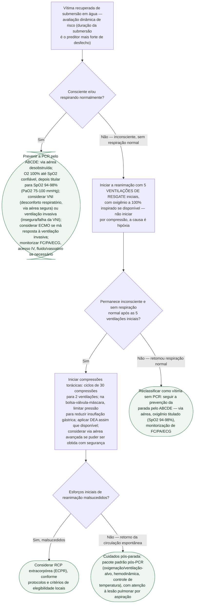

# Afogamento — manejo da parada cardiorrespiratória

Gatilho para este protocolo: **vítima recuperada de submersão em água**. O
eixo que separa as condutas é o estado de consciência e respiração no
resgate — e, para quem já precisa de reanimação, a sequência começa por
**ventilação**, não por compressão, porque a causa da deterioração é
hipóxia.

## Árvore de decisão

## O que vale para todos os ramos, e por isso não está no diagrama

**A duração da submersão é o preditor mais forte de desfecho** (certeza
moderada) — deve orientar a alocação de recursos de busca e resgate.
**Salinidade da água tem efeito inconsistente**, e a revisão do ILCOR
recomenda **contra** usar idade, tempo de resposta do SAMU, tipo/temperatura
da água ou status de testemunha para decidir prognóstico (evidência de
certeza muito baixa).

**A base de evidência para o manejo da PCR no afogamento é consenso de
especialistas**, informado por revisão de escopo do ILCOR — não há ensaio
clínico controlado randomizado dedicado ao tema. Isso não reduz a força da
recomendação de iniciar a reanimação assim que for seguro e viável, que o
grupo redator apoia fortemente dado o peso prognóstico da duração da
submersão e da PCR.
