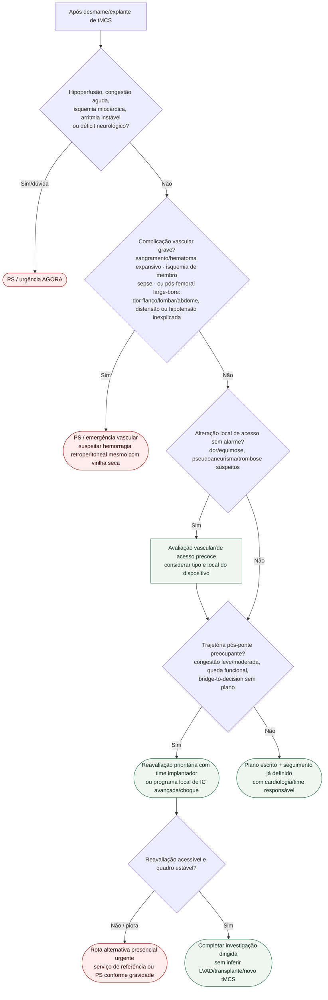

# Fluxograma ambulatorial: pós-tMCS — destino

## Limite
Este é um fluxo operacional de segurança pós-alta; não há protocolo universal ambulatorial pós-tMCS diretamente validado nos consensos citados. Não decide dispositivo, doses, LVAD/transplante ou reimplantação de tMCS.

## Continuidade e avaliação dirigida

Alteração do acesso e piora cardíaca podem coexistir: organizar avaliação vascular e cardiológica em paralelo. Suspeita de pseudoaneurisma/trombose exige exame e imagem dirigidos com prioridade; não esperar consulta rotineira. A ausência de sangramento externo não exclui hemorragia retroperitoneal. Sem acesso rápido à avaliação necessária, usar serviço presencial urgente.

[Complicações do acesso large-bore](/biblioteca/acesso-vascular-large-bore-em-tmcs-prevencao-de-sangramento-isquemia-e-fechamento) · [Seguimento após ponte](/biblioteca/seguimento-ambulatorial-pos-tmcs-ponte-temporaria-quando-escalar).
