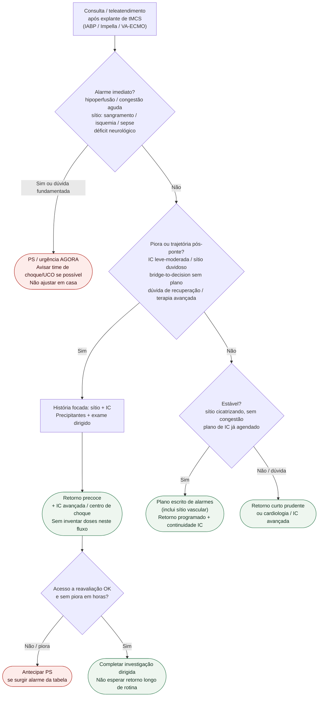

# Fluxograma ambulatorial: pós-tMCS — destino

Prosa: [`seguimento-ambulatorial-pos-tmcs-ponte-temporaria-quando-escalar`](seguimento-ambulatorial-pos-tmcs-ponte-temporaria-quando-escalar.md). Eixos sítio + IC avançada: [`sinalizadores-ambulatoriais-pos-tmcs-sitio-vascular-ic-avancada`](sinalizadores-ambulatoriais-pos-tmcs-sitio-vascular-ic-avancada.md).

## Árvore de decisão

## Notas

- **D1** = gate de segurança (hipoperfusão, congestão aguda, sítio vascular crítico, neurológico).
- **D2** = piora ambulatorial ou trajetória pós-ponte sem plano de IC avançada → retorno precoce + rede (ACC 2025 níveis de cuidado; ESC HF 2021 continuidade).
- **Não decide** doses, anticoagulação sob suporte, indicação/escalonamento/desmame de tMCS nem estadiamento SCAI.
- Complementa — não substitui — o fluxograma pós-UTI geral do pacote #861.
