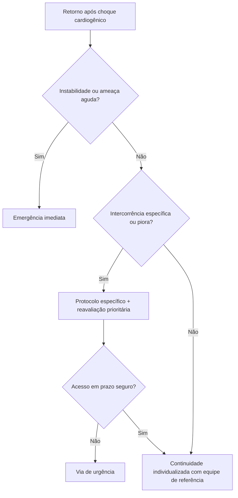

# Seguimento pós-choque cardiogênico

## Aplicação

Aplicar os critérios do protocolo irmão antes de escolher o ramo. Estabilidade atual, evolução e acesso determinam o prazo; o fluxograma não estabelece doses nem substitui o algoritmo específico.

## Navegação

- [`sinalizadores-ambulatoriais-pos-uti-choque-cardiogenico-quando-escalar`](/biblioteca/sinalizadores-ambulatoriais-pos-uti-choque-cardiogenico-quando-escalar)
- [`sinalizadores-ambulatoriais-pos-alta-uti-infeccao-dispositivo-ic-cognicao`](/biblioteca/sinalizadores-ambulatoriais-pos-alta-uti-infeccao-dispositivo-ic-cognicao)

## Limites

HFA/ESC 2020 e ESC IC 2021 sustentam organização e continuidade cardiológica. Diagnóstico de PICS e regras próprias de CIED/MCS foram retirados; intercorrências usam documentos canônicos, sem nova relação forte por similaridade de tema.
